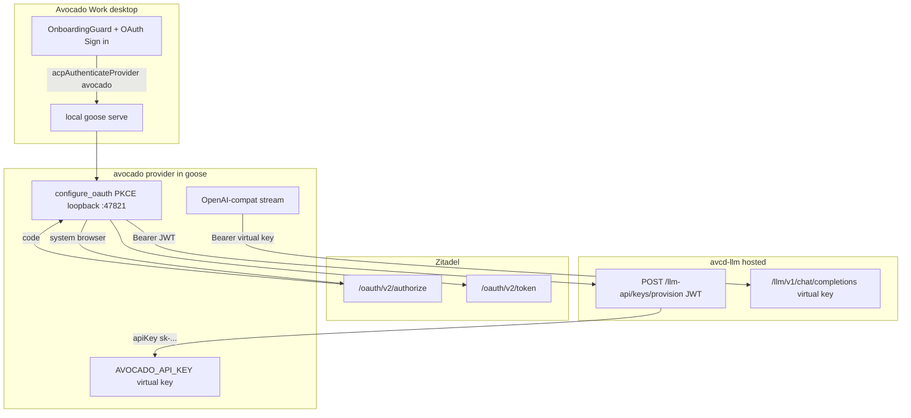

# Local Agent, Hosted Avocado Provider OAuth



## 1. Problem Summary

Avocado Work currently authenticates users in Electron (`LoginGuard`, `ui/desktop/src/auth/**`) and fronts goose with `services/avcd-agent-gateway` (JWT ACP proxy, per-user `goose serve`). That diverges from goose: ACP stays a local secret, and identity belongs on the **provider**. Users cannot be shipped a simple local agent billed by a remote LLM without that wrap.

This plan moves login onto the existing `avocado` provider (same hook as xAI / Databricks): Zitadel PKCE → `POST /llm-api/keys/provision` → store LiteLLM virtual key → chat against `https://dev.avocado.tech/llm`. Desktop goes back to local `goose serve`. Gateway and app-level Zitadel login are removed.

Success: a fresh desktop user signs in with Avocado during onboarding, chats through the billed remote provider, and never runs the gateway. Two different Zitadel subjects receive different virtual keys. A token without `agent-access` does not store a key and does not chat.

Out of scope: hosted multi-tenant goose, web client, payments UI, terraform apply, deploying avcd-llm, Apple/Windows signing.

**Executor Capability Target:** Mid-tier model. Codebase familiarity: none (fresh agent per phase). Depth: contracts, pitfalls, and tests are explicit; no line-level copy-paste implementations.

**Isolation (user choice):** join existing `feature/avocado-llm-provider` **in-place** (no new FIW). Compensations: Phase -1 requires a clean `git status`; each phase commits after GREEN and REFACTOR; scope fence enforced with `git diff --stat`.

## 2. Goals, Non-Goals, Scope Fence

Goals:
- AC-1: `AvocadoProvider` metadata has `ConfigKey::new_oauth("AVOCADO_API_KEY", ...)` so desktop onboarding shows **Sign in with Avocado LLM API** (not an API-key form).
- AC-2: `configure_oauth` runs Zitadel Auth Code + PKCE on `http://127.0.0.1:47821/callback` (already registered), then `POST {provisionUrl}` with the access JWT, then stores `apiKey` as secret `AVOCADO_API_KEY`.
- AC-3: Chat `Authorization` is the LiteLLM virtual key (`sk-...`), never the Zitadel JWT. Host default remains `https://dev.avocado.tech/llm`.
- AC-4: Provision 401 → no key stored; 403 missing `agent-access` → no key stored; 502 `litellm_unavailable` → no key stored. Auth-critical 401/403 mapping must pass 10 consecutive runs.
- AC-5: `from_env` succeeds with no key so ACP `providersConfigAuthenticate` can call `configure_oauth`. `stream` without a key returns `ProviderError::Authentication` / not-configured, not a panic.
- AC-6: `inventory_configured` is true only when a usable `AVOCADO_API_KEY` secret exists. Onboarding does **not** skip Sign in just because `GOOSE_DEFAULT_PROVIDER=avocado` is baked.
- AC-7: Packaged/dev desktop uses **local goose serve**. `REQUIRE_ZITADEL_AUTH` is false. `LoginGuard` is gone. `LOCKED_BACKEND_URL` is unused. `make dev-ui` does not start the gateway.
- AC-8: Two distinct provision subjects yield two distinct stored keys (parametrized, not a single fixture).
- AC-UI: Onboarding and access-denied match the approved mock canvas.

Non-Goals:
- Do not change `crates/goose/src/acp/transport/auth.rs` or ACP secret-key auth.
- Do not modify avcd-llm or avcd-zitadel (provision + native PKCE app already exist).
- Do not terraform apply / deploy / push / PR.
- Do not keep a parallel Electron token store.
- Do not auto-refresh virtual keys beyond: if `expiresAt` is past, `configure_oauth` / a lazy re-provision using the cached refresh token is in-scope; a full billing portal is not.

Allowed write files (avcd-agent, in-place on `feature/avocado-llm-provider`):
- `crates/goose/src/providers/avocado.rs`
- `crates/goose/src/providers/avocado_auth.rs` (new)
- `crates/goose/src/providers/mod.rs` (module export only)
- `crates/goose/src/providers/init.rs` (inventory `with_configured` only)
- `crates/goose/tests/avocado_oauth_provision.rs` (new)
- `ui/desktop/src/updates.ts`
- `ui/desktop/src/App.tsx`
- `ui/desktop/src/main.ts`
- `ui/desktop/src/backendLock.ts` and `backendLock.test.ts` (delete or gut)
- `ui/desktop/src/components/onboarding/OnboardingGuard.tsx`
- `ui/desktop/src/components/onboarding/ProviderSelector.tsx`
- `ui/desktop/src/components/onboarding/ProviderConfigForm.tsx` (only if OAuth path needs a copy tweak)
- `ui/desktop/src/components/settings/SettingsView.tsx`
- `ui/desktop/src/components/settings/app/ExternalBackendSection.tsx`
- `ui/desktop/src/components/auth/**` (delete)
- `ui/desktop/src/auth/**` (delete)
- `ui/desktop/src/preload.ts` (remove auth IPC)
- matching `*.test.ts(x)` for those UI files
- `Makefile`, `docker-compose.yml`, `.env.local.example`
- `scripts/prepare-dev-ui-env.sh`, `scripts/ensure-gateway-dev.sh` (rewrite or delete)
- `services/avcd-agent-gateway/**` (delete)
- `.github/workflows/avcd-agent-gateway.yml` (delete)
- `.cursor/plans/avocado-provider-oauth.plan.md`
- Phase 0 canvas: `~/.cursor/projects/Users-genarionogueira-Documents-avcd-avcd-agent/canvases/avocado-provider-oauth-mock.canvas.tsx`

Read-only:
- `crates/goose/src/acp/**` (generic `configure_oauth` path already works when `oauth_flow` is true)
- `crates/goose/src/providers/huggingface_auth.rs`, `xai_oauth.rs`, `oauth.rs` (copy patterns, do not edit)
- `ui/desktop/src/acp/providers.ts` (`acpAuthenticateProvider` already exists)
- `../avcd-llm/**`, `../avcd-zitadel/**`

Banned: new deps unless a phase names crate+version; editing ACP transport; terraform/pulumi apply; push/PR/deploy; weakening RED tests; `if cfg!(test)` bypasses of OAuth/provision.

Anti-gaming: tests read-only after RED; no hard-coding fixture keys; mocks only at HTTP (Zitadel token URL, provision URL, chat URL); two randomized subjects in AC-8.

## 2.5 Feature Isolation Workspace

- isolation-mode: join-existing (in-place; user chose this)
- teardown-mode: n/a (no FIW)
- feature-slug: `avocado-llm-provider`
- feature branch: `feature/avocado-llm-provider`
- related-plans: [zitadel-desktop-login.plan.md](.cursor/plans/zitadel-desktop-login.plan.md) and [packaged-login-lockdown.plan.md](.cursor/plans/packaged-login-lockdown.plan.md) — **superseded** for wrap-goose; keep their Zitadel app + provision contract
- overlap-discovery: FIW folders `avcd-agent-rebrand`, `landing-page-oidc`, `plane-selfhost`; avcd-agent on `feature/avocado-llm-provider` (clean); avcd-zitadel dirty on `feature/zitadel-desktop-login` (out of scope); user chose join in-place

| Repo | During exec |
|------|-------------|
| avcd-agent | writable primary `~/Documents/avcd/avcd-agent` |
| avcd-llm | read-only |
| avcd-zitadel | read-only |

## 3. E2E Test Definition

Discovery: no test covers avocado OAuth. Existing avocado tests only classify budget errors. Gateway E2E covers provision-from-gateway (deleted this plan). Desktop `LoginGuard.test.tsx` is the old gate — replace with OnboardingGuard/OAuth assertions.

**E2E-1** (binding) — `crates/goose/tests/avocado_oauth_provision.rs` (`cargo test -p goose --test avocado_oauth_provision`):
- Arrange: wiremock (or httptest) for Zitadel token endpoint, provision, and `/v1/chat/completions`. Mint two JWTs conceptually as bearer results of token exchange (tests drive `configure_oauth` with mocked token HTTP, not a real browser). Two randomized `sub` values.
- Act: `configure_oauth` then `stream` a one-shot completion.
- Assert: provision called with `Authorization: Bearer <access_token>`; chat called with `Authorization: Bearer <apiKey>` where `apiKey` is the provision body value and differs per subject; chat header is not the JWT.
- Negatives: token endpoint 401 → no secret written; provision 403 → no secret; provision 502 → no secret.
- Status: FAILING until Phase 3.

**E2E-2** (desktop gate) — `ui/desktop/src/components/onboarding/__tests__/OnboardingGuard.oauth.test.tsx`:
- Avocado unconfigured + baked default provider avocado → Sign in UI rendered, chat children not rendered.
- After `acpAuthenticateProvider` resolves and `is_configured` true → children rendered.
- Access-denied / authenticate throw with forbidden → denied state, children not rendered.
- Status: FAILING until Phase 4.

## 3.5 UI Mock Canvas

Applies: Yes — onboarding Sign in (replaces LoginGuard), signing-in, access-denied, success; settings without External Backend secret/gateway.

Canvas (Phase 0.1, plan mode cannot write it now): `~/.cursor/projects/Users-genarionogueira-Documents-avcd-avcd-agent/canvases/avocado-provider-oauth-mock.canvas.tsx`

States: logged-out welcome + Sign in with Avocado; browser-pending; access-denied (no `agent-access`); signed-in settings (email optional, Sign out via provider unconfigure).

Reuse: `OnboardingGuard` welcome layout, `ProviderConfigForm` OAuth button, existing `AccessDenied.tsx` card chrome (may move copy into onboarding error).

Phase 4 is gated on user approval of the canvas.

## 4. Architecture

Constitution:
- [AGENTS.md](AGENTS.md), custom-distro skill: prefer provider/env over wrapping goose; `anyhow::Result`; `cargo fmt`; no ACP OpenAPI types in UI.
- Deploys CI-only; this plan does not deploy.
- Locked from prior work, **kept**: Zitadel native PKCE client id `385574574122598405`, issuer `https://zitadel.avcd.ai`, project `385574573904494597`, redirect `http://127.0.0.1:47821/callback`, role `agent-access`, provision JSON `{apiKey, baseUrl, userId, expiresAt}`.
- **Superseded**: gateway, Electron PKCE, packaged lock to `https://dev.avocado.tech/agent`, `REQUIRE_ZITADEL_AUTH`.

Design (locked):
- New `avocado_auth.rs` (HF/xAI pattern). Constants baked in Rust (same values as current `updates.ts` BAKED_ZITADEL_*). Env overrides: `ZITADEL_ISSUER`, `ZITADEL_CLIENT_ID`, `ZITADEL_PROJECT_ID`, `AVOCADO_PROVISION_URL` (default `https://dev.avocado.tech/llm-api/keys/provision`).
- Scopes must match [ui/desktop/src/auth/config.ts](ui/desktop/src/auth/config.ts) `defaultScopes` (openid profile email offline_access + project `:aud` + `:roles` + org + resourceowner + Google IdP). Missing `:aud` or `:roles` → provision 403.
- PKCE: reuse loopback style from `huggingface_auth.rs` / `providers/oauth.rs`. Port **47821** path `/callback` — do not invent a new port (Zitadel allowlist).
- After tokens: `POST` provision with empty body, `Authorization: Bearer {access_token}`, `Accept: application/json`. Persist `apiKey` via `Config::global()` secret `AVOCADO_API_KEY`. Also write a private cache file `avocado/oauth/tokens.json` (mode 0o600) with refresh_token + virtual key `expiresAt` for re-provision.
- Chat stays OpenAI-compat in `avocado.rs`. `from_env` must not `?` on missing key. Register inventory `with_configured(|| avocado_auth::has_configured_key())`.
- Desktop: `REQUIRE_ZITADEL_AUTH = false`. Remove `LoginGuard` wrapper. `OnboardingGuard` treats “has provider” as **configured** avocado (or any configured default), not merely `acpReadDefaults` populated from env. When `PROVIDER_MANAGEMENT_ENABLED` is false, auto-select default `avocado` and show `ProviderConfigForm` OAuth immediately (skip “Connect to a Provider” extra click).
- `main.ts`: always allow local goose serve; delete gateway Bearer-on-ACP-URL path.
- Delete `services/avcd-agent-gateway` after desktop no longer references it.

Pitfalls:
- ACP authenticate constructs the provider first — `from_env` requiring `AVOCADO_API_KEY` makes Sign in impossible (HF special-case exists for this). Use xAI-style lazy key, **not** an ACP huggingface special-case.
- Do not send JWT to `/llm` — LiteLLM only accepts `sk-` keys.
- Do not bind 47821 in Electron and Rust at once; remove Electron loopback before enabling provider OAuth in `make dev-ui`.
- `OnboardingGuard` today skips Sign in if bundled `GOOSE_DEFAULT_PROVIDER` is set — must fix or users chat unauthenticated.
- `PROVIDER_MANAGEMENT_ENABLED=false` hides custom providers but still requires a selection path; auto-select avocado or onboarding is a dead end.

I/O contracts:

Provision request:
```
POST /keys/provision
Authorization: Bearer <zitadel-access-jwt>
```

Provision 200:
```
{"apiKey":"sk-...","baseUrl":"https://dev.avocado.tech/llm","userId":"<tenant>:<sub>","expiresAt":"<ISO>"}
```

Provision 401 `{"error":"invalid_token"}`; 403 `{"error":"forbidden","detail":"Missing required role: agent-access"}`; 502 `{"error":"litellm_unavailable"}`.

Produces outputs consumed elsewhere: `AVOCADO_API_KEY` in goose secret store; `is_configured` for onboarding. No new public HTTP in goose.

## 5. Phased Implementation

### Phase -1 — In-place baseline — Complexity: N/A

Goal: clean rollback point on `feature/avocado-llm-provider`.
- Confirm `git status --porcelain` empty in avcd-agent.
- Copy this plan to `.cursor/plans/avocado-provider-oauth.plan.md`.
- Do not touch dirty avcd-zitadel.

### Phase 0 — E2E + canvas — Complexity: N/A

- 0.1 Create mock canvas; stop for user approval before Phase 4.
- 0.2 Write E2E-1 and E2E-2 so they fail for missing module / missing behavior.
- Gate: `cargo test -p goose --test avocado_oauth_provision` fails; `pnpm --dir ui/desktop test:run` OnboardingGuard.oauth fails for the right reason.

### Phase 1 — Provision client + cache — Complexity: Easiest

Goal: pure functions that parse provision JSON, refuse to save on 401/403/502, detect configured key.
Depends on: Phase 0.
RED tests in `avocado_auth.rs` (names in Section 6). Mock HTTP only.
GREEN: `avocado_auth.rs` types + `provision_virtual_key(http, jwt) -> Result<ProvisionedKey>`.
Compile: `cargo test -p goose avocado_auth` + `cargo fmt`.
Do not proceed if 401/403 still write a key.

### Phase 2 — Loopback PKCE — Complexity: Easy

Goal: exchange code for Zitadel tokens against mocked token URL; bind 47821 in tests via injected listener or httptest redirect.
Depends on: Phase 1.
Reuse PKCE patterns from `huggingface_auth.rs`. Authorize URL shape matches `buildAuthorizeUrl` in [ui/desktop/src/auth/pkce.ts](ui/desktop/src/auth/pkce.ts).
Pitfall: `code_challenge_method=S256`; public client (no secret).

### Phase 3 — Wire AvocadoProvider — Complexity: Medium

Goal: AC-1..5, E2E-1 green.
Depends on: Phase 2.
- Metadata `new_oauth` for `AVOCADO_API_KEY`; keep `AVOCADO_HOST`.
- `impl Provider for AvocadoProvider { configure_oauth }`
- `from_env` without required key
- `init.rs`: `register_with_inventory` + `with_configured(avocado_auth::has_configured_key)`
- Keep existing budget `CreditsExhausted` tests green
Gate: `cargo test -p goose --test avocado_oauth_provision` all pass; `cargo test -p goose providers::avocado` all pass; `cargo clippy -p goose --all-targets -- -D warnings`.
Critical: run provision 401/403 cases 10 times, zero failures.

### Phase 4 — Desktop onboarding — Complexity: Medium-Complex

Goal: AC-6, AC-7 (UI), AC-UI. Canvas must be approved.
Depends on: Phase 3.
- `REQUIRE_ZITADEL_AUTH = false`; stop baking gateway lock
- Remove `LoginGuard` from `App.tsx`
- Fix `OnboardingGuard` configured check; auto-select avocado OAuth in `ProviderSelector` when management disabled
- `main.ts`: local serve; remove auth-deferred gateway attach and `?token=` ACP
- Remove auth IPC from `preload.ts`
- Settings: no Zitadel account/gateway secret panel
Gate: E2E-2 pass; `pnpm --dir ui/desktop run typecheck`; `pnpm --dir ui/desktop test:run`.

### Phase 5 — Dev wiring — Complexity: Medium

Goal: `make dev-ui` = local goose + avocado OAuth, no gateway.
Depends on: Phase 4.
- Default `GOOSE_PROVIDER=avocado` in compose / `.env.local.example`
- Rewrite or delete `ensure-gateway-dev.sh`; `prepare-dev-ui-env.sh` must not require `config/avcd-agent-oauth.env` for Electron LoginGuard (provider bakes client id)
- Makefile: drop `gateway-up` as a `dev-ui` dependency; keep a deprecated comment only if a target remains for one release — prefer delete in Phase 6
Gate: `make help` no longer presents gateway as the desktop path; scripts referenced by `dev-ui` exist and do not start port 3100.

### Phase 6 — Delete wrap layer — Complexity: Easy

Goal: dead code gone.
Depends on: Phase 5.
Delete gateway crate/service, Electron `src/auth`, `components/auth`, `backendLock.ts`, gateway workflow, gateway compose, LoginGuard tests (replaced).
Gate: `git grep -n LoginGuard ui/desktop/src` empty except changelog/plans; `cargo test -p goose` no regressions; desktop typecheck green.

### Phase 7 — E2E validation — Complexity: Most Complex

Re-run E2E-1 (including 10x negatives), E2E-2, `cargo test -p goose`, desktop `test:run` + typecheck, `cargo fmt --check`.
Manual (DoD, not automated): `make dev-ui` from Terminal.app, Sign in, one chat. No push/PR.

### Phase Teardown

No FIW. Stay on `feature/avocado-llm-provider`. Do not push, PR, merge, or deploy.

## 5.5 Parallel Agent Execution

**Parallel execution:** No — single-agent sequential. Rust provider and desktop teardown share `updates.ts` / `main.ts` / onboarding.

## 6. TDD Test Plan

Naming: `Given[State]_When[Action]_Then[Result]`.

avocado_auth (Phase 1):
- GivenValidProvisionJson_WhenParse_ThenReturnsApiKeyBaseUrlUserIdExpiresAt
- GivenTwoDifferentApiKeys_WhenParse_ThenKeysDiffer (anti-hardcode)
- Given401InvalidToken_WhenProvision_ThenErrAndNoSecretWrite
- Given403Forbidden_WhenProvision_ThenErrAndNoSecretWrite
- Given502LiteLLM_WhenProvision_ThenErrAndNoSecretWrite
- GivenEmptySecretAndEmptyCache_WhenHasConfiguredKey_ThenFalse
- GivenStoredApiKey_WhenHasConfiguredKey_ThenTrue

PKCE (Phase 2):
- GivenAuthorizeParams_WhenBuildUrl_ThenHasS256AndRedirect47821Callback
- GivenToken200WithRefresh_WhenExchange_ThenStoresAccessAndRefresh
- GivenToken401_WhenExchange_ThenNoCacheFile

Provider (Phase 3) + E2E-1:
- GivenNoApiKey_WhenFromEnv_ThenOk
- GivenNoApiKey_WhenStream_ThenAuthenticationError
- GivenOauthFlowKey_WhenMetadata_ThenOauthFlowTrue
- GivenMockOauthAndProvision_WhenConfigureOauthThenStream_ThenChatUsesVirtualKeyNotJwt
- GivenRolelessProvision_WhenConfigureOauth_ThenNotConfigured

Desktop (Phase 4) + E2E-2:
- GivenAvocadoUnconfigured_WhenOnboarding_ThenSignInNotChat
- GivenAvocadoConfigured_WhenOnboarding_ThenChildrenRendered
- GivenAuthenticateForbidden_WhenOnboarding_ThenAccessDenied
- GivenPackagedEnv_WhenResolveStartup_ThenLocalServeNotLockedGateway (replaces lockdown E2E)

Mutation gate: `oauth_flow` flipped false → onboarding would show API key (E2E-2 / metadata test); 403 treated as 200 → AC-4 fails; chat uses JWT → E2E-1 header assert fails; OnboardingGuard only checks defaults → E2E-2 skip-onboarding case fails.

Subjective terms: “configured” = `has_configured_key()` true (secret present). “Access denied” = authenticate/provision 403, children not rendered.

## 7. Risk Register

- Auth gap (High): JWT sent to LiteLLM — mitigated by E2E-1 header assert.
- 403 users (Med): allowlist still required in Zitadel; UX must show access-denied, not a generic chat error.
- Port 47821 clash (Med): delete Electron listener before `make dev-ui`.
- Onboarding skip (High): baked defaults skip Sign in — Phase 4 test.
- Dirty avcd-zitadel (Low): out of scope; do not apply terraform.
- In-place collision (Med): single-agent + clean tree at Phase -1.
- Virtual key 30d expiry (Med): cache refresh_token and re-provision when expired; otherwise Sign in again.
- Accidental push (Low): teardown forbids it.
- Broken window: leaving gateway in-tree after ship — Phase 6 deletes it.

## 8. Definition of Done + Evidence Map

- E2E-1 pass: `cargo test -p goose --test avocado_oauth_provision`
- E2E-2 pass: `pnpm --dir ui/desktop test:run -- OnboardingGuard.oauth`
- AC-4 10/10: same E2E-1 negatives in a loop
- Compile: `cargo test -p goose`, `cargo clippy -p goose --all-targets -- -D warnings`, `pnpm --dir ui/desktop run typecheck`
- Scope: `git diff --stat` only allowed paths
- Tests: `git diff` on test files is additions (plus deleting obsolete LoginGuard/gateway tests in Phase 6 — those deletions are listed in the phase, not silent weakening)
- No gateway on `make dev-ui`
- Independent verification: fresh agent runs evidence map; any AC miss = FAIL
- Hidden checks (verifier only): chat Authorization starts with `sk-` not a JWT (`eyJ`); packaged startup is local-serve

| AC | Evidence |
|----|----------|
| AC-1 | metadata unit test oauth_flow; E2E-2 Sign in copy |
| AC-2 | E2E-1 provision called after token |
| AC-3 | E2E-1 chat header |
| AC-4 | E2E-1 negatives 10x |
| AC-5 | from_env / stream unit tests |
| AC-6 | E2E-2 unconfigured does not skip |
| AC-7 | startup test + Makefile; grep LoginGuard empty |
| AC-8 | E2E-1 two subjects |
| AC-UI | user vs canvas |

Self-audit: re-run each command; paste pass/fail; unmapped AC = INCOMPLETE.

## 9. PIRS

| Dimension | Rating | Points |
|-----------|--------|--------|
| 1 Goal Clarity | PASS | 10 |
| 2 Task Atomicity | PASS | 9 |
| 3 Test Coverage | PASS | 9 |
| 4 Test Quality | PASS | 8 |
| 5 Architecture | WARN (canvas in Phase 0) | 4 |
| 6 Sequencing | PASS | 8 |
| 7 Context | PASS | 7 |
| 8 Risk | PASS | 7 |
| 9 DoD | PASS | 7 |
| 10 Scope Fence | WARN (in-place FIW deviation, user-approved) | 4 |
| 11 Evidence | PASS | 10 |
| 12 Executor Fit | PASS | 8 |
| **Total** | | **91 / 100** with WARN deductions → **83** |

**Band:** Good. **Agent Safety:** SENIOR-AGENT. Floor: none (canvas scheduled Phase 0.1; in-place isolation is explicit user choice).

**Plan review (my-plan-review):** APPROVED WITH CONDITIONS — (1) canvas must exist and be approved before Phase 4; (2) do not start Phase 4 until E2E-1 is green so desktop Sign in has a working `configure_oauth`; (3) never terraform-apply from this branch.
