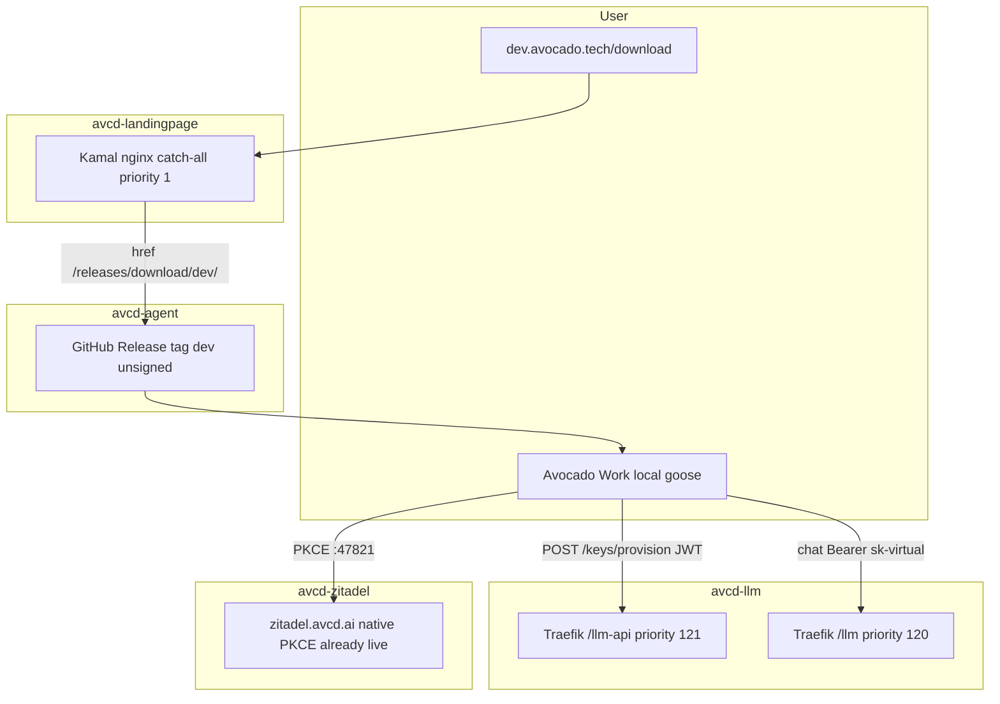

# Avocado Work DEV E2E (download, login, chat)

## 1. Problem Summary

A new user cannot complete Avocado Work on **DEV** today. `https://dev.avocado.tech/download` is not on landingpage `main` (page lives on `feature/avocado-work-distribution`). `Avocado-Technology/avcd-agent` has **zero GitHub Releases**. Avocado Sign-in + provider allowlist live only on local `feature/avocado-llm-provider`, not `origin`. Hosted `https://dev.avocado.tech/llm` and `/llm-api` currently serve the landing SPA (POST provision → nginx **405**). `Avocado-Technology/avcd-llm` **does not exist** on GitHub, so the Kamal workflow has never run.

This plan does **not** re-implement OAuth. It consumes existing feature work and adds the AVCD CI/CD ship path so DEV works: download from the website, unsigned installer from tag `dev`, Zitadel login, billed chat on avcd-llm.

**Success (hard):** `GET https://dev.avocado.tech/download` is 200; the three installer links contain `/releases/download/dev/`; those GitHub assets exist; `GET /llm/health/liveliness` and `GET /llm-api/health` are 200 JSON (not HTML); `POST /llm-api/keys/provision` with a junk Bearer returns **401 JSON** (not 405); a user with `agent-access` can install the `dev` DMG/EXE, Sign in with Avocado, and receive a model reply.

**Out of scope:** prod `avocado.tech`, Apple/Azure signing, `stable` tag, native auto-update, hosted goose gateway, terraform apply, payments UI.

**Executor Capability Target:** Mid-tier model. Codebase familiarity: none (fresh agent per phase). Depth: contracts, pitfalls, and tests explicit; no line-level copy-paste. Human owns GitHub repo creation, environment vars, and `gh workflow run`.

## 2. Goals, Non-Goals, Scope Fence

Goals:
- AC-1: Unsigned workflow `publish-desktop-dev.yml` in avcd-agent publishes GitHub Release tag `dev` (`allowUpdates: true`, `signing: false`) with exactly `Avocado Work.dmg`, `Avocado Work_intel_mac.dmg`, `Avocado Work-Setup-x64.exe`.
- AC-2: Landingpage DEV image bakes `NEXT_PUBLIC_DESKTOP_RELEASE_TAG=dev` (owner `Avocado-Technology`, repo `avcd-agent`, signed false). `/download` links use `/releases/download/dev/`.
- AC-3: `deploy-dev.yml` smoke includes `GET /download` → 200 and HTML/JS containing `/releases/download/dev/`.
- AC-4: avcd-llm `deploy-digitalocean-dev.yml` verifies `GET /llm/health/liveliness` **and** `GET /llm-api/health` → 200, and `POST /llm-api/keys/provision` with `Authorization: Bearer probe` → **401** (not 405). Repeat the POST check 10/10.
- AC-5: Packaged avocado provider still defaults to `https://dev.avocado.tech/llm` and `https://dev.avocado.tech/llm-api/keys/provision` (already on `feature/avocado-llm-provider`).
- AC-6: Zitadel native app (`385574574122598405`, redirect `http://127.0.0.1:47821/callback`, role `agent-access`) stays as-is; this plan does not apply Terraform.
- AC-7: No Makefile `deploy-*` targets. Ship is GitHub Actions only, matching other AVCD apps.
- AC-LIVE (human Phase Ship): one real download → Sign in → chat on DEV.

Non-Goals: prod landing deploy; signed `stable`; enabling `canary.yml`; `ENABLE_MAC_NATIVE_AUTO_UPDATE`; Linux/CUDA installers; creating a second Zitadel tenant; wrapping goose in a gateway; Infisical Makefile on landingpage.

Allowed write files (relative to FIW worktrees):
- `avcd-agent/.github/workflows/publish-desktop-dev.yml` (new)
- `avcd-agent/scripts/verify-release-assets.sh` (extend for tag `dev` / unsigned guards)
- `avcd-agent/.cursor/plans/avocado-work-dev-e2e.plan.md`
- `avcd-landingpage/Dockerfile`
- `avcd-landingpage/config/deploy.yml`
- `avcd-landingpage/scripts/ci/preprocess-deploy.sh`
- `avcd-landingpage/.github/workflows/deploy-dev.yml`
- `avcd-landingpage/lib/desktop-download.ts` (only if tests need a helper; defaults stay)
- `avcd-landingpage/tests/unit/desktop-download.test.ts`
- `avcd-landingpage/tests/e2e/download.e2e.spec.ts` (assert configured tag, not hardcoded `stable` only)
- `avcd-landingpage/.env.example` (document DEV tag)
- `avcd-llm/.github/workflows/deploy-digitalocean-dev.yml`
- `avcd-llm/scripts/ci/verify-dev-routes.sh` (new; used by workflow smoke)
- `avcd-zitadel/.github/workflows/terraform-apply-prod.yml` (optional: add `avcd-agent-targets.sh` to failure fallback only)

Read-only: `crates/goose/src/providers/avocado.rs`, `avocado_auth.rs`, `ui/desktop/src/updates.ts`, onboarding, `avcd-llm/src/**` provision handlers, `terraform/avcd_agent_oauth.tf`, landing `app/download/page.tsx` (already implemented on `feature/avocado-work-distribution`).

Banned: `kamal deploy` / `terraform apply` / `pulumi up` from a laptop; Apple/Azure signing secrets; changing PKCE port 47821; pointing packaged app at prod LLM; merging to `main` / push / PR during implementation phases; weakening RED tests; `GOOSE_PROVIDER_ALLOWLIST=*` in release builds.

Anti-gaming: tests read-only after RED; do not hard-code a fake `dev` release in the landing page (must be env-baked); do not stub Traefik by making the smoke accept HTML 200; provision smoke must require JSON `invalid_token` / 401.

## 2.5 Feature Isolation Workspace

- **isolation-mode:** join-existing
- **teardown-mode:** shared
- **feature-slug:** `avocado-llm-provider`
- **FIW root:** `~/Documents/avcd-features/avocado-llm-provider/`
- **feature branch:** `feature/avocado-llm-provider` (same slug on every repo)
- **related-plans:** [avocado-provider-oauth.plan.md](.cursor/plans/avocado-provider-oauth.plan.md) (OAuth done on agent FIW); landingpage `feature/avocado-work-distribution` (`/download`); zitadel `feature/zitadel-desktop-login` (native PKCE already applied locally)
- **overlap-discovery:** scanned `~/Documents/avcd-features` (avocado-llm-provider, landing-page-oidc, plane-selfhost, avcd-agent-rebrand); user chose **join avocado-llm-provider** and **unsigned tag `dev`**

| Repo | Primary during exec | Worktree |
|------|---------------------|----------|
| avcd-agent | `~/Documents/avcd/avcd-agent` (main, read-only) | FIW `avcd-agent` already exists |
| avcd-llm | `~/Documents/avcd/avcd-llm` (main, read-only) | FIW `avcd-llm` already exists |
| avcd-landingpage | `~/Documents/avcd/avcd-landingpage` | **add** FIW worktree, new branch from `feature/avocado-work-distribution` |
| avcd-zitadel | `~/Documents/avcd/avcd-zitadel` | **add** FIW worktree, new branch from `feature/zitadel-desktop-login` |

**Bootstrap (Phase -1):** do not recreate the FIW folder. Reuse agent + llm worktrees. For landingpage and zitadel, `git worktree add -b feature/avocado-llm-provider <FIW>/<repo> <existing-feature-tip>` so `/download` and agent OAuth Terraform come along. Then `move_agent_to_root` to the FIW.

**Teardown:** promote each primary to `feature/avocado-llm-provider`. **Do not** delete the shared FIW. **No** push / PR / merge / deploy.

## 3. E2E Test Definition

Discovery: landingpage `tests/e2e/download.e2e.spec.ts` hardcodes `stable` and is not on `main`. avcd-llm unit tests cover provision 401/403/502 locally, not live Traefik. avcd-agent has no `dev` release workflow. No test covers the three-repo DEV journey.

**E2E-1 (binding, automated, per repo — Phase 0 RED):**

- avcd-agent: `scripts/verify-release-assets.sh --dev-channel` (or equivalent) fails until `publish-desktop-dev.yml` exists, `signing: false`, tag `dev`, and the three website filenames appear in the upload glob. Must fail if `github.repository == 'aaif-goose/goose'` guard is copied from canary (this fork must run). Must fail if CUDA/linux jobs are required (DEV is mac arm64 + mac x64 + win x64 only).
- avcd-landingpage: unit `GivenTagDev_WhenDownloadUrl_ThenPathContainsDev` (covers AC-2). A small script or test greps `Dockerfile` + `config/deploy.yml` + `preprocess-deploy.sh` for `NEXT_PUBLIC_DESKTOP_RELEASE_TAG`. `download.e2e.spec.ts` must use `getDesktopReleaseConfig()` so a baked `dev` tag still passes; default-without-env remains `stable`.
- avcd-llm: test or script greps `deploy-digitalocean-dev.yml` for `/llm-api/health` and `keys/provision` 401. Fail until those strings exist.

**E2E-2 (live, human Phase Ship — not agent-executed):**

1. `curl -sf https://dev.avocado.tech/llm/health/liveliness`
2. `curl -sf https://dev.avocado.tech/llm-api/health`
3. `POST https://dev.avocado.tech/llm-api/keys/provision` + `Bearer probe` → 401 JSON, 10 consecutive runs
4. Open `https://dev.avocado.tech/download`, click Apple Silicon, get a real DMG from tag `dev`
5. Install, Sign in with an `agent-access` Google user, send “Reply with exactly: OK”, get a reply

Status: E2E-1 FAILING until phases 1–3. E2E-2 FAILING until Phase Ship.

## 3.5 UI Mock Canvas

**Applies:** No. This plan does not create or restyle UI. `/download` already exists on `feature/avocado-work-distribution` (`app/download/page.tsx`). DEV vs prod is the baked `NEXT_PUBLIC_DESKTOP_RELEASE_TAG`. Unsigned caveat already renders when `NEXT_PUBLIC_RELEASE_SIGNED` is not `true`.

## 4. Architecture

**Constitution:** [AGENTS.md](AGENTS.md); AVCD Makefile-over-scripts for local only; **CI/CD-only deploy** (no `make deploy`, no local Kamal); custom-distro skill (GitHub Releases, not Kamal, for the desktop app); avocado-provider-oauth locked: local goose, Zitadel PKCE in the provider, chat uses LiteLLM virtual key not JWT.

**Locked decisions (do not reopen):**
- Three repos stay separate. Landing does not host binaries. Agent does not Kamal. LLM does not know about Electron.
- DEV download tag is **`dev`**, unsigned, overwritten each DEV publish (user choice). Prod later uses `stable` + signing (out of scope).
- Packaged app LLM URLs stay `dev.avocado.tech` (correct for this goal).
- Zitadel is already live on `zitadel.avcd.ai` (client `385574574122598405`, project `385574573904494597`). No second IdP.
- Landing Traefik catch-all **priority 1** must stay. LLM routers 120/121 must actually be registered or `/llm` keeps hitting nginx.

**Design:**

1. **avcd-llm first on the wire.** Same pattern as other AVCD services: `.github/workflows/deploy-digitalocean-dev.yml` + Kamal + Infisical `/llm` + GitHub Environment `development`. After Kamal, add an explicit smoke step (do not rely only on `verify_url=/llm/...`) because `/llm-api` is a separate Traefik router on a URL backend (`http://avcd-llm-api:3000`). If that router is missing, `/llm-api` is swallowed by `PathPrefix(/llm)` or the landing catch-all.

2. **avcd-agent unsigned DEV channel.** New workflow calling existing `bundle-macos.yml` / `bundle-windows.yml` with `signing: false`, `package_desktop: true`, no CUDA. Publish with `ncipollo/release-action` `tag: dev`, `prerelease: true`, `allowUpdates: true`. Trigger: `workflow_dispatch` (required for first cut from the feature branch) and optional `push` to `main` after merge. Do not use `canary.yml` (still gated to `aaif-goose/goose`).

3. **avcd-landingpage bake tag at image build.** Static export: env must be Docker `ARG`/`ENV` like the existing Zitadel/GraphQL args. `preprocess-deploy.sh` substitutes `__DESKTOP_RELEASE_TAG__` etc. from GitHub Environment **vars** (public). `development` vars: tag `dev`, signed `false`. `production` later: tag `stable` (not this plan). Smoke `/download`.

4. **Human GitHub repo for avcd-llm.** Local git has no `origin`. Phase Ship creates `Avocado-Technology/avcd-llm` (private), sets Environment `development` vars (`DO_DEPLOY_HOST`, `DO_PUBLIC_HOST=dev.avocado.tech`, `ZITADEL_PROJECT_ID=385574573904494597`, Infisical OIDC + `INFISICAL_PROJECT_ID`), Infisical `/llm` secrets (`LITELLM_MASTER_KEY`, `OPENROUTER_API_KEY`, `DATABASE_URL`, `POSTGRES_PASSWORD`), then `gh workflow run deploy-digitalocean-dev.yml -f kamal_command=setup` then `deploy`.

**I/O contracts:**

Landing download URL:
`https://github.com/Avocado-Technology/avcd-agent/releases/download/dev/Avocado%20Work.dmg` (and intel / Setup.exe).

Provision (unchanged):
`POST https://dev.avocado.tech/llm-api/keys/provision` + `Authorization: Bearer <zitadel JWT>` → 200 `{apiKey, baseUrl, userId, expiresAt}` or 401/403/502 as in `avcd-llm/src/index.ts`.

Chat: `https://dev.avocado.tech/llm/v1/chat/completions` + `Authorization: Bearer sk-...`.

**Pitfalls:**
- First avcd-llm deploy is `setup` then `deploy`; `setup` is the greenfield Kamal bootstrap.
- Landing `/download` on current live DEV is SPA fallback 200 to the homepage — smoke must assert the heading or the `dev` release path, not merely HTTP 200.
- `release.yml` still signs on `v1.*` tags — do not tag `v1.*` in this plan.
- Do not bind port 47821 in Electron; provider OAuth owns it.
- `PathPrefix(/llm)` matches `/llm-api`; API router priority **must** stay 121 and the accessory must be on `avcd_edge`.
- Cross-repo filename drift: website `FILENAMES` in [lib/desktop-download.ts](../avcd-landingpage/lib/desktop-download.ts) must match the ncipollo artifact glob.

Produces outputs consumed elsewhere: GitHub Release `dev` (consumed by landingpage); Traefik `/llm` + `/llm-api` (consumed by packaged avocado provider). Landingpage produces no binaries.

## 5. Phased Implementation

### Phase -1 — Join FIW — Complexity: N/A

Reuse `~/Documents/avcd-features/avocado-llm-provider/`. Add landingpage + zitadel worktrees on `feature/avocado-llm-provider` from the existing feature tips. Copy this plan to `avcd-agent/.cursor/plans/avocado-work-dev-e2e.plan.md`. Move agent root to FIW. Gate: `git -C <FIW>/avcd-agent branch --show-current` is `feature/avocado-llm-provider`; landingpage worktree contains `app/download/page.tsx`.

### Phase 0 — E2E-1 RED — Complexity: N/A

Write the three failing contract checks in Section 3. Gate: they fail for missing workflow / missing ARG / missing llm-api smoke, not syntax errors.

### Phase 1 — avcd-llm deploy smoke — Complexity: Easiest

**Why first:** hosted provision is the runtime blocker (405). **Depends on:** Phase 0.

RED: grep-test fails. GREEN: extend [deploy-digitalocean-dev.yml](../avcd-llm/.github/workflows/deploy-digitalocean-dev.yml) after Kamal with `scripts/ci/verify-dev-routes.sh` against `https://${DO_PUBLIC_HOST}`: liveliness 200, `/llm-api/health` 200, POST provision 401 JSON. Do not change provision application code. COMPILE: workflow YAML parses (`actionlint` if present, else `python -c 'import yaml'`). Gate: contract test green. Still no live deploy.

### Phase 2 — landingpage bake `dev` tag — Complexity: Easy

**Depends on:** Phase 0. Branch already has `/download`.

RED: Dockerfile grep fails. GREEN: add ARGs `NEXT_PUBLIC_DESKTOP_RELEASE_OWNER/REPO/TAG/RELEASE_SIGNED` to [Dockerfile](../avcd-landingpage/Dockerfile) builder; placeholders in [config/deploy.yml](../avcd-landingpage/config/deploy.yml) `builder.args`; substitute in [preprocess-deploy.sh](../avcd-landingpage/scripts/ci/preprocess-deploy.sh); require the four vars in `deploy-dev.yml` verify step; smoke `GET /download` and assert `/releases/download/dev/` (DEV env). Unit test for `downloadUrl` with tag `dev`. Update e2e to use `getDesktopReleaseConfig()` so it does not hardcode `stable` as the only legal tag. COMPILE: `make check` in landingpage FIW. Gate: unit + e2e + typecheck green.

### Phase 3 — unsigned `dev` desktop publish — Complexity: Medium

**Depends on:** Phase 0. Must run on the agent FIW that already has Avocado branding + avocado provider.

RED: `--dev-channel` verifier fails. GREEN: add `.github/workflows/publish-desktop-dev.yml` that `uses` bundle-macos (arm64 + x64) and bundle-windows with `signing: false`, `package_desktop: true`, no CUDA; `contents: write` job downloads artifacts and publishes tag `dev`. Set `GITHUB_OWNER=Avocado-Technology`, `GITHUB_REPO=avcd-agent`, `GOOSE_BUNDLE_NAME=Avocado Work` like the feature `release.yml`. Guard: this workflow **must** run for `Avocado-Technology/avcd-agent` (opposite of canary). COMPILE: `make check-ui` / `make check-core` if those targets exist on the feature Makefile; otherwise `pnpm --dir ui/desktop run typecheck`. Gate: verifier green.

### Phase 4 — zitadel branch only — Complexity: Easy

**Depends on:** Phase -1. No apply. Confirm `terraform/avcd_agent_oauth.tf` is on the FIW branch. Optional: add `scripts/terraform/avcd-agent-targets.sh` to the apply-prod failure fallback list. Gate: `git grep avcd_agent_oauth` in the zitadel worktree is non-empty. Document: tester Google user must already be in `avcd_agent_allowed_users` (currently `genarionogueira2@gmail.com` is committed).

### Phase 5 — E2E-1 green + compile — Complexity: More Complex

Re-run all Phase 0 tests; `git diff --stat` inside each FIW worktree matches the fence. No live curls required.

### Phase Teardown — Complexity: N/A

Shared FIW stays. Switch primaries to `feature/avocado-llm-provider`. Move agent root back. **STOP. No push/PR/deploy.**

### Phase Ship — human, after validation — Complexity: Most Complex

Not executed by the implementing agent. Order is load-bearing:

1. Create `Avocado-Technology/avcd-llm` (private) and `git remote add origin`; push `feature/avocado-llm-provider` then PR/merge to `main` (or dispatch from the feature ref if the workflow is on that ref).
2. Fill GitHub Environment `development` + Infisical `/llm`.
3. `gh workflow run deploy-digitalocean-dev.yml -R Avocado-Technology/avcd-llm -f kamal_command=setup` then `deploy`. Watch with `gh run watch`. Confirm E2E-2 steps 1–3 (401 10/10).
4. Push avcd-agent feature; `gh workflow run publish-desktop-dev.yml -R Avocado-Technology/avcd-agent`. Confirm `gh release view dev` has the three assets.
5. Set landingpage GitHub `development` vars (`NEXT_PUBLIC_DESKTOP_RELEASE_TAG=dev`, signed false). Merge landingpage feature to `main` (path filter fires `deploy-dev.yml`) or `gh workflow run deploy-dev.yml`. Confirm `/download` links.
6. Manual install + Sign in + chat.

Rollback: point landing tag back or `gh release delete dev`; Kamal rollback is a new `workflow_dispatch` of a previous llm SHA — do not SSH the droplet.

## 5.5 Parallel Agent Execution

**Parallel execution:** Yes — after Phase -1 and Phase 0 on trunk, Wave 2 runs three file-disjoint lanes (different git repos).

- Wave 1 (orchestrator): Phase -1, Phase 0
- Wave 2 concurrent: lane-llm (Phase 1), lane-landing (Phase 2), lane-agent (Phase 3), lane-zitadel (Phase 4)
- Wave 3 (orchestrator): Phase 5, Teardown

File ownership is the whole repo per lane. Manifest owner: none shared (no lockfile edits expected). Frozen seam: installer filenames + tag `dev` + provision URL — declared in Section 4; no lane may rename assets. Orchestrator merges nothing across repos (separate remotes). Degradation: if only one agent, run Phase 1 → 2 → 3 → 4 sequentially.

## 6. TDD Test Plan

Naming: `Given[State]_When[Action]_Then[Result]`.

- GivenEnvTagDev_WhenDownloadUrl_ThenContainsReleasesDownloadDev
- GivenDefaultEnv_WhenDownloadUrl_ThenTagStable (prod default unchanged)
- GivenOwnerAaifGoose_WhenDownloadUrl_ThenThrows
- GivenMissingDesktopReleaseTagArg_WhenGrepDockerfile_ThenFail (Phase 0 RED)
- GivenPublishDesktopDevYml_WhenVerifyDevChannel_ThenUnsignedAndTagDev
- GivenCanaryStyleRepoGuard_WhenVerifyDevChannel_ThenFail
- GivenDeployLlmYml_WhenGrep_ThenLlmApiHealthAndProvision401
- GivenProvisionProbe_WhenLiveShip_Then401TenOfTen (Phase Ship only)

Mutation gate: `signing: true` in publish-desktop-dev → verifier fails; tag `stable` in DEV landing vars → deploy smoke fails; provision smoke accepting 405 → AC-4 fails; `/download` smoke only checking HTTP 200 → homepage fallback would pass (must assert `dev` path or heading).

Subjective terms: “working in DEV” = E2E-2 checklist all pass. “Unsigned” = `signing: false` and no `environment: signing`.

## 7. Risk Register

- avcd-llm GitHub repo missing (High): Phase Ship `gh repo create`; blocks live LLM. Mitigation: code phases still complete in FIW.
- Traefik `/llm-api` not registered (High): 405 remains. Mitigation: AC-4 401 JSON smoke; accessory reboot already in workflow.
- Landing `/download` 200 but homepage (Med): smoke asserts release path.
- Filename drift (Med): verifier + landing unit test share the three names.
- `agent-access` missing for tester (Med): 403 after Sign in. Mitigation: AC-6 allowlist; do not terraform-apply from this plan — human adds user via existing zitadel PR if needed.
- Unsigned macOS Gatekeeper (Low): page already shows unsigned-beta copy; acceptable for DEV.
- Accidental `v1.*` tag (Med): banned in this plan; would demand signing secrets and fail.
- Shared FIW deleted (Med): teardown-mode shared.
- Accidental push during exec (Low): teardown forbids it.
- Parallel lane edits wrong repo (Low): one repo per lane.

## 8. Definition of Done + Evidence Map

- E2E-1 green in each FIW worktree
- `git diff --stat` matches fence
- Tests only added, not weakened
- Teardown: primaries on `feature/avocado-llm-provider`; FIW kept; no push/PR/deploy
- Independent verification: fresh agent re-runs E2E-1; Phase Ship is a separate human request
- AC-LIVE is **INCOMPLETE** until Phase Ship — do not claim DEV works from FIW tests alone

| AC | Evidence |
|----|----------|
| AC-1 | `scripts/verify-release-assets.sh --dev-channel` |
| AC-2 | `desktop-download.test.ts` tag=dev; Dockerfile ARG grep |
| AC-3 | `deploy-dev.yml` smoke snippet + Playwright using config helper |
| AC-4 | `verify-dev-routes.sh` in llm workflow; 10x POST 401 at Ship |
| AC-5 | read-only: `AVOCADO_DEFAULT_HOST` / `DEFAULT_PROVISION_URL` unchanged |
| AC-6 | no terraform apply in `git log`; tf file present |
| AC-7 | no new `deploy-*` Makefile target |
| AC-LIVE | Phase Ship checklist |

## 9. PIRS

| Dimension | Rating | Points |
|-----------|--------|--------|
| 1 Goal Clarity | PASS | 10 |
| 2 Task Atomicity | PASS | 9 |
| 3 Test Coverage | PASS | 9 |
| 4 Test Quality | PASS | 8 |
| 5 Architecture | PASS (no new UI; canvas skipped with justification) | 9 |
| 6 Sequencing | PASS (llm smoke → landing bake → desktop publish; live ship last) | 8 |
| 7 Context | PASS | 7 |
| 8 Risk | PASS | 7 |
| 9 DoD | PASS (AC-LIVE explicitly human) | 7 |
| 10 Scope Fence | WARN (join-existing / shared FIW; user-approved) | 4 |
| 11 Evidence | PASS | 10 |
| 12 Executor Fit | PASS | 8 |
| **Total** | | **96 with WARN → 92 / 100** |

**Band:** Excellent. **Agent Safety:** AGENT-SAFE for code phases; live DEV requires human Phase Ship (repo + secrets + workflow_dispatch).

**Plan review (my-plan-review):** APPROVED WITH CONDITIONS — (1) do not treat FIW-green as “DEV works”; (2) create `Avocado-Technology/avcd-llm` before any llm workflow_dispatch; (3) never terraform-apply or Kamal from a laptop; (4) first desktop publish must be `workflow_dispatch` on `feature/avocado-llm-provider` because the workflow will not exist on `origin/main` until pushed.