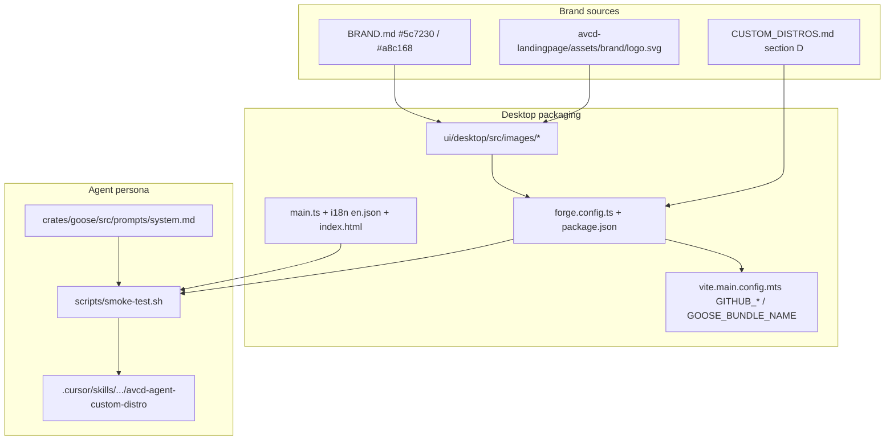

# Avocado Work Full Brand Replacement



## 1. Problem Summary

The fork still ships as **AVCD Agent** (name, menus, Electron bundle, icons, system persona, smoke checks). Product intent is a full white-label as **Avocado Work**, with the same avocado mark used on [avocado.tech](https://avocado.tech) / [`avcd-landingpage/assets/brand/logo.svg`](../../avcd-landingpage/assets/brand/logo.svg).

Success = a local package and running desktop show **Avocado Work** (not AVCD Agent / Goose), dock/app icon is the landing avocado mark, `make test-smoke` + `make validate-openrouter` pass, and the in-repo custom-distro skill documents the new identity.

Out of scope: renaming the GitHub repo; renaming Docker Compose project/service names; Infisical project ID changes; deploying releases; rewriting every locale file by hand (English source + `make sync-i18n` only); changing OpenRouter catalog content.

```
Executor Capability Target: Mid-tier model
Codebase familiarity assumed: Some — has read CUSTOM_DISTROS §D and .cursor/skills/architecture/avcd-agent-custom-distro
Plan depth rationale: Many string touchpoints + icon pipeline; contracts, identity table, smoke gates, and pitfalls explicit — not brittle line-by-line copy for every i18n key.
```

## 2. Goals, Non-Goals & Scope Fence

**Goals**
- [ ] G1 — Display / product name is **Avocado Work** in Forge, `package.json` `productName`, `index.html`, menus, About, smoke assertions
- [ ] G2 — Executable / protocol / Linux package bin is **`avocado-work`** (scheme `avocado-work`)
- [ ] G3 — App icons (`icon.svg` → png/ico/icns + tray templates) derived from landing `logo.svg` / `logo-dark.svg` brand colors
- [ ] G4 — System prompt persona says Avocado Work + Avocado Technology (goose/AAIF attribution kept)
- [ ] G5 — Updater Vite defaults + Forge publisher stay `Avocado-Technology` / `avcd-agent`; `GOOSE_BUNDLE_NAME` default **`Avocado Work`**
- [ ] G6 — Living skill + smoke-test updated to Avocado Work identity
- [ ] G7 — OpenRouter preset still validates (`make validate-openrouter`)

**Non-Goals**
- GitHub repo rename away from `avcd-agent`
- Docker image/container rename (`avcd-agent-dev`, compose project)
- Production notarized release / push / PR / deploy
- Full manual translation of all locale JSON files
- UI chrome redesign beyond name + icons (no new design system)

**Locked identity**

| Concern | Value |
|---------|--------|
| Display name | `Avocado Work` |
| Executable | `avocado-work` |
| Protocol | `avocado-work` / `AvocadoWorkProtocol` |
| Bundle / `GOOSE_BUNDLE_NAME` | `Avocado Work` |
| GitHub publisher | `Avocado-Technology` / `avcd-agent` |
| Logo source | `~/Documents/avcd/avcd-landingpage/assets/brand/logo.svg` (+ `logo-dark.svg` for light/tray as needed) |
| Brand fill | `#5c7230` (light), `#a8c168` (dark) |
| Dev secret string | keep `avcd-agent-local-development-key` (infra continuity) |

**Scope fence — allowed writes (FIW worktree only)**
- `ui/desktop/forge.config.ts`
- `ui/desktop/package.json`
- `ui/desktop/index.html`
- `ui/desktop/forge.deb.desktop`, `ui/desktop/forge.rpm.desktop`
- `ui/desktop/vite.main.config.mts`
- `ui/desktop/src/app-update.yml`
- `ui/desktop/src/main.ts`
- `ui/desktop/src/i18n/messages/en.json` (+ generated locale outputs from `make sync-i18n` only)
- `ui/desktop/src/images/**` (icons, glyph, templates; loading assets if still goose-branded)
- `ui/desktop/src/images/prepare.sh` (if needed for mark-on-canvas)
- `crates/goose/src/prompts/system.md`
- `scripts/smoke-test.sh`
- `Makefile` (help text / package-ui name strings that hardcode AVCD Agent)
- `README.md`
- `NOTICE` (product name line only; keep Apache attribution)
- `.cursor/skills/architecture/avcd-agent-custom-distro/**`
- `.cursor/plans/avocado-work-rebrand.plan.md`
- Plan-authoring canvas: `~/.cursor/projects/*/canvases/avocado-work-rebrand-mock.canvas.tsx`

**Read-only**
- `CUSTOM_DISTROS.md`, `LICENSE`
- `~/Documents/avcd/avcd-landingpage/assets/brand/**` (copy from, do not modify)
- OpenRouter catalog / compose provider wiring (unless a string literally says AVCD Agent)
- Primary checkout outside FIW after Phase -1

**Banned**
- Unrelated refactors; new npm/cargo deps unless ImageMagick/`iconutil` already assumed by `prepare.sh`
- Weakening/deleting tests; hard-coding smoke to pass without real metadata
- Editing primary `~/Documents/avcd/avcd-agent` once FIW exists
- Push / PR / deploy in teardown

## 2.5 Feature Isolation Workspace

**isolation-mode:** join-existing  
**teardown-mode:** exclusive (this plan finishes the product rename on that branch)  
**feature-slug:** `avcd-agent-rebrand`  
**FIW root:** `~/Documents/avcd-features/avcd-agent-rebrand/`  
**base branch:** `main` (worktree attaches existing `feature/avcd-agent-rebrand`)  
**feature branch:** `feature/avcd-agent-rebrand`  
**related-plan(s):** [openrouter-provider-preset.plan.md](avcd-agent/.cursor/plans/openrouter-provider-preset.plan.md)  
**overlap-discovery:** Active branch `feature/avcd-agent-rebrand` with OpenRouter/skill WIP; no FIW folder yet; user directed to write plan → join existing rebrand branch

| Repo | Primary (read-only during exec) | Worktree (writable) |
|------|----------------------------------|---------------------|
| avcd-agent | `~/Documents/avcd/avcd-agent` | `~/Documents/avcd-features/avcd-agent-rebrand/avcd-agent` |

**Bootstrap:** create FIW worktree on existing branch (carry uncommitted work carefully — commit or stash on primary before `worktree add`, or `worktree add` then re-apply). Prefer: commit WIP on primary only if user asks; else stash → worktree → stash pop in FIW.  
**Teardown:** clean worktree → `worktree remove` → `git -C primary switch feature/avcd-agent-rebrand` → delete FIW → **STOP** (no push/PR/deploy).

## 3. E2E Test Definition

**Discovery:** [`scripts/smoke-test.sh`](avcd-agent/scripts/smoke-test.sh) is the packaging/branding E2E gate (9 checks). Desktop Playwright e2e exists but is secondary; branding acceptance is smoke + icon/file assertions.

**Spec (update existing smoke — tests are the contract; do not delete checks)**

File: `scripts/smoke-test.sh` (and any tiny helper under `scripts/` only if needed for icon hash/path checks)

```
E2E: Avocado Work branding + local stack
1. server container running
2. ACP /status or /acp responds
3. CLI --version semantic
4. Bundle path contains Avocado Work.app (not AVCD Agent.app / Goose.app)
5. CFBundleName == Avocado Work; executable name not Goose / not AVCD
6. Updater/publisher not aaif-goose; Vite defaults mention Avocado Work bundle
7. PostHog upstream key absent
8. index.html title Avocado Work + system.md "called Avocado Work"
9. LICENSE/NOTICE attribution present
Plus: ui/desktop/src/images/icon.svg contains landing path geometry or brand fill #5c7230
```

Initial state after Phase 0: smoke **FAIL** on AVCD Agent expectations until rename lands.

## 3.5 UI Mock Canvas

**Applies:** Yes — app icon, window title, About/menu product name, dock mark.

**Canvas (create in Phase -1 / plan authoring before Phase 1):**  
`~/.cursor/projects/Users-genarionogueira-Documents-avcd-api/canvases/avocado-work-rebrand-mock.canvas.tsx`

**States shown:**
- App window chrome titled **Avocado Work**
- Dock / app icon: avocado mark `#5c7230` with pit cutout (match landing SVG)
- About dialog label **About Avocado Work**
- Contrast: strikethrough “AVCD Agent” as retired name

**Reuse:** landing logo path geometry; Electron Forge icon pipeline (`prepare.sh`).

**User approval:** [ ] Layout/icon contract approved before Phase 2 icon generation commits as final

## 4. Architecture Overview

**Constitution**
- Prefer Makefile targets; CI/CD-only deploy
- Skills over root docs; update [avcd-agent-custom-distro](avcd-agent/.cursor/skills/architecture/avcd-agent-custom-distro/SKILL.md)
- Upstream [CUSTOM_DISTROS.md](avcd-agent/CUSTOM_DISTROS.md) §D order: assets → Forge → system prompt → UI copy → packaging/updater → checklist

**Decisions locked**
- Product string **Avocado Work** (title case); kebab `avocado-work` for bin/protocol
- Logo = copy/adapt landing SVG into `icon.svg` on a square canvas suitable for `prepare.sh` (mark centered on brand-appropriate background or transparent→macOS requirements); regenerate png/ico/icns via existing `prepare.sh` (ImageMagick + `iconutil`)
- Keep GitHub repo id `avcd-agent` for updater continuity
- Keep Docker/dev secret naming `avcd-agent-*` to avoid breaking local compose
- Electron `userData` will become `~/Library/Application Support/Avocado Work` — accept fresh local state (document in README)

**Pitfalls**
- `GOOSE_BUNDLE_NAME` must match Forge `name` / zip scripts or packaging breaks
- Protocol change invalidates old `avcd-agent://` deeplinks — intentional for full rebrand
- `make package-ui` Makefile hardcodes `AVCD Agent` today — must update
- Do not leave Vite defaults on Goose while Forge says Avocado Work
- Tray `glyph.svg` / templates must not remain goose silhouette

## 5. Phased Implementation

### Phase -1 — FIW bootstrap — Complexity: N/A

**Goal:** Isolated worktree on `feature/avcd-agent-rebrand` + mock canvas + agent root = FIW.  
**Depends on:** none.

- Preserve primary WIP (stash or user-approved commit)
- `mkdir -p ~/Documents/avcd-features/avcd-agent-rebrand`
- `git -C ~/Documents/avcd/avcd-agent worktree add …/avcd-agent feature/avcd-agent-rebrand` (or create branch attach)
- Restore WIP into FIW
- Create mock canvas file (visual contract)
- `move_agent_to_root` → FIW path
- Gate: `git -C FIW branch --show-current` → `feature/avcd-agent-rebrand`

### Phase 0 — RED: failing branding E2E — Complexity: Easy

**Goal:** Smoke/brand assertions expect Avocado Work and fail on current AVCD Agent.  
**Depends on:** Phase -1.

- Update `scripts/smoke-test.sh` expectations to Avocado Work (tests become the spec)
- Add assertion that `icon.svg` references brand green `#5c7230` or landing path snippet
- Run `make test-smoke` (or smoke script alone if package missing) → expect FAIL on name/title/persona
- Do **not** implement product rename yet
- Gate: documented failing checks; tests read-only thereafter except additive cases

### Phase 1 — Identity metadata strings — Complexity: Easy

**Goal:** All packaging metadata + titles say Avocado Work / avocado-work.  
**Depends on:** Phase 0.

**RED:** unit-less; rely on smoke + `rg` gate.  
**GREEN:** edit Forge, package.json, desktop templates, index.html, vite.main defaults (`GOOSE_BUNDLE_NAME`), app-update.yml comments if any, Makefile `package-ui` strings.  
**Compile:** `cd ui/desktop && pnpm exec tsc -p tsconfig.json --noEmit` or `make check-ui` subset if fast.  
**Gate:** `rg -n "AVCD Agent" ui/desktop/forge.config.ts ui/desktop/package.json ui/desktop/index.html Makefile` → no matches in those files.

### Phase 2 — Icons from landing logo — Complexity: Medium

**Goal:** Desktop icons are avocado mark.  
**Depends on:** Phase 1.

- Copy landing SVG into `icon.svg` / `glyph.svg` (adapt viewBox for 1024 app icon + 22px tray)
- Run `ui/desktop/src/images/prepare.sh` (requires ImageMagick + macOS `iconutil`)
- Replace light variants from `logo-dark.svg` where appropriate
- Gate: `file icon.icns icon.ico icon.png` exist; `rg '#5c7230' icon.svg`; smoke icon assertion path ready

### Phase 3 — Persona + UI copy — Complexity: Medium

**Goal:** System prompt + English UI strings + main process menus.  
**Depends on:** Phase 1.

- `crates/goose/src/prompts/system.md` → Avocado Work
- `ui/desktop/src/main.ts` menus/dialogs
- `en.json` product strings; `make sync-i18n`
- README + NOTICE product naming; skill identity table + checklists
- Gate: `rg "called Avocado Work" crates/goose/src/prompts/system.md`; `rg "AVCD Agent" ui/desktop/src/main.ts` → empty

### Phase 4 — Package + smoke GREEN — Complexity: More Complex

**Goal:** `make package-ui` produces `Avocado Work.app`; `make test-smoke` 9/9; OpenRouter still green.  
**Depends on:** Phases 2–3.

- `make package-ui` (Node 22 for packager if README requires)
- `make test-smoke` → all PASS
- `make validate-openrouter` → all PASS
- Compare UI to mock canvas (icon + title)
- Gate: hard stop until smoke 9/9

### Phase 5 — E2E validation — Complexity: Most Complex

**Goal:** Manual + scripted proof of journey.  
**Depends on:** Phase 4.

- `make dev` + `make dev-ui` (Terminal): window title Avocado Work, dock icon avocado mark, chat still works with OpenRouter
- Evidence: smoke log + screenshot/notes vs canvas
- Reliability: run `make test-smoke` twice (packaging critical) — 2/2 pass

### Phase Teardown — Complexity: N/A

- Clean FIW commits (only if user asked to commit)
- `worktree remove` → primary `switch feature/avcd-agent-rebrand` → delete FIW
- Move agent to primary
- **STOP** — no push/PR/deploy

## 5.5 Parallel Agent Execution

**Parallel execution:** No — single-agent sequential (tightly coupled branding files; one manifest owner would still serialize).

## 6. TDD Test Plan

| Test / check | AC | Phase |
|--------------|----|-------|
| Smoke: bundle `Avocado Work.app` | G1 | 0→4 |
| Smoke: CFBundleName Avocado Work | G1/G2 | 0→4 |
| Smoke: title + system persona | G1/G4 | 0→4 |
| Smoke: updater not aaif-goose; bundle name Avocado Work in vite defaults | G5 | 0→4 |
| Icon SVG brand fill / geometry | G3 | 0→2 |
| `make validate-openrouter` | G7 | 4 |
| `rg` no `AVCD Agent` in forge/package/index/main/system.md | G1/G4 | 1/3 |
| Mutation: if smoke still accepts `AVCD Agent`, suite fails | anti-gaming | 0 |

Anti-gaming: do not keep dual-accept AVCD Agent \| Avocado Work; do not stub bundle existence with empty dir named correctly without Forge metadata.

## 7. Risk Register

| Risk | L | I | Sev | Mitigation |
|------|---|---|-----|------------|
| ImageMagick/`iconutil` missing locally | Med | High | High | Document deps; fail Phase 2 clearly; commit generated binaries |
| Protocol rename breaks old deeplinks | Med | Med | Med | Intentional; note in README |
| userData path change loses local settings | High | Low | Med | Document; acceptable for rebrand |
| Uncommitted OpenRouter WIP lost in worktree move | Med | High | High | Stash/pop or commit before FIW |
| Partial string rename leaves AVCD Agent in menus | Med | Med | Med | `rg` gates + sync-i18n |
| Accidental push in teardown | Low | High | Med | Teardown bans push |

## 8. Definition of Done + Evidence Map

| # | AC | Evidence |
|---|----|----------|
| AC-1 | G1 display name | smoke CFBundleName + index title |
| AC-2 | G2 executable/protocol | forge executableName + protocols schemes |
| AC-3 | G3 logo | icon.svg brand + icns/ico present; canvas match |
| AC-4 | G4 persona | system.md grep |
| AC-5 | G5 updater/bundle | vite.main defaults + smoke updater check |
| AC-6 | G6 skill/smoke docs | skill identity table updated |
| AC-7 | G7 OpenRouter | `make validate-openrouter` PASS |
| AC-UI | Canvas match | user/compare dock + title |

Self-audit: re-run smoke + validate-openrouter; `git diff --stat` inside FIW only; no test deletions; teardown without push.

Independent verification: fresh agent or my-plan-review pass after implementation; any AC miss = FAIL.

## 9. PIRS (planner self-score)

| Dimension | Rating | Pts |
|-----------|--------|-----|
| 1 Goal Clarity | PASS | 10 |
| 2 Task Atomicity | PASS | 9 |
| 3 Test Coverage | PASS | 9 |
| 4 Test Quality | PASS | 8 |
| 5 Architecture | PASS | 9 |
| 6 Sequencing | PASS | 8 |
| 7 Context | PASS | 7 |
| 8 Risk | PASS | 7 |
| 9 DoD | PASS | 7 |
| 10 Scope Fence + FIW | PASS | 8 |
| 11 Evidence | PASS | 10 |
| 12 Executor Fit | PASS | 8 |
| **Total** | | **100** |

**Band:** Excellent — AGENT-SAFE (sequential). Floor: none. Canvas must exist before Phase 1 GREEN.

---

## Plan Review (my-plan-review)

### Overall Verdict
**APPROVED WITH CONDITIONS** — Ready for sequential execution after FIW bootstrap and mock canvas creation; do not start Phase 1 until canvas exists and smoke RED is committed.

### Plan Readiness Score

| Dimension | Rating | Points |
|-----------|--------|--------|
| 1. Goal Clarity, Scope Fence & Executor Fit | PASS | 15 |
| 2. Technical Feasibility | PASS | 15 |
| 3. Architecture, Design & Context Discipline | WARN | 8 |
| 4. Dependency & Sequencing | PASS | 15 |
| 5. Risk Coverage | — | 8 |
| 6. Test Strategy & Anti-Gaming | PASS | 15 |
| 7. Completeness, Operability & Evidence | PASS | 15 |
| **Total** | | **91 / 100** |

**Band:** Excellent — APPROVED WITH CONDITIONS  
**Parallel execution:** N-A — single-agent plan

**Conditions before Phase 1**
1. Create FIW and mock canvas (Phase -1)
2. Safely move OpenRouter/skill WIP into FIW (stash/pop) so nothing is lost
3. Confirm ImageMagick + `iconutil` available before Phase 2

**Risk deductions:** WIP loss (High −2), icon tooling (Med −0 already mitigated in phases)

**Recommended improvements (non-blocking)**
- Optional: add `scripts/check-branding.sh` wrapping the `rg` gates for faster RED loops
- Optional later: migrate old `AVCD Agent` userData — out of scope here
