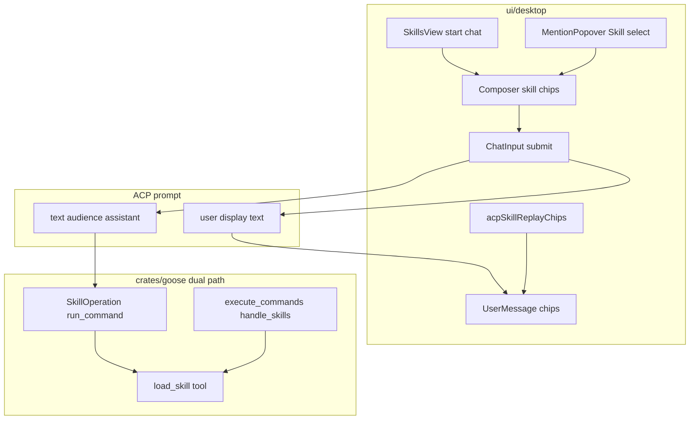

# Multi-Skill Composer (PR #8881 on ui/desktop)



## 1. Problem Summary

Users cannot attach multiple skills to one Avocado Work chat message. Upstream [PR #8881](https://github.com/aaif-goose/goose/pull/8881) solved this in **goose2** (skill chips, slash→chip, Skills→chat, assistant-only skill prompt + visible chips, voice/replay). goose2 was later deleted; **`ui/desktop` never got the port**. CLI already supports `/skills a b` via a `load_skill` nudge; ACP/desktop `/skills` only lists and ignores params.

**Building:** Port #8881 contracts into `ui/desktop` (not resurrect goose2), and wire ACP backend dual-path (`GOOSE_STATE_MACHINE` + legacy) so `/skills a b` matches CLI. Skill chips send assistant-only instruction text (ACP `annotations.audience: ["assistant"]`) plus user-visible chip metadata.

**Success:** User can select multiple skills (popover and/or Skills view), see chips in composer, send a request, see chips on the user bubble (not the raw instruction), reload session and still see chips, use voice auto-submit with chips, and type `/skills a b` to load multiple skills through ACP.

**Out of scope:** Resurrecting `ui/goose2`; changing skill discovery paths; “Add Skill” install marketplace; eager multi-SKILL.md expand into context (use progressive `load_skill`); push/PR/deploy; rebrand work itself.

```
Executor Capability Target: Mid-tier model
Codebase familiarity assumed: Some — has read AGENTS.md dual-path note + ChatInput/ACP prompt path
Plan depth rationale: Large UI+backend seam; contracts and tests are the binding spec; port helpers from commit 69efb796a, do not invent a new protocol
```

## 2. Goals, Non-Goals & Scope Fence

**Goals**
- G1 — Composer holds 0..N selected skill chips; remove per chip; chips clear after successful send
- G2 — Slash autocomplete selecting a Skill adds a chip (does not only insert `/name` text)
- G3 — Typing `/skillname task` (or colon-qualified plugin skill) resolves to chip + display task text on send
- G4 — Send path: local bubble shows `displayText` + `metadata.chips`; ACP prompt includes assistant-only instruction then visible user text
- G5 — Session reload/replay reconstructs skill chips from assistant-only instruction without showing that text
- G6 — Skills view “Use in chat” / start-chat seeds one skill chip in a new (or current) chat composer
- G7 — Voice auto-submit uses the same skill-aware submit payload
- G8 — Backend: `/skills` lists; `/skills a b` nudges `load_skill` for each name on **both** state-machine and legacy paths (CLI wording shared)
- G9 — Existing single `/skillname` backend eager expand remains for raw slash-only messages that bypass the chip builder

**Non-Goals**
- goose2 tree or Electron rewrite
- Skill install/publish UI
- Changing Rust ACP audience filtering (reuse existing)
- Rebrand string/icon work (owned by related plan)

**Scope fence — allowed writes (relative to FIW worktree `avcd-agent/`)**
- `crates/goose/src/slash_commands/skill_slash_command.rs`
- `crates/goose/src/agents/state_machine/ops_skills.rs`
- `crates/goose/src/agents/execute_commands.rs`
- `crates/goose/src/agents/state_machine/tests/prompt_skill_lifecycle.rs`
- `crates/goose-cli/src/session/mod.rs` (only if extracting shared nudge helper)
- `ui/desktop/src/types/message.ts`
- `ui/desktop/src/acp/prompt.ts`
- `ui/desktop/src/acp/__tests__/prompt.test.ts`
- `ui/desktop/src/acp/adapter/` (replay helper + wire-in)
- `ui/desktop/src/acp/sessionNotificationAdapter.ts` and/or `adapter/messages.ts` as needed for replay
- `ui/desktop/src/hooks/useChatSession.ts`
- `ui/desktop/src/acp/chatSessionController.ts` (retry/edit if chips present)
- `ui/desktop/src/components/ChatInput.tsx`
- `ui/desktop/src/components/MentionPopover.tsx`
- `ui/desktop/src/components/UserMessage.tsx` (or adjacent chip component)
- `ui/desktop/src/components/BaseChat.tsx`, `Hub.tsx`, `App.tsx` (skill-draft seed / Skills→chat)
- `ui/desktop/src/components/skills/SkillsView.tsx`
- New: `ui/desktop/src/components/skills/lib/skillChatPrompt.ts`
- New: `ui/desktop/src/components/skills/lib/skillSendPayload.ts`
- New: `ui/desktop/src/components/chat/ComposerChip.tsx` (or under `components/`)
- New: `ui/desktop/src/components/chat/ChatInputSelectionChips.tsx`
- New: `ui/desktop/src/acp/acpSkillReplayChips.ts`
- New tests under `ui/desktop/src/**/__tests__/` for skills composer/replay
- i18n English keys only if desktop already syncs from `en` (follow existing i18n pattern)
- Plan/canvas authoring: `.cursor/plans/multi-skill-composer.plan.md`; canvas at Cursor canvases path (see 3.5)

**Read-only**
- `crates/goose/src/acp/server.rs` (audience ingest — reuse)
- `crates/goose-cli/src/session/input.rs` (reference LoadSkills parse)
- git commit `69efb796a` goose2 helpers (port contracts only)
- Related plan: `.cursor/plans/avocado-work-rebrand.plan.md`

**Banned**
- Do not recreate `ui/goose2`
- Do not add npm/cargo deps unless a phase names package+version
- Do not refactor unrelated chat/ACP code
- Do not weaken/delete tests; no fixture hard-coding; no stubbing skill load
- Do not write in primary tree once FIW exists; do not push/PR/deploy in teardown

**Anti-gaming:** tests read-only; no hard-coding skill names from fixtures into production; no no-op `load_skill` stubs.

## 2.5 Feature Isolation Workspace

- **isolation-mode:** join-existing
- **teardown-mode:** shared
- **feature-slug:** `avcd-agent-rebrand`
- **FIW root:** `~/Documents/avcd-features/avcd-agent-rebrand/`
- **base branch:** `main` (branch already exists: `feature/avcd-agent-rebrand`)
- **feature branch:** `feature/avcd-agent-rebrand`
- **related-plan(s):** [avocado-work-rebrand.plan.md](avcd-agent/.cursor/plans/avocado-work-rebrand.plan.md)
- **overlap-discovery:** scanned `~/Documents/avcd-features` (no FIW yet), worktrees (primary on rebrand), plans (rebrand + openrouter), branches (`feature/avcd-agent-rebrand`). User chose **join rebrand**.

| Repo | Primary (RO during exec) | Worktree |
|------|--------------------------|----------|
| avcd-agent | `~/Documents/avcd/avcd-agent` | `~/Documents/avcd-features/avcd-agent-rebrand/avcd-agent` |

**Bootstrap:** create FIW + `git worktree add` attaching existing `feature/avcd-agent-rebrand` (no `-b` if branch exists). Move agent root to FIW. Primary dirty state stays on primary — do not mix; prefer clean attach from branch tip.

**Teardown:** promote primary to `feature/avcd-agent-rebrand` for manual validation; **keep FIW** (shared with rebrand plan); no push/PR/deploy.

## 3. E2E Test Definition

**Discovery:** No desktop E2E for skill chips. Closest: `prompt_skill_lifecycle.rs` (`/skills` list, single `/review`, `load_skill` tool); CLI `test_skill_command` for `/skills a b` parse. Extend backend lifecycle; add desktop unit/integration tests mirroring goose2 `ChatInput.skills.test.tsx` / replay tests.

**E2E / acceptance journey (executable contract)**

File (new): `ui/desktop/src/components/__tests__/ChatInput.skills.test.tsx` (+ backend lifecycle cases)

```
describe E2E-ish: Multi-skill composer
  it GivenTwoSkillChips_WhenSend_ThenLocalBubbleHasChipsAndPromptHasAssistantAudienceBlock
  it GivenSlashSkillWithTask_WhenSend_ThenChipAndDisplayTask_NotRawSlash
  it GivenSkillsViewStartChat_WhenComposerOpens_ThenOneSkillChipSeeded
  it GivenVoiceAutoSubmitWithChips_WhenSubmitSpoken_ThenSamePayloadAsManualSend
  it GivenSessionReplayWithAssistantOnlySkillInstruction_WhenLoad_ThenChipsRestoredWithoutShowingInstruction
```

Backend companion (Phase 0/2):
```
prompt_skill_lifecycle: /skills a b → user nudge mentioning both names + load_skill (not list-only)
```

**E2E status:** FAILING until final UI+backend phases green.

## 3.5 UI Mock Canvas

**Applies:** Yes — composer chips, UserMessage chips, SkillsView “Use in chat”

**Canvas (create in Phase -1 before UI GREEN):**  
`~/.cursor/projects/Users-genarionogueira-Documents-avcd-api/canvases/multi-skill-composer-mock.canvas.tsx`

**States to show**
- Composer with 2 skill chips + typed request
- Mention popover Skill → chip (caption)
- Sent user bubble with skill chips (no assistant instruction text)
- Skills list row action “Use in chat”
- Empty chips (normal composer)

**Reuse targets:** existing `ChatInput` chrome, `MentionPopover` / `ItemIcon` Skill sparkles, Avocado Work branding from related plan if present on branch

**User approval:** required before Phase 4 UI GREEN

## 4. Architecture Overview

**Constitution**
- [AGENTS.md](avcd-agent/AGENTS.md): dual-path agent loop — change **both** state machine and legacy; UI via `just run-ui` / `pnpm` in `ui/desktop`
- Prefer Makefile/`just` targets over ad-hoc scripts
- Do not invent new ACP RPCs for multi-skill

**Locked decisions**
- Port #8881 **contracts** from commit `69efb796a` into `ui/desktop` paths listed above
- Chip send instruction aligned with CLI progressive load:  
  `Use the load_skill tool to load the following skills: "a", "b".`  
  (not full SKILL.md paste for multi-select)
- Visible vs agent text via existing ACP `annotations.audience`
- `/skills` with params on backend = CLI `LoadSkills`; empty = list
- Raw single `/skillname` that hits backend without chip builder keeps current `resolve_command` eager expand (G9)
- Skills→chat seeds draft on session create / navigate to chat (match AppShell pattern, desktop `App`/`Hub`/`BaseChat`)

**Contracts**

Chip draft:
```
ChatSkillDraft = { id, name, description?, sourceLabel? }
MessageChip = { label, type: "skill" }
metadata.chips?: MessageChip[]
```

Send assembly (`buildSkillSendPayload`):
- Input: submittedText, skillDrafts[], optional slashSkillMatch
- Output: `messageText` (display), `sendOptions: { chips, displayText, assistantPrompt }`
- ACP blocks: first text block = assistantPrompt + `audience: ["assistant"]`; second = displayText (user)

Backend `/skills` params:
```
format_load_skills_nudge(names) ->
  Use the load_skill tool to load the following skills: "a", "b".
```

**Produces outputs consumed elsewhere:** yes — `metadata.chips` consumed by UserMessage + replay; assistant-only content consumed by agent `filter_for_audience`.

**Reversibility:** UI chips reversible; backend `/skills` params behavior is load-bearing once docs match CLI.

## 5. Phased Implementation

### Phase -1 — FIW bootstrap + mock canvas — Complexity: N/A infra

**Goal:** Shared FIW on rebrand branch; mock canvas exists.  
**Depends on:** none  

- Create `~/Documents/avcd-features/avcd-agent-rebrand/` and worktree for existing `feature/avcd-agent-rebrand`
- `move_agent_to_root` to FIW
- Write mock canvas (Section 3.5); get layout approval
- Copy/save this plan to `avcd-agent/.cursor/plans/multi-skill-composer.plan.md` in FIW

### Phase 0 — Failing acceptance tests — Complexity: Easy

**Goal:** RED tests for G1–G8.  
**Depends on:** Phase -1  

- Extend `prompt_skill_lifecycle.rs` for `/skills a b` (expect nudge, not catalog-only)
- Add desktop tests: `skillChatPrompt` / `skillSendPayload` unit tests; `prompt.test.ts` audience forwarding; ChatInput.skills skeleton FAILING; replay chip test FAILING
- Gate: tests fail for missing implementation (not compile errors)

### Phase 1 — Shared skill prompt helpers (TS + Rust nudge) — Complexity: Easy

**Goal:** Pure helpers with unit tests green.  
**Depends on:** Phase 0  

- Port `skillChatPrompt.ts` + `skillSendPayload.ts` from #8881 contracts; instruction string uses CLI `load_skill` wording
- Add `format_load_skills_nudge` in `skill_slash_command.rs`; CLI may call it
- RED→GREEN→REFACTOR; `cargo test -p goose …`; `pnpm test` targeted files
- Compile: `cargo check -p goose`; `cd ui/desktop && pnpm run typecheck`

### Phase 2 — Backend `/skills a b` dual-path — Complexity: Medium

**Goal:** G8 on state machine + legacy.  
**Depends on:** Phase 1  

- `ops_skills.rs`: non-empty params → hide slash msg + inject nudge user message + continue turn; empty → list
- `execute_commands.rs`: same; update builtin description
- Lifecycle tests green
- Gate: `cargo test -p goose prompt_skill_lifecycle` + clippy on touched crates

### Phase 3 — Message types + ACP prompt annotations — Complexity: Medium

**Goal:** Types + `messageToAcpPromptContent` forwards text annotations; createUserMessage accepts chips/display/assistant blocks.  
**Depends on:** Phase 1  

- Extend `types/message.ts`
- Fix `prompt.ts` text branch to forward `annotations` (today images only)
- `prompt.test.ts` green
- Compile typecheck

### Phase 4 — Composer chips + Mention + ChatInput submit — Complexity: Complex

**Goal:** G1–G4, G7 (voice path).  
**Depends on:** Phase 3  

- `ComposerChip` + selection strip
- ChatInput skill draft state; Mention Skill → add chip
- Slash resolve via `resolveSkillSlashCommand` on submit
- Wire `useChatSession.handleSubmit` / Hub for skill send options
- Voice auto-submit shares `performSubmit` skill payload
- Match mock canvas
- Tests: ChatInput.skills + Mention behavior green
- Gate: `pnpm test` targeted + `pnpm run typecheck`

### Phase 5 — UserMessage chips + ACP replay — Complexity: Medium-Complex

**Goal:** G5.  
**Depends on:** Phase 4  

- Render `metadata.chips` on UserMessage
- Port `acpSkillReplayChips` + wire notification/adapter path
- Replay tests green

### Phase 6 — Skills view → chat seed — Complexity: Medium

**Goal:** G6.  
**Depends on:** Phase 4  

- SkillsView action “Use in chat”
- App/Hub/BaseChat: create/navigate session + seed skill draft
- Test SkillsView → seed green

### Phase 7 — E2E validation gate — Complexity: Most Complex

**Goal:** All G1–G8 evidence green; manual smoke in `make dev-ui` if available.  
**Depends on:** Phases 2–6  

- Re-run all evidence commands; scope-fence `git diff --stat` inside FIW
- DoD checklist

### Phase Teardown — shared

Promote primary to `feature/avcd-agent-rebrand`; keep FIW; move agent to primaries; **STOP** (no push/PR/deploy). Coordinate with rebrand plan before deleting FIW.

## 5.5 Parallel Agent Execution

**Parallel execution:** No — single-agent sequential (UI and backend share message contracts; parallel lanes would fight on ChatInput/types).

## 6. TDD Test Plan

**Scenarios (Canon list)**
- Happy: two chips + text → audience block + chips metadata
- Happy: `/skills code-review insight` → nudge both names (backend)
- Happy: slash `/review fix tests` → chip review + display “fix tests”
- Happy: Skills view seed one chip
- Happy: voice auto-submit preserves chips
- Happy: replay restores chips, hides instruction
- Edge: zero chips → unchanged send
- Edge: chip-only send (empty display) → still valid prompt (space/display rules from #8881)
- Edge: reserved slash (`/skills`, `/compact`) not treated as skill name
- Edge: duplicate skill select → one chip
- Edge: colon-qualified plugin skill name if desktop slash list exposes it
- Negative: unknown `/not-a-skill foo` → normal text or no chip (match #8881 reserved/resolve rules)
- Negative: `/skills` empty → list text, not nudge
- Negative: assistant-only block must not appear in UserMessage body
- Mutation: drop `audience` forwarding → test fails; ignore params on `/skills a` → lifecycle fails

**Commands**
- Backend: `cargo test -p goose --test prompt_skill_lifecycle` (or package path as in crate)
- UI: `cd ui/desktop && pnpm exec vitest run <skill test files>`
- Compile: `cargo check -p goose && cd ui/desktop && pnpm run typecheck`

**Critical-gate reliability:** N/A for money/auth; single green for unit gates; manual UI smoke once.

**Subjective terms:** “visible chips” = `metadata.chips` rendered; instruction not in `userVisible` text body.

## 7. Risk Register

- **Dual-path miss** (High): fix only state machine → legacy regressions — mitigate: AGENTS.md both paths + tests
- **Annotation drop on text** (High): already dropped in `prompt.ts` — Phase 3 must fix
- **Context bloat** if someone pastes full SKILL.md for N skills — mitigate: nudge + `load_skill` only
- **Join-rebrand conflicts** (Med): dirty primary / shared branch — FIW worktree; coordinate commits
- **Shared teardown deletes FIW early** (Med): teardown-mode shared; ask before remove
- **Replay without chips** (Med): port acpSkillReplayChips completely
- **Accidental push/deploy** (Low): banned in teardown
- **Parallel collision** (Low): sequential plan

## 8. Definition of Done + Evidence Map

- All phases green; G1–G8 mapped to named tests
- Compile gates pass; no out-of-fence files in FIW `git diff --stat`
- Tests not weakened
- FIW shared kept; primary on feature branch for manual validation
- Independent verification via my-plan-review / fresh agent
- No push/PR/deploy

Evidence map (fill on execution):
- AC-G1..G7 → ChatInput.skills / UserMessage / replay / SkillsView tests
- AC-G8 → prompt_skill_lifecycle `/skills a b`
- AC-G9 → existing single-skill lifecycle still passes
- AC-UI → mock canvas vs implemented UI

## 9. PIRS (planner self-score)

| Dimension | Rating | Points |
|-----------|--------|--------|
| 1 Goal Clarity | PASS | 10 |
| 2 Task Atomicity | PASS | 9 |
| 3 Test Coverage | PASS | 9 |
| 4 Test Quality | PASS | 8 |
| 5 Architecture | WARN — canvas file created in Phase -1 not at authoring instant | 4 |
| 6 Sequencing | PASS | 8 |
| 7 Context | PASS | 7 |
| 8 Risk | PASS | 7 |
| 9 DoD | PASS | 7 |
| 10 Scope Fence | PASS | 8 |
| 11 Evidence | PASS | 10 |
| 12 Executor Fit | PASS | 8 |
| **Total** | | **95→ with Dim5 WARN ~91** |

**Band:** Excellent / AGENT-SAFE after Phase -1 canvas exists  
**Floor:** Dim5 WARN until canvas written — treat canvas as hard gate before Phase 4

---

## Plan Review (my-plan-review) — pre-implementation

### Overall Verdict
**APPROVED WITH CONDITIONS** — architecture matches platform dual-path + #8881 contracts; block UI implementation until mock canvas exists and FIW worktree is created on the shared rebrand branch.

### Plan Readiness Score

| Dimension | Rating | Points |
|-----------|--------|--------|
| 1 Goal / Fence / Executor | PASS | 15 |
| 2 Feasibility | PASS | 15 |
| 3 Architecture | WARN | 8 |
| 4 Sequencing | PASS | 15 |
| 5 Risk | — | 8 (−2 Med join-branch) |
| 6 Test / Anti-gaming | PASS | 15 |
| 7 Completeness / Evidence | WARN | 8 |
| **Total** | | **84 / 100** |

**Band:** Good — APPROVED WITH CONDITIONS  
**Parallel execution:** N/A — single-agent

### Required before implementation
1. Phase -1: create shared FIW worktree on `feature/avcd-agent-rebrand`
2. Write and approve `multi-skill-composer-mock.canvas.tsx`
3. Persist plan file under `avcd-agent/.cursor/plans/multi-skill-composer.plan.md` in FIW
4. Confirm dirty primary work is not mixed into FIW commits without explicit user request

### Recommended improvements
- Prefer extracting shared Rust nudge helper so CLI and ACP cannot drift
- Keep MentionsPopover Skill path chip-only; avoid double-inserting `/name` and chip
- Document G9 vs chip-path behavior in a short comment near `ops_skills` / ChatInput submit

### Open questions
None material — instruction wording locked to CLI `load_skill` nudge for multi-skill chips.
