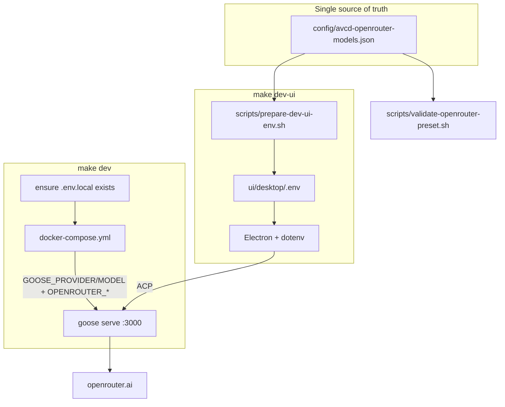

# AVCD Agent OpenRouter Provider Preset

> **Related**: [avcd-ai OpenRouter config](../../../avcd-ai/config/avcd-librechat.yaml) | [CUSTOM_DISTROS.md](../../CUSTOM_DISTROS.md)

## Plan Review → Refactors Applied

| Finding | Severity | Change in this plan |
|---------|----------|---------------------|
| Sibling-repo catalog check hard-fails CI/fresh clones | High | Catalog self-validates (count=13, default present, unique IDs). Sibling avcd-ai compare is **WARN-only** when `../avcd-ai` exists |
| `env_file: .env.local` crashes Compose if file missing | High | `make dev` ensures `.env.local` exists (`cp -n .env.local.example .env.local`); compose uses that file |
| Three validation scripts + optional smoke + vitest = sprawl | Med | **One** script `scripts/validate-openrouter-preset.sh` with offline/online modes; no smoke-test or vitest additions |
| Stale Docker volume fear overstated | Med | Env `GOOSE_PROVIDER`/`GOOSE_MODEL` **override** config ([providers.rs](../../crates/goose/src/config/providers.rs)); document volume reset only for secret/keyring quirks |
| `GOOSE_PREDEFINED_MODELS` JSON in `.env` is escape-prone | Med | `prepare-dev-ui-env.sh` builds JSON with `python3`/`jq`, writes dotenv-safe single-line; dry-run asserted in offline gate |
| Phase 2+ blocked on real API key | Med | Offline gates (catalog + desktop `.env`) never need a key; online `goose info` is optional/skippable |
| Plan lived only under `~/.cursor/plans/` | Low | Canonical copy is this file under `avcd-agent/.cursor/plans/` |
| Docs phase separate from catalog | Low | Merge catalog + `.env.local.example` + README into Phase 1 |

**Review verdict after refactor:** APPROVED — AGENT-SAFE for sequential mid-tier executor.

---

## Architecture



---

## 1. Problem Summary

AVCD Agent starts with no LLM provider. Developers must configure OpenRouter manually, and Docker does not load provider secrets from `.env.local`. avcd-ai already uses OpenRouter with 13 curated models.

**Build:** Preset `openrouter` + default `deepseek/deepseek-v4-flash` + the same 13-model picker list for local `make dev` / `make dev-ui`.

**Success (measurable):**
1. Offline: catalog has exactly 13 IDs; `prepare-dev-ui-env.sh` writes `GOOSE_PREDEFINED_MODELS` with 13 entries and `provider: openrouter`.
2. Online (when `OPENROUTER_API_KEY` set): `docker compose run --rm cli info` reports provider `openrouter` and model `deepseek/deepseek-v4-flash`.
3. README states `OPENROUTER_KEY` (avcd-ai) → `OPENROUTER_API_KEY` (avcd-agent).

**Out of scope:** Infisical project creation, packaging/`GOOSE_BUNDLE_*`, hiding other providers, LibreChat UI parity, MCP/Tavily, Rust provider changes, `init-config.yaml` (unused dead path).

**Executor Capability Target:** Mid-tier model; familiarity: README + this plan. Prefer contracts + one validation script over many micro-phases.

---

## 2. Goals, Non-Goals & Scope Fence

**Goals:**
- [ ] Committed catalog: 13 models + aliases (deploy list from avcd-ai)
- [ ] Defaults: provider `openrouter`, model `deepseek/deepseek-v4-flash`
- [ ] `make dev` loads secrets from `.env.local` into server/cli
- [ ] `make dev-ui` injects desktop defaults + predefined model list
- [ ] `make validate-openrouter` offline always; online when key present
- [ ] README key-mapping + reset note

**Non-Goals:** Sibling-repo hard dependency; smoke-test expansion; new npm/cargo deps; UI redesign.

**Allowed write files:**
- `config/avcd-openrouter-models.json` (new)
- `.env.local.example`
- `docker-compose.yml`
- `Makefile`
- `README.md`
- `scripts/prepare-dev-ui-env.sh`
- `scripts/validate-openrouter-preset.sh` (new)
- `.cursor/plans/openrouter-provider-preset.plan.md` (this file)

**Read-only:** `../avcd-ai/config/avcd-librechat.yaml` (optional WARN compare only)

**Banned:** edits under `crates/`; new dependencies; smoke-test/vitest churn; weaken/delete tests; hard-code fixture-only returns.

**Branch:** continue `feature/avcd-agent-rebrand` on primary `~/Documents/avcd/avcd-agent` (user choice). No new FIW.

---

## 2.5 Feature Isolation Workspace

**isolation-mode:** join-existing  
**teardown-mode:** shared (branch already in use)  
**feature-slug:** `avcd-agent-rebrand`  
**overlap-discovery:** no conflicting FIW; continue primary checkout.

---

## 3. E2E / Acceptance

**File:** `scripts/validate-openrouter-preset.sh`

| Mode | When | Checks |
|------|------|--------|
| `offline` (default) | always | Catalog: 13 models, `defaultModel` set, unique `name`s, each entry has `alias` + will map to `provider: openrouter`. Dry-run prepare: generate temp `.env` (or parse stdout) and assert `GOOSE_DEFAULT_PROVIDER`, `GOOSE_DEFAULT_MODEL`, and predefined JSON length 13 |
| `online` | `OPENROUTER_API_KEY` non-empty | `make dev` already up (or script starts check only); `docker compose run --rm cli info` contains `openrouter` and `deepseek/deepseek-v4-flash`. If key empty: print SKIP and exit 0 for online section |

**Makefile:** `validate-openrouter` → offline always; if key set, also online.

**Initial state:** FAILING (no catalog / no wiring).

---

## 3.5 UI Mock Canvas

**Applies:** No — reuses existing predefined-models path in `SwitchModelModal`.

---

## 4. Architecture & Contracts

### Env mapping

| Concern | Value |
|---------|--------|
| avcd-ai key | `OPENROUTER_KEY` |
| avcd-agent key | `OPENROUTER_API_KEY` |
| Provider id | `openrouter` |
| Host | `OPENROUTER_HOST=https://openrouter.ai` (goose default) |
| Default model | `deepseek/deepseek-v4-flash` |

### Catalog JSON (`config/avcd-openrouter-models.json`)

```json
{
  "provider": "openrouter",
  "defaultModel": "deepseek/deepseek-v4-flash",
  "models": [
    {
      "name": "deepseek/deepseek-v4-flash",
      "alias": "DeepSeek V4 Flash",
      "subtext": "Open-weight agentic coding"
    }
  ]
}
```

Exactly **13** `models[].name` values, matching avcd-ai deploy `endpoints.custom[0].models.default` order preferred (default first).

### Docker (`docker-compose.yml`)

```yaml
# server + cli:
env_file:
  - .env.local
environment:
  GOOSE_SERVER__SECRET_KEY: ${GOOSE_SERVER__SECRET_KEY:-avcd-agent-local-development-key}
  GOOSE_TELEMETRY_OFF: "true"
  GOOSE_DISABLE_KEYRING: "true"
  GOOSE_PROVIDER: ${GOOSE_PROVIDER:-openrouter}
  GOOSE_MODEL: ${GOOSE_MODEL:-deepseek/deepseek-v4-flash}
  OPENROUTER_HOST: ${OPENROUTER_HOST:-https://openrouter.ai}
  # OPENROUTER_API_KEY from env_file only — do not hardcode
```

**Makefile `dev`:** before compose up, `test -f .env.local || cp .env.local.example .env.local`.

### Desktop (`prepare-dev-ui-env.sh`)

Write `ui/desktop/.env`:
1. Existing external-backend vars (unchanged)
2. `GOOSE_DEFAULT_PROVIDER` / `GOOSE_DEFAULT_MODEL` from catalog
3. `GOOSE_PREDEFINED_MODELS` = minified JSON array of `{name, provider, alias, subtext}` (provider forced from catalog)

**Escaping:** build JSON with `python3 -c` (stdlib); write as `GOOSE_PREDEFINED_MODELS='...'` or equivalent dotenv-safe form. Prefer also exporting the same vars in the `make dev-ui` shell invocation (belt-and-suspenders with dotenv) so Electron Forge child process cannot miss them.

### Precedence note

`GOOSE_PROVIDER` / `GOOSE_MODEL` env vars win over volume `config.yaml`. Stale volume does **not** block defaults when compose sets env. Volume wipe only needed if a stored secret/keyring state conflicts; document as optional troubleshooting.

---

## 5. Phased Implementation

### Phase 1 — Catalog + templates + docs — Easy

**Depends on:** none  

**RED:** `scripts/validate-openrouter-preset.sh offline` fails (missing catalog).  

**GREEN:**
- Create `config/avcd-openrouter-models.json` (full 13 from avcd-ai deploy)
- Implement offline half of `validate-openrouter-preset.sh` (catalog checks only first)
- Update `.env.local.example` with OpenRouter fields + comments
- README: key mapping, `make validate-openrouter`, optional volume reset

**Gate:** `./scripts/validate-openrouter-preset.sh offline` → catalog section green (prepare section may still fail until Phase 3).

### Phase 2 — Docker preset — Medium

**Depends on:** Phase 1  

**GREEN:**
- `Makefile` `dev` ensures `.env.local` exists
- `docker-compose.yml` `env_file` + provider env for `server` and `cli`

**Gate (offline):** compose config validates (`docker compose config` succeeds with generated `.env.local`).  
**Gate (online, if key):** `make dev` + `docker compose run --rm cli info` shows openrouter + default model.

### Phase 3 — Desktop env injection — Medium

**Depends on:** Phase 1  

**GREEN:**
- Extend `prepare-dev-ui-env.sh` to emit defaults + predefined list
- Optionally pass the same three vars through `make dev-ui` `bash -c` env (in addition to `.env`)
- Finish offline gate: dry-run prepare asserts 13 models

**Gate:** `./scripts/validate-openrouter-preset.sh offline` → full green. Manual: `make dev-ui` → model switcher shows predefined list.

### Phase 4 — Makefile target + online acceptance — Easy

**Depends on:** Phases 2–3  

**GREEN:** `make validate-openrouter` → offline + online-if-key.  

**Gate:** command exits 0. With key: online section PASS not SKIP.

### Teardown

No FIW. No push/PR/deploy. Leave work on `feature/avcd-agent-rebrand` for human validation.

---

## 5.5 Parallel Agent Execution

**Parallel execution:** No — single-agent sequential.  
(Phases 2 and 3 are file-disjoint and *could* parallelize later; not worth the orchestration for this size.)

---

## 6. TDD / Test Plan

| Check | Mode | Asserts |
|-------|------|---------|
| Catalog count / default / unique names | offline | hard fail |
| Prepare dry-run predefined length 13 + provider field | offline | hard fail |
| Sibling avcd-ai ID set compare | offline | WARN if sibling missing or differs |
| `goose info` provider+model | online | hard fail if key set; SKIP if empty |
| `docker compose config` | Phase 2 | exit 0 |

**Anti-gaming:** Offline tests do not call OpenRouter. Online uses real `goose info`, not a stub. Do not weaken script assertions.

**No** new vitest file; **no** smoke-test expansion (keeps gate surface small).

---

## 7. Risk Register

| Risk | Severity | Mitigation |
|------|----------|------------|
| Missing `.env.local` breaks Compose | High | `make dev` creates from example |
| JSON quoting breaks Electron dotenv | High | python3 minify + dotenv-safe write; dual-pass via make env |
| Key absent → “not configured” UX | Medium | README + online SKIP vs fail messaging |
| Sibling path absent in CI | Low | WARN-only compare |
| Stale keyring/secrets in volume | Low | Optional volume rm in troubleshooting |

---

## 8. Definition of Done + Evidence Map

| # | AC | Evidence |
|---|----|----------|
| AC-1 | 13-model catalog committed | `validate-openrouter-preset.sh offline` catalog section |
| AC-2 | Desktop env gets predefined list | same script prepare section; `ui/desktop/.env` after `make dev-ui` |
| AC-3 | Docker loads provider defaults | `docker compose config` shows `GOOSE_PROVIDER=openrouter`; online `goose info` when key set |
| AC-4 | Docs key mapping | README grep `OPENROUTER_API_KEY` / `OPENROUTER_KEY` |
| AC-5 | Scope fence | `git diff --stat` ⊆ allowed files |

**Self-audit:** re-run `make validate-openrouter`; paste pass/fail. Independent verification by fresh agent / my-plan-review after implementation.

---

## 9. PIRS (post-refactor)

| Dimension | Rating |
|-----------|--------|
| Goal Clarity | PASS |
| Task Atomicity | PASS |
| Test Coverage | PASS (offline always; online gated) |
| Architecture | PASS |
| Sequencing | PASS |
| Scope Fence | PASS |
| Executor Fit | PASS |
| **Band** | **Excellent / AGENT-SAFE** |

---

## Implementation todos

1. Catalog JSON + offline validation (catalog half) + `.env.local.example` + README  
2. Docker compose + `make dev` ensure env file  
3. `prepare-dev-ui-env.sh` + finish offline prepare assertions  
4. `make validate-openrouter` + online path with real key  
