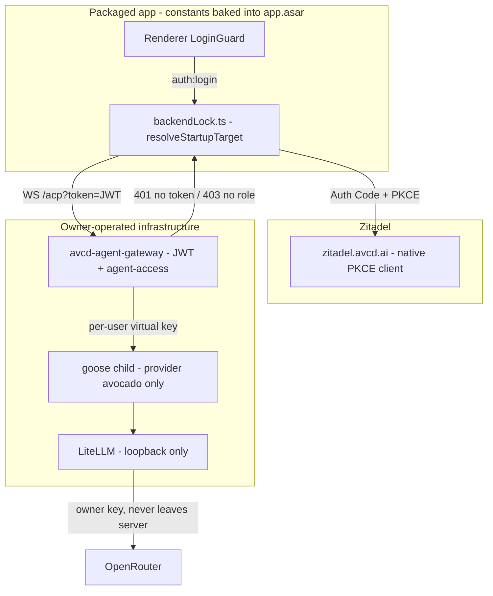

# Lock the packaged app to Avocado with enforced login

## 1. Problem Summary

The desktop app's lockdown is currently a renderer-side convention, so a downloadable build does not enforce it. Packaged builds ship no env file (`extraResource: ['src/bin', 'src/images', 'src/app-update.yml']` in [ui/desktop/forge.config.ts](ui/desktop/forge.config.ts):11), so `isZitadelAuthEnabled()` returns false, `getActiveExternalBackend()` returns null, and the app spawns its own unauthenticated local `goose serve` — the gateway's JWT and `agent-access` enforcement is never reached. Separately, the Rust provider registry accepts any provider name over ACP, and the gateway will inject the owner's `OPENROUTER_API_KEY` into a child that has shell access. This plan bakes the auth/backend lock into the build, prunes the provider registry to `avocado`, and removes every code path that can supply a shared owner credential. Success: a packaged build with a scrubbed environment refuses to run without a Zitadel login carrying `agent-access`, talks only to the configured gateway, exposes only `avocado`, and never receives an owner-level key.

**Executor Capability Target**: Mid-tier model; codebase familiarity: none (fresh agent per phase). Depth calibration: contracts, exact chokepoint line references, and named pitfalls are explicit because the fail-closed traps are non-obvious; line-level how-to is avoided — the tests are the binding spec.

## 2. Goals, Non-Goals & Scope Fence

Goals (each is a hard threshold — any single miss fails the plan):
- AC-1: A packaged build with an empty environment resolves to the locked remote backend with auth required, and never to local-serve.
- AC-2: When locked, `AVCD_AUTH_MODE=off` and a missing issuer cannot disable auth; `isZitadelAuthEnabled()` returns true.
- AC-3: When locked, `settings.externalGoosed` cannot redirect the app; the baked URL always wins. A release build with an empty `LOCKED_BACKEND_URL` fails the build rather than falling back.
- AC-4: The provider registry contains only `avocado`: `create("openai")` errors, `providers()` returns exactly one entry, and a planted declarative provider JSON does not survive `refresh_custom_providers()`.
- AC-5: No shared owner credential can reach a child: the gateway refuses to boot without `AVOCADO_PROVISION_URL`, and a spawned child's env contains no `OPENROUTER_API_KEY` and no LiteLLM master key; two users get different virtual keys.
- AC-6: LiteLLM's admin surface is loopback-only and has no default master key.
- AC-7: A stray `JWT_SECRET` cannot mint access when `ZITADEL_ISSUER` is set, and production requires `JWT_REQUIRED=true` so tenant identity cannot collapse to `DEFAULT_DEV_TENANT_ID`.
- AC-UI: The locked settings view and the fail-closed screen match the approved mock canvas.

Definition of "locked" (no judgment allowed): `REQUIRE_ZITADEL_AUTH === true` in [ui/desktop/src/updates.ts](ui/desktop/src/updates.ts) AND `app.isPackaged === true`. Every "when locked" clause above means exactly this conjunction.

Non-Goals (explicitly out of scope; do not implement):
- Gateway public deployment, TLS, hostname, Traefik/WebSocket passthrough (no deploy job exists; separate plan).
- Per-instance sandboxing of goose children (see Risk R1 — accepted, documented).
- The gateway `/llm` credential relay. Deferred deliberately: after AC-5 the only key in a child is that user's own budget-capped virtual key, so extraction grants nothing beyond usage they already have.
- Payments, subscriptions, entitlement granting, anything in `web`.
- Apple/Windows signing certificate procurement (see Risk R2), telemetry repointing, Apache-2.0/trademark compliance.

Scope Fence — allowed write files (relative to each repo root):
- avcd-agent: `ui/desktop/src/backendLock.ts` (new), `ui/desktop/src/backendLock.test.ts` (new), `ui/desktop/src/updates.ts`, `ui/desktop/src/main.ts`, `ui/desktop/src/auth/config.ts`, `ui/desktop/src/components/settings/app/ExternalBackendSection.tsx`, `ui/desktop/src/components/settings/SettingsView.tsx`, `ui/desktop/src/__tests__/packagedLockdown.e2e.test.ts` (new), `crates/goose/src/providers/init.rs`, `services/avcd-agent-gateway/src/index.ts`, `services/avcd-agent-gateway/src/instance/supervisor.ts`, `services/avcd-agent-gateway/src/auth/verify-bearer.ts`, `services/avcd-agent-gateway/src/auth/settings.ts`, matching `*.test.ts` files for those modules, `services/avcd-agent-gateway/tests/e2e/lockdown.e2e.test.ts` (new), `.cursor/plans/packaged-login-lockdown.plan.md`
- avcd-llm: `compose.yaml`
- Phase 0 only: `~/.cursor/projects/Users-genarionogueira-Documents-avcd-api/canvases/packaged-lockdown-mock.canvas.tsx`

Read-only (read for context, do not modify): `crates/goose/src/acp/**`, `crates/goose/src/providers/avocado.rs` (its `CreditsExhausted` marker contract is frozen), `crates/goose/src/config/declarative_providers.rs`, `ui/desktop/src/gooseServe.ts`, `ui/desktop/forge.config.ts`, `services/avcd-agent-gateway/src/proxy/server.ts`, `services/avcd-agent-gateway/src/instance/env.ts`, `avcd-llm/src/**`.

Banned: refactors outside the allowed files; any dependency or lock-file change (no phase needs one); renaming exported symbols outside the stated contracts; editing `crates/goose/src/acp/**`; push, PR, merge, or deploy at any point.

Anti-gaming rules: tests written in RED steps are READ-ONLY — never weaken, skip, or delete one; report a wrong test instead. No hard-coding to fixture values (the isolation assertions use two randomized users per run). No stubbing the behavior under test — mocks only at external I/O (Zitadel network, goose binary). No `if (env === 'test')` bypasses, and no `!app.isPackaged` escape hatch beyond the single documented dev-override in Phase 3.

## 2.5 Feature Isolation Workspace (in-place — user-directed deviation)

- isolation-mode: **in-place** (user chose to work in the primary checkouts); teardown-mode: n/a
- overlap-discovery: scanned `~/Documents/avcd-features` (found `avcd-agent-rebrand`, `landing-page-oidc`, `plane-selfhost` — unrelated), `git worktree list` on both primaries (none), `.cursor/plans/` (related: [zitadel-desktop-login.plan.md](.cursor/plans/zitadel-desktop-login.plan.md), whose decisions this plan inherits), and `feature/*` branches. No competing feature; user directed in-place execution.
- Repos and branches: `~/Documents/avcd/avcd-agent` on `feature/avocado-llm-provider`; `~/Documents/avcd/avcd-llm` on `main`.
- Deviation rationale and compensating controls: the FIW requirement exists to stop concurrent agents colliding on one working tree. Section 5.5 declares single-agent sequential execution and the user is the only other actor, so the collision risk this control mitigates does not apply. Compensations: (a) Phase -1 commits the in-flight dev fixes first, creating a clean rollback point; (b) every phase commits after GREEN and after REFACTOR; (c) the scope fence is enforced by `git diff --stat` at each gate.
- PRECONDITION (hard gate in Phase -1): both primaries are dirty — avcd-agent has 4 modified files (`scripts/ensure-gateway-dev.sh`, `scripts/prepare-dev-ui-env.sh`, `ui/desktop/.env`, `ui/pnpm-workspace.yaml`), avcd-llm has 3 (`Makefile`, `config/litellm.yaml`, `tests/e2e/litellm-budget.e2e.test.ts`). Commit them before any new work.
- No push, PR, merge, or deploy. Handoff is a manual validation pass on `feature/avocado-llm-provider`.

## 3. E2E Test Definition

Discovery: no existing test covers packaged-build behavior or provider lockdown. Gateway E2E today is [avocado-provisioning.e2e.test.ts](services/avcd-agent-gateway/tests/e2e/avocado-provisioning.e2e.test.ts) and [isolation.e2e.test.ts](services/avcd-agent-gateway/tests/e2e/isolation.e2e.test.ts) (401/403 already covered by `GivenRolelessToken_WhenPostAcp_Then403`). Desktop has `src/gooseServe.test.ts` as the precedent for unit-testing main-process modules. Both E2E specs below are written failing in Phase 0.

**E2E-1 (binding acceptance — packaged lockdown)** — `ui/desktop/src/__tests__/packagedLockdown.e2e.test.ts` (vitest, `pnpm run test:run`):
- Arrange: import `resolveStartupTarget` from the new `backendLock.ts`; build fixtures for `{ isPackaged, env, settings, distro }`.
- Assert: packaged + empty env + empty settings returns `{ mode: 'locked-remote', url: LOCKED_BACKEND_URL, requireAuth: true }`; `mode` is never `'local-serve'` for any packaged input; `env.AVCD_AUTH_MODE='off'` still yields `requireAuth: true`; `settings.externalGoosed={enabled:true,url:'http://evil.test'}` still yields the baked URL; packaged with `LOCKED_BACKEND_URL=''` throws a build/startup error rather than returning a target.
- Status: FAILING until Phase 4.

**E2E-2 (owner-credential containment)** — `services/avcd-agent-gateway/tests/e2e/lockdown.e2e.test.ts` (vitest, `npm run test:e2e`):
- Arrange: local JWKS server (jose RS256), gateway with `ZITADEL_ISSUER`/`ZITADEL_PROJECT_ID` set, two randomized users with `agent-access`, plus a roleless token.
- Assert: gateway refuses to boot with `AVOCADO_PROVISION_URL` unset; no token → 401 and roleless → 403 (auth-critical: repeat 10x, zero failures); a spawned child's env has no `OPENROUTER_API_KEY`, its `AVOCADO_API_KEY` is not the LiteLLM master key, and userA's key differs from userB's.
- Status: FAILING until Phase 5.

Manual verification (DoD, not automated because a real package build takes minutes): `cd ui/desktop && pnpm run package`, launch the built app with a scrubbed environment, confirm the login gate appears and no local `goosed` process is spawned.

## 3.5 UI Mock Canvas

Applies: **Yes** — the locked Settings → App view (no External Backend section, no provider management) and a new fail-closed screen shown when the locked backend is unreachable.

Canvas: `~/.cursor/projects/Users-genarionogueira-Documents-avcd-api/canvases/packaged-lockdown-mock.canvas.tsx`. It cannot be created during plan authoring (plan mode restricts writes to markdown), so creating it is **Step 0.1 of Phase 0** and Phase 4 is hard-gated on user approval — the same convention as the sibling plan's Section 3.5. States to show: locked Settings → App (Zitadel account panel, no backend fields); fail-closed screen ("Cannot reach Avocado — sign in required", retry action, no disable-backend button); access-denied (valid login without `agent-access`). Reuse targets: the existing `AccessDenied.tsx` card layout and current settings `Input`/`Switch` chrome.

## 4. Architecture

Constitution and locked decisions (do not reopen):
- Read [AGENTS.md](AGENTS.md) plus the monorepo rules; deploys are CI-only; plans live in `<repo>/.cursor/plans/`.
- Inherited from [zitadel-desktop-login.plan.md](.cursor/plans/zitadel-desktop-login.plan.md): token transport (`?token=` on WS, `Authorization: Bearer` on HTTP probes, gateway swaps in the per-instance secret), gateway is TypeScript under `services/avcd-agent-gateway/`, Zitadel native PKCE client on fixed loopback port 47821, instance env contract (`GOOSE_PATH_ROOT` absolute, `GOOSE_DISABLE_KEYRING=true`), and `avocado.rs`'s frozen `CreditsExhausted` marker contract.
- **Supersedes one prior decision**: that plan kept "local spawned-backend mode unchanged (no login required)". This plan removes that path *for packaged builds only*, because it is exactly the hole that lets a downloaded app bypass the gateway. Unpackaged dev builds keep local-serve.
- Enforcement must be compiled in, not shipped as config: constants baked at the `//{env-macro-start}//` hook in [ui/desktop/src/main.ts](ui/desktop/src/main.ts):888-898 inside `app.asar`, not a bundled dotfile a user can edit.

Design:
- **New pure module** `ui/desktop/src/backendLock.ts` exporting `resolveStartupTarget(input: { isPackaged: boolean; env: NodeJS.ProcessEnv; settings: Settings; distro: DistroFlags }): { mode: 'locked-remote' | 'external' | 'local-serve'; url?: string; requireAuth: boolean }`. All lock logic lives here so it is unit-testable; `main.ts` only calls it and branches. This follows the `gooseServe.test.ts` precedent and keeps the `main.ts` diff small.
- **Distro flags** join the existing `CUSTOM_DISTROS` block in [ui/desktop/src/updates.ts](ui/desktop/src/updates.ts) (which already holds `PROVIDER_MANAGEMENT_ENABLED = false` and `CONFIGURATION_ENABLED = false`): `REQUIRE_ZITADEL_AUTH`, `LOCKED_BACKEND_URL`, plus baked issuer and client id.
- **Auth lock** in [ui/desktop/src/auth/config.ts](ui/desktop/src/auth/config.ts):18-28: when locked, `isZitadelAuthEnabled()` returns true unconditionally and env overrides are honoured only when `!app.isPackaged`.
- **Registry allowlist**: a `retain_allowed(&mut registry)` helper called at the end of `init_registry` (right after `load_custom_providers_into_registry`, [crates/goose/src/providers/init.rs](crates/goose/src/providers/init.rs):219-222) and again inside `refresh_custom_providers` (:241-252). Every `create*` path and `inventory_identity` funnel through `get_from_registry`, which already errors with `Unknown provider: {name}`, and the UI list reads `providers()` — so one filter closes both, including declarative JSON a user drops into their writable `custom_providers/` dir. Deliberately minimal: upstream warns that divergent forks lose security updates, so no ACP handlers are edited.
- **Fail-closed config**: [avcd-llm/compose.yaml](../avcd-llm/compose.yaml) binds `127.0.0.1:4000:4000` and `127.0.0.1:${API_PORT}:3000` and drops the `:-sk-local-master-change-me` default (present on both services, lines 11 and 40); the gateway loses its `OPENROUTER_API_KEY` defaults and the non-provisioned supervisor path; [verify-bearer.ts](services/avcd-agent-gateway/src/auth/verify-bearer.ts):133-139 refuses the HS256 fallback when `zitadelIssuer` is set; production requires `jwtRequired` so [tenant-context.ts](services/avcd-agent-gateway/src/auth/tenant-context.ts):42-58 cannot fall back to `DEFAULT_DEV_TENANT_ID`.

## 5. Phases (easiest to most complex)

**Phase -1 — Baseline** (infra, no tests): commit the 4 dirty avcd-agent files on `feature/avocado-llm-provider` and the 3 dirty avcd-llm files on `main` (rollback point); save this plan to `avcd-agent/.cursor/plans/packaged-login-lockdown.plan.md`. Gate: `git status --porcelain` clean in both repos.

**Phase 0 — E2E definition + mock canvas** (N/A): Step 0.1 create `packaged-lockdown-mock.canvas.tsx` with the three states and request user approval. Step 0.2 write E2E-1 and E2E-2 exactly as specified in Section 3. Gate: both suites exist and FAIL for the right reason (missing module / missing enforcement), not from syntax errors.

**Phase 1 — Fail closed** — Complexity: Easiest (config only). Why here: no code depends on it and it removes the largest credential exposure first. Depends on: Phase 0.
- RED: unit tests asserting the gateway throws at boot when `AVOCADO_PROVISION_URL` is unset, and that `verifyBearerToken` refuses HS256 when `zitadelIssuer` is set even with `jwtSecret` present. Run `cd services/avcd-agent-gateway && npm run test:unit` → new tests fail.
- GREEN: apply the four Phase-1 changes in Section 4's "Fail-closed config"; delete the `providerApiKeyEnv ... || 'OPENROUTER_API_KEY'` and `providerApiKey: process.env.OPENROUTER_API_KEY` defaults in [services/avcd-agent-gateway/src/index.ts](services/avcd-agent-gateway/src/index.ts):34-35 and the non-provisioned fallback in [supervisor.ts](services/avcd-agent-gateway/src/instance/supervisor.ts):227-229.
- Ops step (human, outside the fence): rotate the OpenRouter key, `chmod 600` the env file, move it to Infisical via `make upload-secrets`.
- REFACTOR, COMMIT, COMPILE: `npm run typecheck && npm run build`; `cd ../../../avcd-llm && make test-unit`.
- Gate (HARD STOP): `npm run test:unit` all green; `npm run typecheck` exit 0. Do not proceed until 100% pass.

**Phase 2 — Provider allowlist in the Rust core** — Complexity: Easy (pure logic, one file). Why here: self-contained, no dependency on desktop work. Depends on: Phase 0.
- RED: tests in `init.rs` asserting `create("openai")` errors, `providers()` returns exactly `["avocado"]`, and a planted custom-provider JSON does not survive `refresh_custom_providers()`. Run `cargo test -p goose providers::init` → fail.
- GREEN: add `retain_allowed` and both call sites per Section 4.
- REFACTOR, COMMIT, COMPILE: `cargo build -p goose`.
- Gate (HARD STOP): `cargo test -p goose providers::init` all green; `cargo test -p goose` no regressions.

**Phase 3 — Distro constants and auth lock** — Complexity: Medium. Why here: Phase 4 consumes these constants. Depends on: Phase 2.
- RED: `backendLock.test.ts` for `resolveStartupTarget` (happy, edge, negative per Section 6) and a test that locked `isZitadelAuthEnabled()` ignores `AVCD_AUTH_MODE=off`. Run `cd ui/desktop && pnpm run test:run` → fail.
- GREEN: add the flags to `updates.ts`, create `backendLock.ts`, apply the `auth/config.ts` lock, and bake constants at the env-macro hook. A release build with lock enabled and empty `LOCKED_BACKEND_URL` must throw.
- REFACTOR, COMMIT, COMPILE: `pnpm run typecheck`.
- Gate (HARD STOP): `pnpm run test:run` all green; `pnpm run typecheck` exit 0.

**Phase 4 — Main-process lock and UI** — Complexity: Medium-Complex. Why here: needs Phase 3's constants and the approved canvas. Depends on: Phase 3, canvas approval.
- RED: extend E2E-1 assertions to the wired path; add a test that the certificate dialog's "Disable External Backend" action is not offered when the source is not `settings`. Run `pnpm run test:run` → new assertions fail.
- GREEN: branch `main.ts` on `resolveStartupTarget` — remove the local `goose serve` branch when locked (:1288-1352), always use the baked URL and ignore `settings.externalGoosed` (:961-977), add the missing `source === 'settings'` check in the certificate dialog (:1223-1244), and hide `ExternalBackendSection` when locked.
- REFACTOR, COMMIT, COMPILE: `pnpm run typecheck`.
- Gate (HARD STOP): `pnpm run test:run` all green including E2E-1; `pnpm run typecheck` exit 0; final UI matches the approved canvas.

**Phase 5 — Gateway integration** — Complexity: More Complex. Why here: needs Phase 1's fail-closed gateway. Depends on: Phase 1.
- RED/GREEN: make E2E-2 pass — child env free of `OPENROUTER_API_KEY` and of the master key, per-user keys distinct, boot refusal without `AVOCADO_PROVISION_URL`, 401/403 stable across 10 runs.
- COMMIT, COMPILE: `npm run typecheck && npm run build`.
- Gate (HARD STOP): `npm run test:e2e` all green; `npm run test:unit` no regressions.

**Phase 6 — E2E validation** — Complexity: Most Complex. Depends on: Phases 4 and 5.
- Run every suite: `cargo test -p goose`; `cd ui/desktop && pnpm run test:run`; `cd services/avcd-agent-gateway && npm run test:unit && npm run test:e2e`; `cd ../../../avcd-llm && make test-unit`.
- Run the manual packaged verification from Section 3.
- Gate: all green, E2E-1 and E2E-2 fully passing, manual check confirmed.

**Phase Teardown**: commits clean on `feature/avocado-llm-provider` (avcd-agent) and `main` (avcd-llm); no worktrees were created; **no push, PR, merge, or deploy**. Hand off for manual validation.

## 5.5 Parallel Agent Execution

**Parallel execution: No — single-agent sequential.** Phases 1 and 2 are file-disjoint and could in principle run concurrently, but the plan executes in the primary checkouts (Section 2.5), where two agents would share one working tree. Sequential execution is the correctness-preserving choice; this also removes the collision risk the FIW would otherwise mitigate.

## 6. TDD Test Plan

Naming: `Given[State]_When[Action]_Then[Result]`. FIRST-compliant — every test mocks I/O (Zitadel network, goose binary) and completes in milliseconds except E2E-2.

Happy path: packaged empty env yields locked-remote with auth; registry yields `avocado`; provisioned child gets a per-user key.

Edge cases (boundary analysis on the lock inputs): `LOCKED_BACKEND_URL` empty string (must throw, not fall back); `isPackaged=true` with `REQUIRE_ZITADEL_AUTH=false` (dev-style build → local-serve allowed); `isPackaged=false` with lock on (env overrides honoured); `settings.externalGoosed.enabled=true` but `url` empty; registry with zero allowed names (must be a hard error, never an empty registry that silently disables the app).

Negative tests: `AVCD_AUTH_MODE=off` when locked → auth still required; `settings.externalGoosed.url='http://evil.test'` → baked URL wins; `create("openai")` → error; roleless token → 403; missing token → 401; `JWT_SECRET` present with `ZITADEL_ISSUER` set → HS256 refused; `AVOCADO_PROVISION_URL` unset → boot refused.

Mutation resistance: `requireAuth = locked || envSaysOn` mutated to `&&` is killed by the `AVCD_AUTH_MODE=off` test; `isPackaged && REQUIRE_ZITADEL_AUTH` mutated to `||` is killed by the `isPackaged=false` case; `retain_allowed` keeping instead of dropping is killed by the `providers().len() == 1` assertion; the certificate-dialog `source === 'settings'` check inverted is killed by its dedicated test.

Anti-gaming: E2E-2 uses two randomized subjects per run so no fixture value can be hard-coded; assertions check real observable effects (resolved target, spawned child's actual env, registry contents), never that a mock was called; tests from RED steps are read-only.

Critical-gate reliability: the auth gates are money-adjacent. Run `for i in $(seq 10); do npm run test:e2e -- tests/e2e/lockdown.e2e.test.ts || exit 1; done` → 10/10 required; a single flaky failure is a FAIL.

Traceability: AC-1/2/3 → `backendLock.test.ts` + E2E-1; AC-4 → `cargo test -p goose providers::init`; AC-5/7 → E2E-2 + gateway unit tests; AC-6 → compose assertions in gateway unit tests plus manual `docker compose config` check; AC-UI → canvas approval. No orphan tests.

## 7. Risk Register

| Risk | Likelihood | Impact | Severity | Mitigation |
|------|-----------|--------|----------|------------|
| R1: goose children run unsandboxed on the gateway host, so external users get shell there | High | High | Blocker for distribution (out of scope here) | Documented as a Non-Goal and a release gate: do not distribute externally until per-instance isolation lands in its own plan. This plan does not claim distribution-readiness. |
| R2: builds are unsigned unless `APPLE_TEAM_ID` is set, so `app.asar` can be repacked and the baked constants edited | Medium | High | High | Baking beats a shipped dotfile regardless; configure the signing environment before release. Called out in DoD as a release precondition. |
| R3: removing local-serve breaks the dev loop | Medium | Medium | Medium | Lock is `REQUIRE_ZITADEL_AUTH && app.isPackaged`; unpackaged dev builds are unaffected, covered by an explicit test. |
| R4: `retain_allowed` misconfigured to an empty allowlist bricks the app | Low | High | High | Compiled default `avocado`; env override honoured only in dev builds; a test asserts an empty allowlist is a hard error. |
| R5: locked URL points at an unreachable gateway, leaving users stuck | Medium | Medium | Medium | Fail-closed screen with retry (Section 3.5) instead of a silent hang; release build fails if the URL is empty. |
| R6: in-place execution means a mistake dirties the primary tree | Low | Medium | Medium | Phase -1 rollback commit; per-phase commits; `git diff --stat` scope check at each gate. |
| R7: pruning the registry breaks unrelated goose tests that assume built-in providers | Medium | Medium | Medium | Phase 2 gate runs the full `cargo test -p goose`; allowlist is overridable in dev/test builds. |

## 8. Definition of Done + AC to Evidence Map

- [ ] All phase gates green; no phase advanced on a partial pass
- [ ] Compile gates pass: `cargo build -p goose`, `pnpm run typecheck` (desktop), `npm run typecheck && npm run build` (gateway)
- [ ] No regressions: `cargo test -p goose`, `pnpm run test:run`, `npm run test:unit`, `make test-unit` (avcd-llm)
- [ ] Scope fence honored: `git diff --stat` in both repos lists only allowed files; no dependency or lock-file change
- [ ] No test weakened: `git diff` on test files shows additions only
- [ ] Manual packaged verification done (scrubbed env, login gate, no local `goosed`)
- [ ] Release preconditions stated to the user: signing configured (R2) and sandboxing resolved (R1) before any external distribution
- [ ] No push, PR, merge, or deploy performed

| # | Acceptance criterion | Evidence |
|---|---------------------|----------|
| AC-1 | Packaged + empty env never local-serve | E2E-1 "GivenPackagedNoEnv_WhenResolvingTarget_ThenLockedRemoteRequiringAuth" |
| AC-2 | Auth cannot be disabled when locked | `backendLock.test.ts` "GivenLockedAndAuthModeOff_WhenCheckingAuth_ThenStillRequired" |
| AC-3 | Baked URL wins; empty URL fails the build | E2E-1 "GivenSettingsBackendOverride_ThenBakedUrlWins" and "GivenEmptyLockedUrl_ThenThrows" |
| AC-4 | Only `avocado` exists | `cargo test -p goose providers::init` (3 cases) |
| AC-5 | No owner credential in a child | E2E-2 "GivenSpawnedChild_ThenEnvHasNoOwnerKey" + "GivenTwoUsers_ThenDistinctVirtualKeys" |
| AC-6 | LiteLLM loopback-only, no default master key | gateway unit test asserting compose bindings + `docker compose config` check |
| AC-7 | No HS256 bypass; production requires JWT | gateway unit tests "GivenIssuerAndJwtSecret_ThenHs256Refused", "GivenProdWithoutJwtRequired_ThenBootRefused" |
| AC-UI | Locked settings and fail-closed screen | User approval of the canvas; implementer compares final UI to its states |

Self-audit (final action): re-read Section 2, confirm every AC has a green row, run each evidence command and paste actual output (not a summary), report any unmapped criterion as INCOMPLETE, and confirm the scope-fence and no-test-weakening checks.

Independent verification: final acceptance is performed by a fresh verifier (the my-plan-review skill or a clean-context agent), not by the implementing agent. Every AC is a hard threshold — one miss fails the plan.

## 9. Plan Implementation Readiness Score (PIRS)

| Dimension | Rating | Points |
|-----------|--------|--------|
| 1. Goal Clarity | PASS | 10 |
| 2. Task Atomicity | PASS | 9 |
| 3. Test Coverage Breadth | PASS | 9 |
| 4. Test Quality (FIRST + Desiderata) | PASS | 8 |
| 5. Architecture Clarity | PASS | 9 |
| 6. Sequencing Safety | PASS | 8 |
| 7. Context Sufficiency | PASS | 7 |
| 8. Risk Coverage | PASS | 7 |
| 9. Definition of Done | PASS | 7 |
| 10. Scope Fence | WARN | 4 |
| 11. Evidence & Self-Audit | PASS | 10 |
| 12. Executor Fit & Anti-Gaming | PASS | 8 |
| **Total** | | **96 / 100** |

**Band**: Excellent. **Agent Safety**: AGENT-SAFE.

Floor rules: no dimension is FAIL, so no block. Dimension 10 is WARN, not PASS, because worktree isolation is deliberately waived at the user's direction; the fence itself (allowed, read-only, banned, anti-gaming) is complete and Section 2.5 documents the deviation with compensating controls. Restoring a Feature Isolation Workspace is the only change that would take this to 100.
