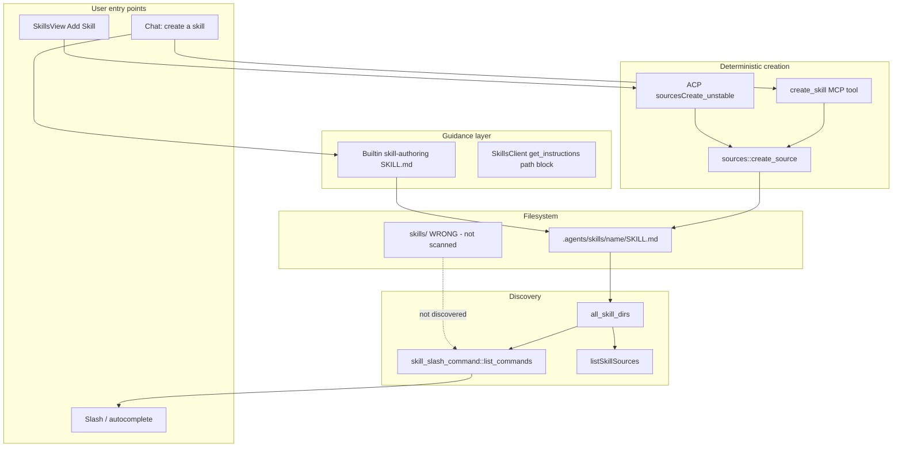

# Skill Authoring Fix — Correct Paths, Meta-Skill, Tool, and UI

## Architecture



---

## Section 1 — Problem Summary

When users ask Avocado Work to create a skill in chat, the agent writes to wrong paths like `workspace/skills/hello-world/SKILL.md`. Goose only discovers skills under [`.agents/skills/`](crates/goose/src/skills/mod.rs) (plus legacy `.goose/skills/`, `.claude/skills/`, and global dirs). Misplaced skills never appear in `/` autocomplete or the Skills page.

Goose already has the correct write API: [`create_source(SourceType::Skill, ...)`](crates/goose/src/sources.rs) writes to `<project>/.agents/skills/<name>/SKILL.md` via [`project_skills_dir`](crates/goose/src/skills/mod.rs). The gap is **guidance** (no meta-skill, no path hints in extension instructions) and **product** (no `create_skill` tool, Add Skill UI hidden, desktop does not call ACP `sourcesCreate`).

**Success (measurable):**
- AC-1: Creating a skill via chat results in `workspace/.agents/skills/<kebab-name>/SKILL.md` (Docker dev `cwd=/workspace`).
- AC-2: That skill appears in slash autocomplete within the same session (after list refresh).
- AC-3: Add Skill UI creates a project skill at the canonical path via ACP (no raw file writes).
- AC-4: Existing misplaced skills (`hello-world`, `code-review`, `planning`) are relocated and discoverable.

**Out of scope:** Summon extension changes, upstream goose PR, skill marketplace, CI deploy, Anthropic-style eval viewer / skill-creator eval loop.

**Executor Capability Target:** Mid-tier model; codebase familiarity: Some (has read AGENTS.md / prior avcd-agent context). Plan depth: contracts + pitfalls + tests; not brittle line-by-line UI markup.

---

## Section 2 — Goals, Non-Goals & Scope Fence

**Goals:**
- [ ] AC-1–AC-4 above
- [ ] Builtin `skill-authoring` meta-skill (always discoverable like `goose-doc-guide`)
- [ ] `create_skill` tool on Skills extension wrapping `create_source`
- [ ] Desktop `createSkillSource()` + unhidden Add Skill flow in SkillsView
- [ ] Optional `~/.agents/skills` mount in Docker dev for global-skill parity

**Non-Goals:**
- Scanning bare `skills/` at project root (hides mistakes; diverges from [agentskills.io](https://github.com/agentskills/agentskills) convention)
- Porting full Anthropic `skill-creator` eval pipeline
- Enabling Summon or changing slash-command multi-skill composer (already done in [multi-skill-composer.plan.md](.cursor/plans/multi-skill-composer.plan.md))

**Allowed write files:**
- `crates/goose/src/skills/builtins/skill_authoring.md` (new)
- `crates/goose/src/skills/builtin.rs` (if registration needed — auto via `include_dir!`)
- `crates/goose/src/skills/client.rs`
- `crates/goose/src/skills/mod.rs` (tests only if needed)
- `crates/goose/src/agents/platform_extensions/mod.rs` (enable skills extension for desktop)
- `ui/desktop/src/acp/sources.ts`
- `ui/desktop/src/components/skills/SkillsView.tsx`
- `ui/desktop/src/components/skills/AddSkillDialog.tsx` (new, or inline modal component)
- `ui/desktop/src/components/skills/__tests__/*.test.ts(x)` (new)
- `workspace/.agents/skills/**` (relocated skills + optional seed copy)
- `docker-compose.yml`
- `~/.cursor/projects/<workspace>/canvases/skill-add-dialog-mock.canvas.tsx` (plan authoring only)

**Read-only:**
- `crates/goose/src/sources.rs` (consume `create_source`, do not refactor)
- `crates/goose/src/slash_commands/skill_slash_command.rs`
- Anthropic `skill-creator` (reference only)

**Banned:**
- No refactors outside allowed paths
- No new npm/cargo dependencies
- No `workspace/skills/` as a new discovery path
- Tests READ-ONLY for executor; no weakening/skipping/deleting tests to pass
- No push/PR/deploy in plan teardown

**Anti-gaming:** no hard-coded paths in tests without also asserting discovery via `discover_skills`; no mocking `create_source` in Rust integration tests — use temp dir + real filesystem.

---

## Section 2.5 — Feature Isolation Workspace

| Field | Value |
|-------|--------|
| **isolation-mode** | `join-existing` |
| **teardown-mode** | `shared` |
| **feature-slug** | `avcd-agent-rebrand` |
| **FIW root** | `~/Documents/avcd-features/avcd-agent-rebrand/` |
| **base branch** | `main` |
| **feature branch** | `feature/avcd-agent-rebrand` |
| **related-plan(s)** | [multi-skill-composer.plan.md](.cursor/plans/multi-skill-composer.plan.md), [avocado-work-rebrand.plan.md](.cursor/plans/avocado-work-rebrand.plan.md) |

| Repo | Primary (read-only during exec) | Worktree (writable) |
|------|----------------------------------|---------------------|
| avcd-agent | `~/Documents/avcd/avcd-agent` | `~/Documents/avcd-features/avcd-agent-rebrand/avcd-agent` |

**Overlap discovery:** FIW `avcd-agent-rebrand` exists; branch `feature/avcd-agent-rebrand` on primary; no conflicting plan for skill paths. **User choice:** join existing FIW (shared teardown).

**Bootstrap:** Reuse `~/Documents/avcd-features/avcd-agent-rebrand/avcd-agent`; `move_agent_to_root` to FIW. All edits/tests run with `cwd` under FIW worktree.

**Teardown:** Promote primary to `feature/avcd-agent-rebrand`; keep FIW (shared). No push/PR/deploy.

---

## Section 3 — E2E Test Definition

**Discovery:** No automated E2E for skill filesystem discovery today. Define new manual + semi-automated acceptance.

**E2E spec (manual procedure — `docs/development/manual-tests/` is out of scope for this plan; execute as Phase 7 gate):**

```
Given: make dev + make dev-ui, session cwd = /workspace (Docker)
When: User sends "Create a skill named e2e-smoke-test for greeting users"
Then:
  - File exists: workspace/.agents/skills/e2e-smoke-test/SKILL.md
  - Frontmatter has name + description
  - Typing / in chat shows e2e-smoke-test (or /skills lists it)
When: User opens Skills → Add Skill, fills name/description/body, saves
Then:
  - Same canonical path; skill appears in list without restart
```

**Automated proxy (Phase 7 unit/integration):** Rust test calls `create_skill` tool → asserts path under `.agents/skills/` → `discover_skills` includes name.

**E2E status:** FAILING until Phase 7.

---

## Section 3.5 — UI Mock Canvas

**Applies:** Yes — Add Skill dialog (name, description, markdown body, scope toggle project vs global).

**Canvas:** `skill-add-dialog-mock.canvas.tsx` at `~/.cursor/projects/Users-genarionogueira-Documents-avcd-api/canvases/skill-add-dialog-mock.canvas.tsx`

**States:** empty form; validation error (invalid name); success toast; populated skills list row after create.

**Reuse targets:** existing `Button`, `Dialog`/`Sheet` patterns from SkillsView; `SkillItem` row styling.

**User approval:** Layout approved before Phase 5 UI implementation.

---

## Section 4 — Architecture & Prior Decisions

**Constitution:** AVCD fork of goose; skills canonical path `.agents/skills/` per [using-skills.md](documentation/docs/guides/context-engineering/using-skills.md). Desktop uses ACP unstable sources API ([`CreateSourceRequest`](crates/goose-sdk-types/src/custom_requests.rs)).

**Decisions (locked):**
- **Path:** `.agents/skills/<name>/SKILL.md` for project skills (not `skills/`, not `.cursor/skills/`).
- **Meta-skill pattern:** Follow Anthropic [`skill-creator`](https://github.com/anthropics/skills/blob/main/skills/skill-creator/SKILL.md) for *content quality*; Goose-specific *path rules* in our shorter `skill-authoring` builtin.
- **Creation API:** Prefer `create_skill` tool / ACP `sourcesCreate` over Developer `write_file`.
- **Discovery:** Do not extend `all_skill_dirs` to scan `skills/`.
- **Skills extension:** Enable `default_enabled: true` for AVCD desktop distro so `load_skill` + `create_skill` are available ([`platform_extensions/mod.rs`](crates/goose/src/agents/platform_extensions/mod.rs) currently has skills off/hidden).

**`create_skill` tool contract:**

```json
{
  "name": "string (kebab-case, required)",
  "description": "string (required)",
  "content": "string (markdown body, required)",
  "global": "boolean (default false — project-scoped)"
}
```

**Postcondition:** Returns created `SourceEntry` with `path` ending in `.agents/skills/<name>/SKILL.md`.

**Produces outputs consumed elsewhere:** New skills feed `discover_skills` → slash list + SkillsView (no other subsystem).

---

## Section 5 — Phased Implementation (easiest → complex)

### Phase -1 — FIW bootstrap (Complexity: infra)

Reuse `~/Documents/avcd-features/avcd-agent-rebrand/avcd-agent`; verify on `feature/avcd-agent-rebrand`; move agent root to FIW.

**Gate:** `git -C $FIW/avcd-agent branch --show-current` → `feature/avcd-agent-rebrand`

---

### Phase 0 — Relocate misplaced skills (Complexity: easiest)

Move (preserve git history if tracked, else plain move):
- `workspace/skills/hello-world/` → `workspace/.agents/skills/hello-world/`
- `workspace/skills/code-review/` → `workspace/.agents/skills/code-review/`
- `workspace/skills/planning/` → `workspace/.agents/skills/planning/`
- Remove empty `workspace/skills/` if empty

**RED:** Add Rust test in `crates/goose/src/skills/mod.rs` or `sources.rs` tests: given relocated layout, `discover_skills(Some(workspace))` returns all three names.

**Gate:** `cargo test -p goose discover` / relevant test name → pass

---

### Phase 1 — Builtin `skill-authoring` meta-skill (Complexity: easy)

Create [`crates/goose/src/skills/builtins/skill_authoring.md`](crates/goose/src/skills/builtins/skill_authoring.md):

**Frontmatter `description` (pushy triggers):** create/add/write skill, SKILL.md, skill not showing in slash, fix skill path, `.agents/skills`.

**Body essentials:**
1. Canonical paths (project + global); explicit NEVER list (`skills/`, `workspace/skills/`)
2. Name rules (match `validate_skill_name`)
3. Frontmatter template
4. **Prefer `create_skill` tool** when available; else ACP/desktop UI; raw write only to `.agents/skills/<name>/SKILL.md`
5. Post-create verification: `discover_skills` / `/skills` / Skills page
6. Relocate guidance for misplaced skills

Adapt content from Anthropic skill-creator **structure section only** (~80 lines max in SKILL.md body).

**RED:** Test `builtin::get_all()` includes content with `name: skill-authoring`; `discover_skills` lists builtin.

**Gate:** `cargo test -p goose skill_authoring` (or builtin discovery test) → pass

---

### Phase 2 — Extend `SkillsClient::get_instructions()` (Complexity: easy)

In [`crates/goose/src/skills/client.rs`](crates/goose/src/skills/client.rs) `get_instructions()`, append after skill list:

```
When creating skills, write ONLY to {working_dir}/.agents/skills/<name>/SKILL.md (project)
or ~/.agents/skills/<name>/SKILL.md (global). Use the create_skill tool when available.
Never use skills/ or workspace/skills/.
```

**RED:** Unit test asserting instructions contain `.agents/skills` and `create_skill`.

**Gate:** `cargo test -p goose skills_client` → pass

---

### Phase 3 — `create_skill` MCP tool (Complexity: medium)

In [`SkillsClient`](crates/goose/src/skills/client.rs):
- Add `create_skill` to `list_tools` schema (name, description, content, optional global boolean)
- `call_tool`: resolve `project_dir` from `self.working_dir`, call `crate::sources::create_source(SourceType::Skill, ...)`
- Return success text with canonical path + reminder to verify in `/` menu

**RED:** `#[tokio::test]` in `client.rs`: temp dir, call `create_skill`, assert file at `.agents/skills/foo/SKILL.md` and `discover_skills` finds it.

**Gate:** `cargo test -p goose test_create_skill` → pass; `cargo clippy -p goose` clean

---

### Phase 4 — Enable skills platform extension for desktop (Complexity: easy)

In [`crates/goose/src/agents/platform_extensions/mod.rs`](crates/goose/src/agents/platform_extensions/mod.rs):
- `skills` extension: `default_enabled: true`, `hidden: false` (AVCD desktop distro comment)

**Gate:** New session includes `skills` in enabled extensions (diagnostics or unit test in `config/extensions.rs` if pattern exists)

---

### Phase 5 — Desktop ACP helper + Add Skill UI (Complexity: complex)

**5a — ACP helper** [`ui/desktop/src/acp/sources.ts`](ui/desktop/src/acp/sources.ts):

```typescript
export async function createSkillSource(params: {
  name: string;
  description: string;
  content: string;
  projectDir: string;
  global?: boolean;
}): Promise<SourceEntry>
```

Calls `client.goose.sourcesCreate_unstable({ type: 'skill', target: { global, projectDir }, ... })`.

**RED:** Vitest mock ACP client; assert correct payload and path in response.

**5b — Add Skill UI** [`SkillsView.tsx`](ui/desktop/src/components/skills/SkillsView.tsx):
- Unhide Add Skill button (remove `hidden`, wire `onClick`)
- New `AddSkillDialog` component: fields name, description, body; validation (kebab-case); scope project (default) vs global
- On success: refresh `listSkillSources`, toast, optional "Use in chat"
- Follow mock canvas from Section 3.5

**Gate:** `cd ui/desktop && pnpm run typecheck && pnpm test -- sources SkillsView` → pass

---

### Phase 6 — Docker dev global skills mount (Complexity: easy)

In [`docker-compose.yml`](docker-compose.yml) `server` service volumes:

```yaml
- ${HOME}/.agents/skills:/home/goose/.agents/skills
```

Document in plan evidence only (no new markdown doc file per AVCD rules — optional one-line comment in compose).

**Gate:** With mount, global skill in host `~/.agents/skills` visible in container `discover_skills` (manual or documented check).

---

### Phase 7 — E2E validation gate (Complexity: most complex)

1. `make dev-down && make dev` (refresh container)
2. `make dev-ui` (Terminal)
3. Execute Section 3 manual E2E (chat create + Add Skill UI)
4. Verify relocated skills in `/` autocomplete
5. `make check` / `cargo test -p goose` / `pnpm run typecheck` full green

**Gate:** All AC-1–AC-4 evidence rows filled.

---

### Phase Teardown

Promote `~/Documents/avcd/avcd-agent` to `feature/avcd-agent-rebrand`; remove worktree only if user confirms all companion plans done (`teardown-mode: shared` — keep FIW). No push/PR/deploy.

---

## Section 5.5 — Parallel Agent Execution

**Parallel execution:** No — single-agent sequential. Phases have file overlap (`client.rs` sequential edits).

---

## Section 6 — TDD Test Plan (summary)

| Test | Phase | AC |
|------|-------|-----|
| `discover_skills` finds relocated skills | 0 | AC-4 |
| Builtin `skill-authoring` discovered | 1 | AC-1 guidance |
| `get_instructions` contains path rules | 2 | AC-1 |
| `create_skill` writes `.agents/skills/` + discoverable | 3 | AC-1, AC-2 |
| `createSkillSource` ACP payload | 5a | AC-3 |
| Add Skill dialog validation | 5b | AC-3 |
| Manual E2E chat + UI | 7 | AC-1–AC-4 |

**Critical gate repeat (auth N/A):** Run `cargo test -p goose` 3× on Phase 3 merge — 3/3 pass.

---

## Section 7 — Risk Register

| Risk | Severity | Mitigation |
|------|----------|------------|
| Agent ignores meta-skill, still writes wrong path | High | `create_skill` tool + pushy description; instructions block |
| Skills extension disabled in user config | Medium | Enable default; document `goose configure` if overridden |
| ACP `sourcesCreate` unstable API drift | Medium | Typecheck against `@aaif/goose-sdk`; single wrapper |
| Docker mount hides permission issues on Linux | Low | Use `${HOME}`; document macOS dev path |
| Join FIW conflicts with uncommitted rebrand work | Medium | Commit or stash before Phase -1 |

---

## Section 8 — Definition of Done + Evidence Map

| AC | Criterion | Evidence |
|----|-----------|----------|
| AC-1 | Chat creates canonical path | Manual E2E log + `ls workspace/.agents/skills/<name>/SKILL.md` |
| AC-2 | Slash autocomplete lists skill | Screenshot or `/skills` output |
| AC-3 | Add Skill UI uses ACP | Vitest `createSkillSource` + manual UI create |
| AC-4 | Relocated skills discoverable | Rust `discover_skills` test 3/3 names |
| AC-BUILD | Compile gates | `cargo test -p goose`, `pnpm run typecheck`, `make check` if exists |
| AC-FENCE | Scope honored | `git diff --stat` only allowed paths |
| AC-TESTS | No test weakening | `git diff` on `*_test*` / `__tests__` shows additions only |

**Independent verification:** Run [my-plan-review](~/.agents/skills/general-development/my-plan-review/SKILL.md) on this plan after implementation; fresh agent executes Phase 7 checklist.

---

## Plan Readiness (PIRS preview)

| Dimension | Rating | Notes |
|-----------|--------|-------|
| Goal clarity | PASS | AC-1–AC-4 quantitative |
| Scope fence | PASS | Allowed/banned paths explicit |
| FIW | PASS | Join-existing documented |
| Architecture | PASS | Decisions locked; I/O contract for `create_skill` |
| Tests | PASS | RED→GREEN per phase |
| UI canvas | PASS | Section 3.5 for Add Skill dialog |

**Band:** Good — **APPROVED WITH CONDITIONS** (create UI mock canvas before Phase 5; confirm FIW worktree is current).

**Parallel execution:** N/A — sequential only.

---

## References (trustworthy)

- [Goose using-skills.md](documentation/docs/guides/context-engineering/using-skills.md) — canonical `.agents/skills/` paths
- [Anthropic Agent Skills best practices](https://platform.claude.com/docs/en/agents-and-tools/agent-skills/best-practices) — description + structure
- [anthropics/skills skill-creator](https://github.com/anthropics/skills/blob/main/skills/skill-creator/SKILL.md) — meta-skill pattern (adapt, do not port eval tooling)
- [agentskills.io client implementation](https://github.com/agentskills/agentskills/blob/main/docs/client-implementation/adding-skills-support.mdx) — cross-agent `.agents/skills/` convention
