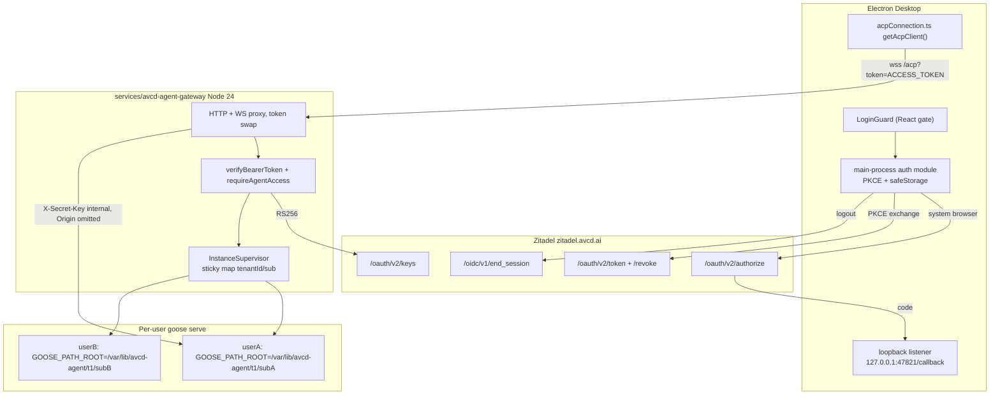

# Zitadel Desktop Login & Per-User Isolation

## 1. Problem Summary

Avocado Work (goose fork) has exactly one inbound auth mechanism: a global shared secret (`GOOSE_SERVER__SECRET_KEY`, checked in `crates/goose/src/acp/transport/auth.rs:15-36`). There is no user, tenant, or role anywhere — sessions, provider keys, MCP OAuth tokens, and config are one global namespace, so the app cannot be commercialized. This plan adds mandatory Zitadel login to the desktop app and a new gateway that maps each authenticated user to their own isolated `goose serve` process. Success: a user must complete Zitadel login before using the app; two logged-in users cannot see each other's sessions or credentials; logout revokes tokens and ends the IdP session. Out of scope: web client, org-per-tenant Zitadel topology (claims are plumbed so it needs no code change later), billing, in-core goose identity.

**Executor Capability Target**: Mid-tier model, codebase familiarity: none (fresh agent per phase). Depth calibration: contracts, exact env vars, and named pitfalls are spelled out because the proxy/isolation traps are non-obvious; line-level how-to is avoided — tests are the binding spec.

## 2. Goals, Non-Goals & Scope Fence

Goals:
- AC-1: Desktop app blocks all use until a Zitadel login completes (Auth Code + PKCE, system browser, loopback redirect).
- AC-2: Gateway rejects requests without a valid RS256 JWT (issuer `https://zitadel.avcd.ai`, audience = bare project ID) with 401, and rejects valid tokens lacking project role `agent-access` with 403.
- AC-3: Each `(tenantId, sub)` gets exactly one `goose serve` process with distinct absolute `GOOSE_PATH_ROOT` and `GOOSE_DISABLE_KEYRING=true`; user A cannot list user B's sessions.
- AC-4: ACP traffic (WS + HTTP + SSE) works end-to-end through the gateway; internal secret never reaches the client.
- AC-5: Logout clears local tokens, revokes the refresh token (`/oauth/v2/revoke`), opens `/oidc/v1/end_session`, and terminates the user's goose instance.
- AC-6: Tenant ID is derived `urn:zitadel:iam:org:id` → `urn:zitadel:iam:user:resourceowner:id` and used in the instance key (org-per-tenant ready).
- AC-UI: Login screen and settings changes match the approved mock canvas.

Non-Goals: web client; Zitadel org-per-tenant provisioning; per-user billing/quotas; changing core goose auth (`crates/goose/src/acp/**` stays untouched); removing local single-user mode (spawned local backend keeps working without login).

Scope Fence — allowed write files (paths relative to FIW worktrees):
- avcd-agent: `services/avcd-agent-gateway/**` (new), `ui/desktop/src/auth/**` (new), `ui/desktop/src/main.ts`, `ui/desktop/src/preload.ts`, `ui/desktop/src/backendStatus.ts`, `ui/desktop/src/acp/url.ts`, `ui/desktop/src/components/auth/**` (new), `ui/desktop/src/App.tsx`, `ui/desktop/src/components/settings/app/ExternalBackendSection.tsx`, `ui/desktop/src/utils/csp.ts`, `ui/desktop/src/test/setup.ts`, `ui/desktop/src/i18n/messages/*.json` (via extract only), matching `__tests__`/`*.test.ts(x)` files, `docker-compose.yml`, `Makefile` (new targets + help only), `.github/workflows/gateway-ci.yml` (new), `.cursor/plans/zitadel-desktop-login.plan.md`
- avcd-zitadel: `terraform/avcd_agent_oauth.tf` (new), `terraform/variables.tf`, `terraform/outputs.tf`, `terraform/environments/prod.tfvars`, `scripts/terraform/avcd-agent-targets.sh` (new), `scripts/write-avcd-agent-oauth-env.sh` (new), `Makefile` (targets + .PHONY + help), `tests/unit/terraform-prod-vars.spec.sh`
- Plan authoring/Phase 0 only: `~/.cursor/projects/Users-genarionogueira-Documents-avcd-api/canvases/zitadel-login-mock.canvas.tsx`

Read-only: `crates/goose/**`, `ui/desktop/src/gooseServe.ts`, `ui/desktop/src/gooseServeLeaseRegistry.ts`, `ui/desktop/src/acp/acpConnection.ts` (token injection happens via `getAcpUrl`, not here), `conta-azul-yoga-subgraph/src/lib/auth/**` (copy source), `web-dash/lib/auth/**` (reference).

Banned: refactors outside allowed files; dependency changes except those named per phase; renaming exported symbols outside stated contracts; editing primary checkouts once FIW exists; any `pulumi up`/`terraform apply` on shared stacks except the documented human-gated targeted bootstrap (Phase 1); push/PR/deploy during execution.

Anti-gaming rules: tests authored in RED steps are READ-ONLY — never weaken, skip, or delete one (report wrong tests instead); no hard-coding to fixture values (isolation tests use two different randomized users); no stubbing the behavior under test — mocks only at external I/O (Zitadel network, goose binary in unit scope); no `if (env === 'test')` bypasses.

## 2.5 Feature Isolation Workspace

- isolation-mode: new-feature; teardown-mode: exclusive
- feature-slug: `zitadel-desktop-login`; FIW root: `~/Documents/avcd-features/zitadel-desktop-login/`
- overlap-discovery: scanned `~/Documents/avcd-features` (found `avcd-agent-rebrand`, `landing-page-oidc`, `plane-selfhost` — different features), worktree list, `.cursor/plans`, `feature/*` branches. No login-feature overlap; user chose desktop/process-per-user/claims-ready scope.
- Repos and branches:
  - `~/Documents/avcd/avcd-agent` (base: `feature/avcd-agent-rebrand`) → `~/Documents/avcd-features/zitadel-desktop-login/avcd-agent` on `feature/zitadel-desktop-login`
  - `~/Documents/avcd/avcd-zitadel` (base: `main`) → `.../zitadel-desktop-login/avcd-zitadel` on `feature/zitadel-desktop-login`
- PRECONDITION (hard gate in Phase -1): the avcd-agent primary has ~24 uncommitted files from the skill-authoring work. Commit them on `feature/avcd-agent-rebrand` (ask user if unclear) before `git worktree add`; branch the new feature off the local rebrand branch tip, not `origin/main` (the rebrand is the working baseline).
- Teardown: commit, `git worktree remove` both, switch primaries to `feature/zitadel-desktop-login`, delete FIW, move agent root back. NO push/PR/merge/deploy.

## 3. E2E Test Definition

No existing E2E covers auth (searched: only transport-secret tests in `crates/goose/tests/acp_transport_auth_test.rs` and desktop vitest suites). New tests, written failing in Phase 0:

**E2E-1 (binding acceptance)** — `services/avcd-agent-gateway/tests/e2e/isolation.e2e.test.ts` (vitest, real goose binary via `cargo build -p goose-cli` or `GOOSE_BIN` env):
- Arrange: local JWKS server from a jose-generated RS256 keypair; gateway configured with `ZITADEL_ISSUER=http://127.0.0.1:<port>`, `ZITADEL_PROJECT_ID=test-project`; mint JWTs for userA and userB (random subs each run) with role `agent-access`, plus one token without the role and one expired token.
- Act/Assert:
  - no token → 401 with `WWW-Authenticate`; roleless token → 403; expired → 401 (auth-critical: repeat these 10x, zero failures)
  - userA connects WS `/acp?token=<jwtA>`, initializes, creates a session; userB initializes and lists sessions → userB sees zero of userA's sessions; on-disk roots `<dataRoot>/<tenant>/<subA>` and `<subB>` both exist and differ
  - `POST /auth/logout` with jwtA → userA's goose process exits; next request respawns cleanly
- Status: FAILING until Phase 8.

**E2E-2 (desktop gate)** — `ui/desktop/src/components/auth/__tests__/LoginGuard.test.tsx`: no token → login screen rendered, children NOT rendered; valid auth state → children rendered; auth-expired event → returns to login screen.

## 3.5 UI Mock Canvas

Applies: Yes — new LoginGuard screen (login, signing-in, error states), "Signed in as" panel replacing the Secret Key field in `ExternalBackendSection`.

Canvas: `~/.cursor/projects/Users-genarionogueira-Documents-avcd-api/canvases/zitadel-login-mock.canvas.tsx` — could not be created during plan authoring (plan mode restricts writes to markdown), so creating it is **Step 0.1 of Phase 0**, and Phase 7 is hard-gated on user approval of the canvas. States to show: logged-out welcome + "Sign in with Avocado" button; browser-flow-pending with cancel; access-denied (missing `agent-access` role) with account switch hint; signed-in settings panel (email, tenant, Sign out button). Reuse targets: `OnboardingGuard` error-card layout (`OnboardingGuard.tsx:164-179`), existing settings `Input`/`Switch` chrome.

## 4. Architecture

Constitution/locked decisions (do not reopen):
- Deploys via GitHub Actions only; Zitadel IAM via Terraform in `avcd-zitadel` applied by `terraform-apply-prod.yml` (targeted local bootstrap is the documented human-gated exception, mirroring `terraform-apply-landing-page`).
- All access tokens JWT (`access_token_type = OIDC_TOKEN_TYPE_JWT`), audience = bare project ID via `urn:zitadel:iam:org:project:id:{id}:aud` scope, roles from `urn:zitadel:iam:org:project:roles` — same conventions as every existing app.
- Gateway is TypeScript (Node 24, `jose ^6`), placed at `services/avcd-agent-gateway/` following the `services/ask-ai-bot` precedent (own Dockerfile, root build context, path-filtered workflow). Rationale: reuses the proven `verify-bearer.ts` family (third copy — adapted, `tenant-context.ts` severed from `AppContext`); Rust would re-implement validated logic.
- Zitadel app: `OIDC_APP_TYPE_NATIVE` + `OIDC_AUTH_METHOD_TYPE_NONE` (PKCE public client, correct per RFC 8252; provider support proven by the DCR shim in `avcd-zitadel/examples`), grants AUTHORIZATION_CODE + REFRESH_TOKEN, redirect `http://127.0.0.1:47821/callback` (fixed port; `dev_mode = true` for plain-HTTP loopback), post-logout `http://127.0.0.1:47821/logged-out`. Project role `agent-access`; IaC user-grant allowlist (empty `user_id` skips) — load-bearing because `project_role_check=false` means the app gate is the only barrier to shell access.
- Token transport: desktop sends the Zitadel access token where the secret used to go — `?token=` on the WS URL (browser WS cannot set headers) and `Authorization: Bearer` on HTTP probes. Gateway validates, then swaps in the per-instance internal secret via `X-Secret-Key` and strips `?token=`. Refresh in the Electron main process (5-min buffer, single-flight, mirroring `web-dash/lib/auth/token-service.ts`); tokens in `safeStorage`, never `settings.json`.
- Proxy contract (from `crates/goose/src/acp/transport/mod.rs` analysis): never forward `Origin` (absent Origin is accepted in every goose mode → no `--allowed-origin` needed); WS proxied as a raw socket tunnel after the auth handshake (preserves frames/compression); forward `Accept` verbatim (else SSE → 406); no response buffering; pass `Acp-Connection-Id`/`Acp-Session-Id` both ways; `OPTIONS` passes unauthenticated; set `X-Forwarded-Proto`; idle timeouts > 15s SSE keep-alive; never log `?token=`.
- Instance env contract (`buildInstanceEnv`): `GOOSE_PATH_ROOT=<AVCD_AGENT_DATA_ROOT>/<tenantId>/` (validated absolute — relative values are silently ignored by goose, a cross-user leak), `GOOSE_DISABLE_KEYRING=true` (mandatory: keyring entry `goose/secrets` is global across instances), fresh 32-byte `GOOSE_SERVER__SECRET_KEY` per instance, `GOOSE_PROVIDER`/`GOOSE_MODEL`/provider key from gateway config, `HOME` set, `GOOSE_OAUTH_CALLBACK_PORT` explicitly unset (fixed port cannot bind twice). Args: `serve --platform desktop --enable-scheduler --host 127.0.0.1 --port <ephemeral>`. Readiness: poll unauthenticated `GET /status` 100ms/30s; drain child stdio after startup (full pipe hangs the agent); SIGTERM→SIGKILL(5s) shutdown; idle reap after 30 min; sticky routing per user is mandatory (goose connection registry is in-process memory).
- Desktop identity chokepoints: `get-acp-url` IPC (`main.ts:1996`) mints a fresh URL per call from the current access token (acpConnection already re-calls it on every reconnect); `backendStatus.ts:67-72` switches `X-Secret-Key` → `Authorization: Bearer`, its 401/403 branch (lines 80-83) becomes the re-login signal; `LoginGuard` wraps `OnboardingGuard` at `App.tsx:699` (login before the guard's first ACP call); CSP gains the Zitadel origin (`utils/csp.ts`). Local spawned-backend mode is unchanged (no login required — generated secret path stays).
- New IPC contract: `auth:get-state` → `{ status: 'signedOut'|'signingIn'|'signedIn', email?, tenantId?, error? }`; `auth:login` → starts PKCE flow; `auth:logout` → revoke + end_session + notify gateway; `auth:on-changed` event. Stub these in `ui/desktop/src/test/setup.ts:77-92` or existing tests fail.
- Gateway HTTP surface: `GET /healthz` (liveness), `GET /readyz` (JWKS reachability → 503, per `jwks-health.ts`), `ANY /acp*` (proxy), `GET/POST /mcp-app-*` (proxy, same user pinning), `POST /auth/logout`.

## 5. Phases (single-agent sequential; Section 5.5: No — no parallel lanes)

**Phase -1 — FIW bootstrap** (infra): resolve the dirty avcd-agent primary (commit skill-authoring work on `feature/avcd-agent-rebrand`); `git worktree add` both repos per Section 2.5; save this plan to `avcd-agent/.cursor/plans/zitadel-desktop-login.plan.md`; move agent root to FIW.

**Phase 0 — E2E definition + mock canvas** (N/A): Step 0.1 create `zitadel-login-mock.canvas.tsx` with the four states and get user approval. Step 0.2 scaffold `services/avcd-agent-gateway/` (package.json: `jose@^6`, `ws@^8`, dev `vitest@^2`, `typescript@^5`, `tsx`; tsconfig NodeNext copied from conta-azul-yoga-subgraph). Step 0.3 write E2E-1 and E2E-2 as specified, confirm both FAIL. Gate: tests exist and fail for the right reason.

**Phase 1 — Zitadel Terraform** (Easiest): `terraform/avcd_agent_oauth.tf` modeled on `avcd_ai_oauth.tf` (project `avcd-agent`, role `agent-access`, user-grant allowlist) with the NATIVE/NONE app; variables + prod.tfvars + outputs (`avcd_agent_project_id`, `avcd_agent_client_id`, `avcd_agent_auth_scopes` joining openid/profile/email/offline_access + `:aud` + org + resourceowner + Google IdP hint); `scripts/terraform/avcd-agent-targets.sh`; `scripts/write-avcd-agent-oauth-env.sh`; Makefile targets + .PHONY + help; case in `tests/unit/terraform-prod-vars.spec.sh`. Gate: `terraform validate` + `make check` (tfvars spec) green; `terraform plan` shows only adds. Apply is human-gated: user runs `make terraform-apply-avcd-agent` or merges for CI apply — needed before Phase 8's optional live smoke, not before unit phases.

**Phase 2 — Gateway auth module** (Easy): copy/adapt `verify-bearer.ts`, `settings.ts` (audience default `avcd-agent`, env `ZITADEL_ISSUER`/`ZITADEL_PROJECT_ID`/`JWT_REQUIRED`/`AGENT_ACCESS_ROLE_KEY`), `user-context.ts`, `tenant-context.ts` (decoupled from AppContext), `jwks-health.ts`, `metrics.ts`; add `requireAgentAccess(payload)` and `resolveInstanceKey(payload) => { tenantId, sub, key }`. RED: happy path, expired/bad-issuer/bad-audience/roleless negatives, tenant precedence (org claim → resourceowner → error when required), BVA on empty/whitespace claims, mutation tests for the role check (`===` vs `!==`) and audience presence. Gate: `npm run test:unit` all green; `tsc --noEmit` exit 0.

**Phase 3 — Instance env derivation** (Easy): pure `buildInstanceEnv(instanceKey, cfg)` + `buildInstanceArgs(port)`. RED: asserts absolute-path validation throws on relative/empty roots; `GOOSE_DISABLE_KEYRING === 'true'`; secret is 64 hex chars and unique across two calls; `GOOSE_OAUTH_CALLBACK_PORT` absent even if present in parent env; path traversal in sub/tenant (e.g. `sub = "../x"`) rejected. Gate: unit green + `tsc --noEmit`.

**Phase 4 — Instance supervisor** (Medium): spawn/readiness/sticky-map/idle-reap/shutdown, tested with a fake binary script (pattern: `ui/desktop/src/gooseServe.test.ts`). RED: same key twice → one process; two keys → two processes; readiness timeout → cleanup + error; SIGTERM then SIGKILL; stdio drained; crash → next request respawns. Gate: unit green + `tsc --noEmit`.

**Phase 5 — Proxy + logout endpoint** (Medium-Complex): `node:http` server; auth middleware (Bearer or `?token=`; OPTIONS exempt); HTTP forward with header rules; WS upgrade → validate → raw `net` socket tunnel to instance with rewritten path/`?token=<internal>`; `POST /auth/logout` terminates instance; `/healthz`, `/readyz`. RED (integration, fake upstream echo server): Accept forwarded verbatim; Origin absent upstream regardless of client Origin; `?token=` replaced not appended; Acp-* headers round-trip; 401/403 mapping; SSE chunks arrive unbuffered (two timed writes observed separately); logout kills process. Gate: `npm run test` green + `tsc --noEmit` + gateway Docker build.

**Phase 6 — Electron auth module** (Complex): `ui/desktop/src/auth/` — `pkce.ts` (verifier/challenge/state), `loopbackServer.ts` (binds 127.0.0.1:47821 only during flow, serves callback + logged-out pages), `tokenStore.ts` (safeStorage encrypt/decrypt, memory fallback flagged), `oidcClient.ts` (authorize URL from discovery, code exchange, refresh with 5-min buffer + single-flight, revoke, end_session URL builder — refresh/logout shapes from `web-dash/lib/auth/refresh-access-token.ts` and `logout.ts`), `authManager.ts` (state machine + events). All separate from `main.ts` (untestable). RED: PKCE S256 vector test; state mismatch rejected; refresh rotation keeps old refresh token when absent; refresh failure → signedOut; logout calls revoke then builds end_session URL with `id_token_hint`. Gate: `pnpm test:run` green; `pnpm typecheck` exit 0.

**Phase 7 — Desktop wiring + UI** (Complex, gated on canvas approval): register IPC (`auth:*`) in `main.ts` + `preload.ts` + `test/setup.ts` stubs; `get-acp-url` mints fresh-token URL in authenticated-external mode; `backendStatus.ts` Bearer header + 401/403 → auth-expired event; `LoginGuard` + `AccessDenied` components wrapping `OnboardingGuard` at `App.tsx:699` (copy its render-branch pattern; strings via `defineMessages` from the local i18n barrel); `ExternalBackendSection` swaps Secret Key input for signed-in panel when auth mode on; CSP adds Zitadel origin; `pnpm i18n:extract` + compile. RED first for LoginGuard (E2E-2), backendStatus header change (update the read-only? — note: `backendStatus.test.ts:29` asserts `X-Secret-Key`; this is a legitimate spec change, replace assertion in the same commit as the contract change and record it). Gate: `pnpm test:run` + `pnpm lint:check` (includes typecheck + i18n:check) green.

**Phase 8 — Integration + E2E validation** (Most Complex): wire gateway into `docker-compose.yml` (gateway service + per-user data volume; remove pinned `GOOSE_OAUTH_CALLBACK_PORT` from instances) and root `Makefile` (`gateway-dev`, `gateway-test` targets + help); add `.github/workflows/gateway-ci.yml` (path-filtered, `npm ci && npm test && docker build`). Run E2E-1 to green, 10x repeat on auth-negative cases; run E2E-2; full suites: gateway `npm test`, desktop `pnpm test:run && pnpm lint:check`, `make check-core` unchanged (proves no crate edits). Optional live smoke against real Zitadel if Phase 1 was applied. Gate: E2E-1 + E2E-2 green, zero regressions.

**Phase Teardown**: per Section 2.5 — clean commits, remove worktrees, switch primaries to `feature/zitadel-desktop-login`, delete FIW, agent back on primaries, STOP (no push/PR/deploy). Hand off for manual validation: real login on `zitadel.avcd.ai` with a granted user, second user denied without grant, logout round-trip.

## 6. TDD Test Plan (highlights; full lists in phase RED steps)

- Naming: `Given..._When..._Then...`; AAA; FIRST; one behavior per test.
- Auth-critical negatives (Phase 2/5): missing token, expired, wrong issuer, wrong audience, roleless, tampered signature, token in query for non-WS HTTP, OPTIONS bypass allowed but POST without token still 401. Repeat-run N=10 zero-failure policy (stochastic reliability) applied to 401/403 gates in E2E-1.
- Isolation mutation gate: tests must fail if instance key drops tenantId (`sub`-only), if `GOOSE_DISABLE_KEYRING` is omitted, or if the same secret is reused across instances — each has a dedicated assertion.
- Traceability: every test annotated `// covers AC-n`; every AC row in Section 8 names its test.
- Subjective terms pinned: "isolated" = userB's session list contains zero sessions created by userA AND path roots differ; "proper logoff" = local tokens cleared + revoke returns 2xx (or logged failure) + end_session URL opened + instance process exited within 10s.

## 7. Risk Register

- Zitadel NATIVE app type unproven in this Terraform (no precedent) — Medium/Medium: fallback is the shipped `conta_azul_mcp` WEB+NONE shape; decide by `terraform plan` result in Phase 1.
- WS tunnel drops Acp headers or buffers SSE — Medium/High: dedicated integration tests in Phase 5 for each of the 12 documented proxy traps.
- Keyring feature compiled into the deployed binary re-shares secrets — Low/Blocker-if-hit: `GOOSE_DISABLE_KEYRING=true` asserted by unit test AND `Dockerfile.dev` builds without `system-keyring` (verified in Phase 8).
- Relative `GOOSE_PATH_ROOT` silently falls back to shared default — Medium/High: throw-on-relative unit test (Phase 3).
- Access token expiry mid-WS-session — High/Medium: goose only checks at connect; reconnects fetch a fresh token via `get-acp-url`; gateway does not kill live tunnels on expiry (documented decision).
- Upstream merge conflicts — Low by design: zero crate edits; desktop edits localized to listed files.
- Dirty primary blocks worktree add — certain/Low: Phase -1 gate commits pending work first.
- Loopback port 47821 occupied — Low/Low: login fails with a clear retry dialog; port choice documented in Terraform redirect URI.
- Accidental deploy/apply — mitigated: CI-only rules restated; only human-gated targeted Terraform bootstrap allowed.

## 8. Definition of Done + AC → Evidence

- AC-1 → `LoginGuard.test.tsx` "GivenSignedOut_ThenChildrenNotRendered" + manual login on primary
- AC-2 → `isolation.e2e.test.ts` 401/403 cases (10x repeat green)
- AC-3 → `isolation.e2e.test.ts` "userB sees zero of userA sessions" + distinct-root assertion; supervisor unit tests
- AC-4 → E2E-1 WS session create/list through gateway; proxy integration suite (Accept/SSE/Acp-headers)
- AC-5 → oidcClient logout unit tests + E2E-1 logout-kills-instance + manual end_session round-trip
- AC-6 → tenant-context unit tests + instance-key includes tenantId assertion
- AC-UI → user approval of `zitadel-login-mock.canvas.tsx` recorded before Phase 7; final UI compared to canvas
- Gates: gateway `npm test` + `tsc --noEmit` + `docker build`; desktop `pnpm test:run` + `pnpm lint:check`; `make check-core`; `terraform validate` + avcd-zitadel `make check`. Scope-fence self-audit: `git diff --stat` in each worktree matches allowed lists; test files show only additions (except the documented `backendStatus.test.ts` contract change); FIW teardown checklist complete; no push/PR/deploy.
- Independent verification: final acceptance by a fresh verifier via the my-plan-review skill against this evidence map — not the implementing agent's self-report. Any single AC below threshold = FAIL.

## 9. PIRS

- Goal Clarity PASS (10) · Task Atomicity PASS (9) · Test Breadth PASS (9) · Test Quality PASS (8) · Architecture WARN (4 — mock canvas specified but not yet rendered; plan mode forbids non-markdown writes, so canvas is Step 0.1 with a hard approval gate before Phase 7) · Sequencing PASS (8) · Context Sufficiency PASS (7) · Risk Coverage PASS (7) · DoD PASS (7) · Scope Fence PASS (8) · Evidence & Self-Audit PASS (10) · Executor Fit PASS (8)
- Total: 95 with the WARN → Band: Excellent; Agent Safety: AGENT-SAFE once the Phase 0 canvas is approved (Phase 7 is BLOCKED until then; all earlier phases are unaffected).
