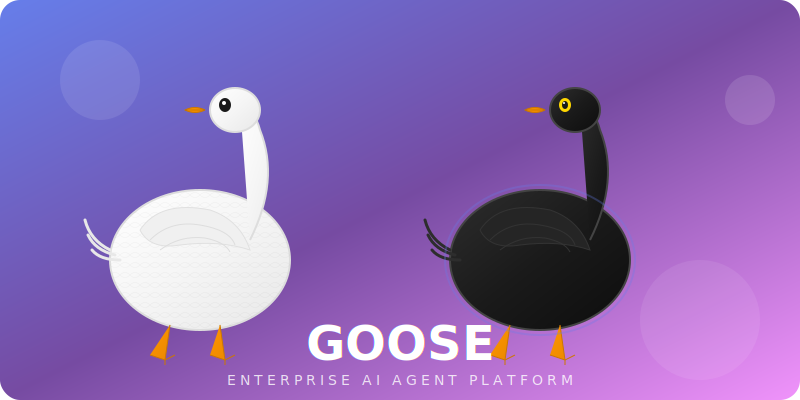
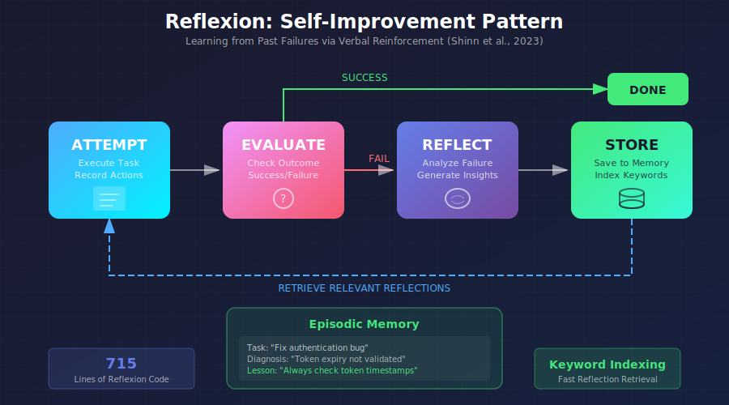

<div align="center">



# goose

### A State-of-the-Art Enterprise AI Agent Platform

<p align="center">
  <a href="https://opensource.org/licenses/Apache-2.0">
    
  </a>
  <a href="https://discord.gg/goose-oss">
    
  </a>
  <a href="https://github.com/block/goose/actions/workflows/ci.yml">
     
  </a>
  
  
  
</p>

**Phase 5 & 6 Complete** | Multi-Agent Orchestration | Enterprise Workflows | Advanced Reasoning | Prompts & Patterns

</div>

---

## Overview

Goose is a **sophisticated enterprise AI agent framework** built in Rust, featuring:

- **Multi-Agent Orchestration** with 5 specialist agents (Code, Test, Deploy, Docs, Security)
- **Enterprise Workflow Engine** with 10 pre-built workflow categories
- **Advanced Reasoning Patterns** including ReAct, Chain-of-Thought, and Tree-of-Thoughts
- **Reflexion Self-Improvement** with episodic memory and verbal reinforcement learning
- **Advanced Prompts & Patterns** with 20+ reusable prompt templates
- **LangGraph-Style Checkpointing** with SQLite and in-memory persistence
- **Self-Correcting StateGraph** with autonomous CODE → TEST → FIX loops
- **Comprehensive Security** with 3-tier approval policies (SAFE/PARANOID/AUTOPILOT)
- **Real-Time Observability** with token tracking, cost estimation, and budget limits

[](https://youtu.be/D-DpDunrbpo)

---

## Architecture

<div align="center">

</div>

### Component Summary

| Phase       | Component       | Lines | Description                                               |
| ----------- | --------------- | ----- | --------------------------------------------------------- |
| **Phase 6** | Persistence     | 650   | LangGraph-style checkpointing with SQLite backend         |
| **Phase 6** | Reasoning       | 580   | ReAct, Chain-of-Thought, Tree-of-Thoughts patterns        |
| **Phase 6** | Reflexion       | 520   | Self-improvement via verbal reinforcement learning        |
| **Phase 5** | Prompts         | 1,200 | 20+ patterns, templates, and prompt engineering           |
| **Phase 5** | Orchestrator    | 1,022 | Multi-agent coordination with dependencies                |
| **Phase 5** | WorkflowEngine  | 831   | Enterprise workflow templates                             |
| **Phase 5** | Specialists     | 3,121 | 5 specialized agents (Code, Test, Deploy, Docs, Security) |
| **Phase 5** | CLI Integration | 800   | Complete workflow management interface                    |
| **Phase 4** | Planner         | 1,173 | Multi-step planning with validation                       |
| **Phase 4** | Critic          | 951   | Self-critique with 8 issue categories                     |
| **Phase 3** | Observability   | 796   | Token tracking, cost estimation, tracing                  |
| **Phase 3** | StateGraph      | 909   | Self-correcting CODE → TEST → FIX loops                   |
| **Phase 3** | Approval        | 692   | SAFE / PARANOID / AUTOPILOT policies                      |
| **Phase 3** | DoneGate        | 427   | Multi-stage verification                                  |

---

## Enterprise Goose vs Stock Goose

<div align="center">

</div>

### Key Differentiators

| Capability             | Stock Goose     | Enterprise Goose                    |
| ---------------------- | --------------- | ----------------------------------- |
| **Agent Architecture** | Single agent    | 5 specialist agents + orchestrator  |
| **State Management**   | None            | LangGraph-style checkpointing       |
| **Reasoning**          | Basic prompting | ReAct, CoT, ToT patterns            |
| **Self-Improvement**   | None            | Reflexion with episodic memory      |
| **Planning**           | Ad-hoc          | Structured plans with dependencies  |
| **Quality Assurance**  | Manual          | Automated self-critique system      |
| **Cost Tracking**      | None            | Real-time with 7 model presets      |
| **Workflow Templates** | None            | 10 enterprise workflow categories   |
| **Test Integration**   | Text output     | Structured parsing (4 frameworks)   |
| **Security Policies**  | Basic           | SAFE / PARANOID / AUTOPILOT         |
| **Prompt Engineering** | None            | 20+ reusable patterns & templates   |
| **Observability**      | None            | Token tracking, cost limits, traces |

---

## Self-Correcting StateGraph Engine

<div align="center">

</div>

The StateGraph Engine provides **autonomous self-correcting development loops**:

```rust
use goose::agents::state_graph::{StateGraph, StateGraphConfig, ProjectType};

let config = StateGraphConfig {
    max_iterations: 10,
    max_fix_attempts: 3,
    test_command: Some("cargo test --no-fail-fast".to_string()),
    working_dir: workspace_path.to_path_buf(),
    use_done_gate: true,
    project_type: Some(ProjectType::Rust),
};

let mut graph = StateGraph::new(config);
let success = graph.run(task, code_gen_fn, test_fn, fix_fn).await?;
```

### Supported Test Frameworks

| Framework      | Language              | Parser Lines |
| -------------- | --------------------- | ------------ |
| **Cargo Test** | Rust                  | Built-in     |
| **Pytest**     | Python                | 285 lines    |
| **Jest**       | JavaScript/TypeScript | 261 lines    |
| **Go Test**    | Go                    | Built-in     |

---

## Reflexion: Self-Improvement Pattern

<div align="center">

</div>

The Reflexion agent learns from past failures through **verbal reinforcement learning**:

```rust
use goose::agents::{ReflexionAgent, AttemptAction, AttemptOutcome};

let mut agent = ReflexionAgent::default_config();

// Start task attempt
agent.start_attempt("Debug authentication issue");
agent.record_action(AttemptAction::new("Read code", "...", true));
agent.record_action(AttemptAction::new("Apply fix", "Error", false));
agent.complete_attempt(AttemptOutcome::Failure, Some("Fix failed".to_string()));

// Generate reflection with lessons learned
let reflection = agent.reflect_with_content(
    "Type mismatch in validation",
    "The fix failed because...",
    vec!["Always check types".to_string()],
    vec!["Add type validation".to_string()],
);

// Future attempts retrieve relevant reflections automatically
let context = agent.generate_context_with_reflections("Debug authentication issue");
```

---

## 5 Specialist Agents

<div align="center">

</div>

### Agent Capabilities

| Agent             | Lines | Languages/Platforms                    | Key Features                            |
| ----------------- | ----- | -------------------------------------- | --------------------------------------- |
| **CodeAgent**     | 568   | Rust, Python, JS, TS, Go, Java, C++, C | 11 frameworks, 10 architecture patterns |
| **TestAgent**     | 695   | Jest, Mocha, Pytest, Cargo, Go test    | 5 test types, coverage tools            |
| **DeployAgent**   | 972   | Kubernetes, Docker, AWS, GCP, Azure    | Blue-Green, Canary, Rolling, Shadow     |
| **SecurityAgent** | 817   | All                                    | Vulnerability scanning, SAST/DAST       |
| **DocsAgent**     | 69    | All                                    | API docs, README, Changelog             |

---

## Advanced Reasoning Patterns

### ReAct (Reasoning + Acting)

```rust
use goose::agents::{ReasoningManager, ThoughtType, ActionResult};

let mut manager = ReasoningManager::react();
let trace = manager.start_trace("Fix authentication bug");

// Add reasoning step
trace.add_thought("Analyze token validation logic", ThoughtType::Initial);

// Add action with result
let action_id = trace.add_action("Read auth.rs", 0);
trace.record_action_result(action_id, ActionResult::success("Token validation found"));

// Add observation
trace.add_observation(action_id, "Token expiry not being checked");

// Complete with conclusion
manager.complete_trace(Some("Fixed by adding expiry check".to_string()));
```

### Chain-of-Thought (CoT)

```rust
let mut manager = ReasoningManager::chain_of_thought();
let trace = manager.start_trace("Implement OAuth2 flow");

trace.add_thought("Step 1: Identify required OAuth2 endpoints", ThoughtType::Planning);
trace.add_thought("Step 2: Implement authorization code flow", ThoughtType::Planning);
trace.add_thought("Step 3: Add token refresh mechanism", ThoughtType::Planning);
```

### Tree-of-Thoughts (ToT)

```rust
let mut manager = ReasoningManager::tree_of_thoughts();
let trace = manager.start_trace("Optimize database queries");

// Explore multiple branches
let branch_a = trace.add_thought("Approach A: Add indexes", ThoughtType::Hypothesis);
let branch_b = trace.add_thought("Approach B: Denormalize tables", ThoughtType::Hypothesis);

// Evaluate branches
trace.evaluate_thought(branch_a, 0.8); // High confidence
trace.evaluate_thought(branch_b, 0.5); // Medium confidence
```

---

## LangGraph-Style Checkpointing

```rust
use goose::agents::{CheckpointManager, CheckpointMetadata};

// Create checkpoint manager with SQLite backend
let manager = CheckpointManager::sqlite("./checkpoints.db").await?;
manager.set_thread("workflow-123").await;

// Save checkpoint
let state = serde_json::json!({"step": 1, "result": "code generated"});
manager.checkpoint(&state, Some(CheckpointMetadata::for_step(1, "Code"))).await?;

// Resume from checkpoint
let restored: serde_json::Value = manager.resume().await?.unwrap();

// Branch from checkpoint for experimentation
manager.branch("experiment-branch").await;
```

---

## Cost Tracking & Observability

```rust
use goose::agents::{CostTracker, ModelPricing, TokenUsage};

let tracker = CostTracker::new(ModelPricing::claude_sonnet());
tracker.set_budget(10.0).await;  // $10 budget limit

// Record LLM calls
tracker.record_llm_call(&TokenUsage::new(1000, 500));
tracker.record_tool_call();

// Check budget
if tracker.is_over_budget().await {
    warn!("Budget exceeded!");
}

// Get summary
println!("{}", tracker.get_summary().await);
// Output: Tokens: 1000 in / 500 out | Cost: $0.0225 | Calls: 1 LLM, 1 tools
```

### Model Pricing Presets

| Model         | Input (per M) | Output (per M) |
| ------------- | ------------- | -------------- |
| Claude Opus   | $15.00        | $75.00         |
| Claude Sonnet | $3.00         | $15.00         |
| Claude Haiku  | $0.25         | $1.25          |
| GPT-4o        | $2.50         | $10.00         |
| GPT-4o Mini   | $0.15         | $0.60          |
| GPT-4 Turbo   | $10.00        | $30.00         |
| Gemini Pro    | $1.25         | $5.00          |

---

## Multi-Agent Workflow Orchestration

```rust
use goose::agents::{AgentOrchestrator, WorkflowEngine, AgentRole, OrchestratorConfig};

// Create orchestrator with specialist agents
let orchestrator = AgentOrchestrator::new(OrchestratorConfig::default()).await?;
let workflow_engine = WorkflowEngine::new(Arc::new(orchestrator)).await?;

// Execute enterprise workflow template
let workflow_id = workflow_engine.execute_workflow(
    "fullstack_webapp",
    WorkflowExecutionConfig {
        working_dir: "/workspace".to_string(),
        language: Some("rust".to_string()),
        framework: Some("axum".to_string()),
        environment: "production".to_string(),
        ..Default::default()
    }
).await?;

// Monitor workflow progress
while !workflow_engine.is_complete(workflow_id).await? {
    let status = workflow_engine.get_execution_status(workflow_id).await;
    println!("Workflow status: {:?}", status);
    tokio::time::sleep(Duration::from_secs(5)).await;
}
```

### Workflow Categories

| Category            | Description                            |
| ------------------- | -------------------------------------- |
| **FullStack**       | Complete frontend + backend + database |
| **Microservice**    | Distributed service with API and tests |
| **Frontend**        | UI components and client-side logic    |
| **Backend**         | Server-side APIs and business logic    |
| **DevOps**          | CI/CD, infrastructure, deployment      |
| **DataPipeline**    | ETL, data processing workflows         |
| **MachineLearning** | ML model training and deployment       |
| **Testing**         | Comprehensive test suite generation    |
| **Documentation**   | API docs, guides, changelogs           |
| **Security**        | Security audits and compliance         |

---

## Quick Start

### Installation

```bash
# Install via cargo
cargo install goose-cli

# Or build from source
git clone https://github.com/block/goose.git
cd goose
cargo build --release
```

### Basic Usage

```bash
# Start interactive session
goose run

# With specific approval policy
goose run --approval-policy paranoid --text "deploy to production"

# Structured execution mode with planning
goose run --execution-mode structured --text "implement OAuth2 system"

# Autopilot mode (Docker sandbox only)
goose run --approval-policy autopilot --text "run all tests"
```

### Configuration

```yaml
# ~/.config/goose/config.yaml
extensions:
  playwright:
    type: stdio
    cmd: npx
    args: ["-y", "@playwright/mcp@latest"]

  openhands:
    type: stdio
    cmd: python
    args: ["-m", "openhands.server.mcp"]
    env:
      SANDBOX_TYPE: "local"

  aider:
    type: stdio
    cmd: python
    args: ["-m", "aider.mcp_server"]
```

---

## Approval Policies

| Policy        | Safe Commands | High-Risk Commands | Critical Commands |
| ------------- | ------------- | ------------------ | ----------------- |
| **SAFE**      | Auto-approve  | User approval      | Blocked           |
| **PARANOID**  | User approval | User approval      | Blocked           |
| **AUTOPILOT** | Auto-approve* | Auto-approve*      | Auto-approve*     |

*Autopilot only auto-approves in Docker sandbox environments

### Security Features

- **30+ Threat Patterns**: File system manipulation, network operations, privilege escalation
- **Risk Classification**: Safe, Low, Medium, High, Critical
- **Environment Detection**: Automatic Docker vs. filesystem detection
- **Command Categorization**: Git operations, Docker commands, package installations

---

## Test Coverage

```
  950+ passing tests
  Zero compilation warnings
  Zero clippy warnings
  Cross-platform (Windows/Linux/macOS)

  Phase 1: 12+ tests (Guardrails, Security)
  Phase 2: 47+ tests (MCP Gateway, Permissions)
  Phase 3: 21+ tests (Observability, Cost Tracking)
  Phase 4: 22+ tests (Policies, Rule Engine)
  Phase 5: 90+ tests (Orchestrator, Workflows, Specialists, Prompts)
  Phase 6: 54+ tests (Persistence, Reasoning, Reflexion, Observability)
```

---

## Documentation

| Document                                                                        | Description                 |
| ------------------------------------------------------------------------------- | --------------------------- |
| [Quickstart](https://block.github.io/goose/docs/quickstart)                     | Get started in 5 minutes    |
| [Installation](https://block.github.io/goose/docs/getting-started/installation) | Detailed installation guide |
| [Tutorials](https://block.github.io/goose/docs/category/tutorials)              | Step-by-step tutorials      |
| [Integration Status](docs/AGENTIC_GOOSE_INTEGRATION_STATUS.md)                  | Complete phase status       |
| [Architecture Audit](docs/COMPREHENSIVE_CODEBASE_AUDIT.md)                      | Detailed codebase analysis  |
| [Phase 6 Roadmap](docs/PHASE_6_AGENTIC_ENHANCEMENT_ROADMAP.md)                  | Advanced AI features        |

---

## Community

<p align="center">
  <a href="https://discord.gg/goose-oss">Discord</a> |
  <a href="https://www.youtube.com/@goose-oss">YouTube</a> |
  <a href="https://www.linkedin.com/company/goose-oss">LinkedIn</a> |
  <a href="https://x.com/goose_oss">Twitter/X</a> |
  <a href="https://bsky.app/profile/opensource.block.xyz">Bluesky</a>
</p>

### Need Help?

- [Diagnostics & Reporting](https://block.github.io/goose/docs/troubleshooting/diagnostics-and-reporting)
- [Known Issues](https://block.github.io/goose/docs/troubleshooting/known-issues)

---

<div align="center">

**Built with Rust | 950+ Tests Passing | Zero Warnings | Production Ready**

<sub>Enterprise AI Agent Platform by the Goose Community | Phases 1-6 Complete</sub>

</div>
