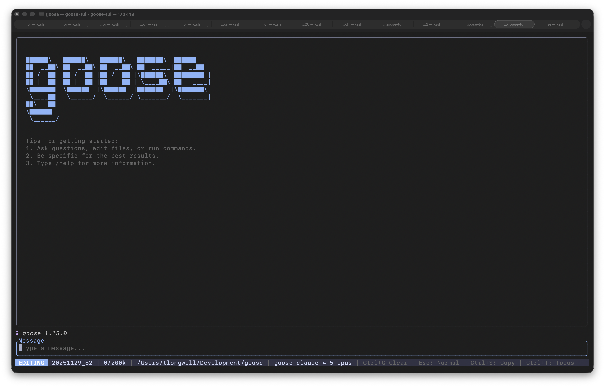
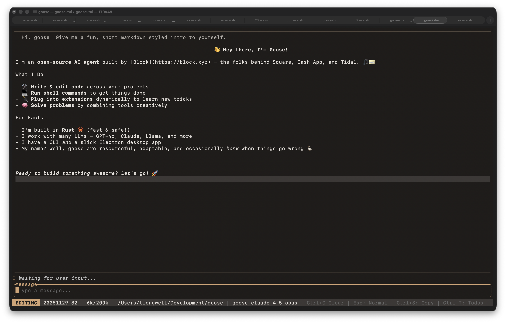

# Goose TUI

A terminal user interface for [Goose](https://github.com/block/goose), the AI agent framework.

<p align="center">
  
  
</p>

## Features

- **Interactive Chat**: Full conversation interface with markdown rendering
- **Session Management**: Create, resume, and fork sessions
- **Theming**: 11 built-in color themes
- **Recipe Support**: Run automated workflows from YAML files
- **Headless Mode**: Non-interactive execution for scripts and CI
- **Custom Commands**: Create shortcuts for frequently used tools with dynamic arguments
- **Todo Tracking**: Automatic task extraction from agent responses
- **Copy Mode**: Disable mouse capture for terminal text selection

## Installation

The TUI is part of the Goose monorepo. Build from source:

```bash
cd /path/to/goose
source bin/activate-hermit
cargo build -p goose-tui --release
```

The binary will be at `target/release/goose-tui`.

## Quick Start

```bash
# Start interactive session
goose-tui

# Resume a previous session
goose-tui --session <session-id>

# Run a recipe
goose-tui --recipe my-recipe.yaml

# Run a recipe without TUI (headless)
goose-tui --recipe my-recipe.yaml --headless

# Use lightweight CLI mode (fallback for compatibility)
goose-tui --cli
```

## Usage

### Interactive Mode

The default mode. Start a new session or resume an existing one:

```bash
goose-tui                      # New session
goose-tui --session abc123     # Resume session
```

### Recipe Mode

Execute a recipe file with the TUI showing progress:

```bash
goose-tui --recipe workflow.yaml
```

The recipe's prompt is automatically sent to the agent. The TUI exits when the agent finishes.

### Headless Mode

Run recipes without the TUI interface. Useful for automation:

```bash
goose-tui --recipe workflow.yaml --headless
```

Output is printed to stdout. Automatically enabled when stdout is not a terminal.

### CLI Mode

A lightweight fallback when the full TUI isn't suitable:

```bash
goose-tui --cli
```

CLI mode provides the same functionality with simple line-by-line output. Use it when:
- Your terminal has compatibility issues with the TUI
- You need to pipe or capture output
- You prefer a simpler interface
- You're using a screen reader

#### CLI Keybindings

| Key | Action |
|-----|--------|
| `Enter` | Send message |
| `Ctrl+J` | Insert newline (multi-line input) |
| `↑/↓` | Navigate command history |
| `Ctrl+C` | Cancel current input |
| `Ctrl+D` | Exit |

#### CLI Commands

| Command | Description |
|---------|-------------|
| `/help` | Show help |
| `/clear` | Clear screen |
| `/exit` | Exit |

## Keybindings

### General

| Key | Action |
|-----|--------|
| `Ctrl+C` | Interrupt (working) / Clear input / Quit |
| `Ctrl+L` | Refresh screen |
| `Ctrl+T` | Toggle todo panel |
| `Ctrl+S` | Toggle copy mode |
| `Esc` | Close popup / Switch to Normal mode |

### Editing Mode

| Key | Action |
|-----|--------|
| `Enter` | Send message |
| `Ctrl+J` | Insert newline |
| `Esc` | Switch to Normal mode |

### Normal Mode

| Key | Action |
|-----|--------|
| `i` / `e` | Switch to Editing mode |
| `j` / `↓` | Scroll down |
| `k` / `↑` | Scroll up |
| `Enter` | View message details |

### Message Detail Popup

| Key | Action |
|-----|--------|
| `c` | Copy to clipboard |
| `f` | Fork session from this message |
| `Esc` / `q` | Close |

## Slash Commands

Type these in the input field:

| Command | Description |
|---------|-------------|
| `/help` | Show help popup |
| `/config` | Open configuration (provider, model, extensions) |
| `/session` | Open session picker |
| `/theme [name]` | Change theme (e.g., `/theme dark`) |
| `/alias` | Create or manage custom commands |
| `/clear` | Clear chat history |
| `/compact` | Trigger context compaction |
| `/copy` | Toggle copy mode |
| `/todos` | Toggle todo popup |
| `/exit` | Exit the TUI |

## Themes

11 built-in themes available via `/theme <name>`:

| Theme | Description |
|-------|-------------|
| `goose` | Warm brown tones (default) |
| `gemini` | Catppuccin-inspired with terminal background |
| `light` | GitHub Light style |
| `dark` | One Dark style |
| `midnight` | Catppuccin Mocha |
| `nord` | Nord color palette |
| `dracula` | Dracula color palette |
| `matrix` | Green on black |
| `tokyonight` | Tokyo Night style |
| `solarized` | Solarized Dark |
| `retrowave` | Synthwave/vaporwave aesthetic |

Theme preference is saved to your Goose configuration.

### Custom Themes

You can define custom themes in `~/.config/goose/config.yaml`. Custom themes appear alongside built-in themes in the theme picker.

#### Theme Format

```yaml
tui_custom_themes:
  sakura:
    base:
      background: [30, 25, 28]
      foreground: [255, 220, 235]
      cursor: [255, 183, 197]
      selection: [60, 45, 55]
      border: [90, 70, 85]
      border_active: [255, 174, 201]
      user_message_foreground: [230, 190, 210]
    status:
      info: [168, 216, 255]
      success: [180, 230, 180]
      warning: [255, 200, 150]
      error: [255, 140, 160]
      thinking: [212, 170, 230]
```

#### Color Format

Colors are RGB arrays `[r, g, b]` where each value is 0-255. For terminal default background, use the string `"Reset"` instead of an RGB array.

#### Using Custom Themes

1. Add your theme definition to `tui_custom_themes` in your config file
2. Use `/theme <name>` to switch to it (e.g., `/theme sakura`)
3. Or set it as default: `tui_theme: sakura`

Custom themes are loaded at startup and appear in the theme picker (`/theme` without arguments).

## Custom Commands

Create shortcuts for frequently used tools with `/alias`:

1. Type `/alias` to open the command builder
2. Select a tool from the list (or manage existing aliases)
3. Fill in the arguments
4. Give it a name

Your custom command is now available as `/<name>`.

### Dynamic Arguments with `{input}`

Use `{input}` as a placeholder in any argument to accept text when the command is run:

1. Create an alias with `{input}` in an argument (e.g., `{"query": "{input}"}`)
2. Run it with trailing text: `/mysearch hello world`
3. The `{input}` placeholder is replaced with "hello world"

This enables commands like `/grep {pattern}` or `/run {script}` that take dynamic input.

Custom commands are saved to your Goose configuration.

## Configuration

The TUI uses the global Goose configuration at `~/.config/goose/config.yaml`.

TUI-specific settings:
- `tui_theme`: Current theme name
- `tui_custom_themes`: Custom theme definitions (see [Custom Themes](#custom-themes))
- `tui_custom_commands`: List of custom commands

Use `/config` to change:
- **Provider**: AI provider (OpenAI, Anthropic, etc.)
- **Model**: Model to use
- **Extensions**: Enable/disable MCP extensions

## Interface Layout

```
┌─────────────────────────────────────────────┐
│                                             │
│              Chat Messages                  │
│                                             │
│  │ User message with border                 │
│                                             │
│  Assistant response with markdown           │
│                                             │
│  ╭─ tool_name args... ──────────────────╮   │
│  │ Tool output (truncated)              │   │
│  ╰──────────────────────────────────────╯   │
│                                             │
├─────────────────────────────────────────────┤
│ ⠋ Current task (2/5)              Flash!    │  ← Info line
├─────────────────────────────────────────────┤
│ Message                                     │  ← Input
│ Type here...                                │
├─────────────────────────────────────────────┤
│ EDITING │ COPY │ session │ 12k/128k │ ...   │  ← Status bar
└─────────────────────────────────────────────┘
```

**Info line** shows: spinner + current task (or pun) when working, flash messages on the right.

**Status bar** shows: mode, COPY indicator (if active), session ID, token usage, working directory, model, and contextual hints.

## Session Forking

Fork a session to explore alternative paths:

1. Press `Esc` to enter Normal mode
2. Use `j`/`k` to scroll to a message
3. Press `Enter` to view message details
4. Press `f` to fork from that message
5. A new session is created with messages up to that point

The original session remains unchanged. Useful for trying different approaches or recovering from mistakes.

## Copy Mode

By default, mouse events are captured for scrolling. To select text with your terminal:

1. Press `Ctrl+S` or type `/copy` to enter copy mode
2. Select text with your mouse
3. Press `Ctrl+S` again to exit copy mode

The status bar shows `COPY` when copy mode is active.

## Troubleshooting

### TUI doesn't start

- Ensure Goose is properly configured: `goose configure`
- Check logs at `~/.goose/logs/` (daily rolling logs named `tui.log.YYYY-MM-DD`)

### Can't select text

- Enter copy mode with `Ctrl+S`

### Theme not saving

- Check write permissions for `~/.config/goose/config.yaml`

### Session not found

- Sessions are stored by goose-server
- Use `/session` to see available sessions

## Development

See [AGENTS.md](AGENTS.md) for development instructions and [ARCHITECTURE.md](ARCHITECTURE.md) for system design.

```bash
# Build
cargo build -p goose-tui

# Test
cargo test -p goose-tui

# Run in development
cargo run -p goose-tui
```
