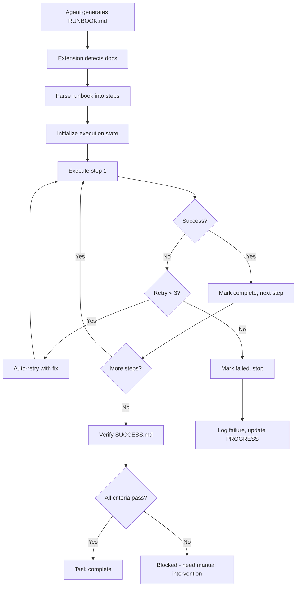

# Runbook Compliance System (Phase 7)

## Problem Statement

Goose previously had a "spec handoff" failure mode:
1. Agent generates excellent documentation/specs ✅
2. Agent treats docs as "output to show user" ❌
3. Agent tells user to run commands instead of running them ❌
4. User has to manually execute or re-prompt ❌

**Result:** Breaking autonomous flow and requiring manual intervention despite being in Auto mode.

## Solution: Markdown as Binding Contract

The Runbook Compliance System treats `docs/RUNBOOK.md` and specification markdowns as **executable contracts**, not documentation output.

### Core Principles

1. **Documentation = Execution Instructions**
   - When Goose writes RUNBOOK.md, it's writing code for itself
   - Markdown specs are binding contracts to execute

2. **Auto-Execute, Don't Hand-Off**
   - If Developer tools available → execute immediately
   - Only ask user for: secrets, permissions, genuine decisions
   - Never say "run this command" - just run it

3. **Verify Success Rigorously**
   - docs/SUCCESS.md defines hard pass/fail criteria
   - Task not complete until ALL criteria verified
   - No placeholders, TODOs, or stubs allowed

4. **Spec-Drift Repair**
   - If reality diverges from docs during execution
   - Update docs to match working reality
   - Never leave stale documentation

## File Structure

```
project/
├── docs/
│   ├── RUNBOOK.md        # Executable step-by-step instructions
│   ├── SUCCESS.md        # Hard verification criteria
│   ├── PROGRESS.md       # Auto-generated status (DO NOT EDIT)
│   └── CHANGELOG.md      # Spec drift log
├── artifacts/
│   ├── run-state.json    # Machine-readable execution state
│   └── run-log.txt       # Full command outputs
└── .goosehints           # Enforcement policy (loaded at startup)
```

## Using the System

### For Users

**Basic Usage:**
```bash
# Start Goose with auto mode
goose --mode auto

# Goose will:
# 1. Generate RUNBOOK.md + SUCCESS.md
# 2. Immediately execute runbook steps
# 3. Verify success criteria
# 4. Update PROGRESS.md in real-time
# 5. Only stop when complete or blocked
```

**Execute Existing Runbook:**
```bash
# Run runbook as explicit task
goose run -i docs/RUNBOOK.md -s

# With progress streaming
goose run --output-format stream-json -i docs/RUNBOOK.md
```

**Check Progress:**
```bash
# View current status
cat docs/PROGRESS.md

# View execution log
tail -f artifacts/run-log.txt

# Check state machine
cat artifacts/run-state.json | jq
```

### For Agent Developers

**Creating Compliant Runbooks:**

Use the template at `crates/goose/src/agents/templates/RUNBOOK.template.md`:

```markdown
# Project Runbook

**Goal:** Implement feature X

**Preconditions:**
- Rust 1.75+
- cargo installed

## Steps

### 1. Install Dependencies
**Command:**
```bash
cargo add serde serde_json
```
**Expected Result:** Dependencies added to Cargo.toml
**If Fails:** Check network connection

### 2. Run Tests
**Command:**
```bash
cargo test --workspace
```
**Expected Result:** All tests pass
**If Fails:** Fix failing tests before continuing
```

**Creating Success Criteria:**

Use the template at `crates/goose/src/agents/templates/SUCCESS.template.md`:

```markdown
# Success Criteria

## Automated Checks
- **Build succeeds**
  Check: `cargo build`
  Expect: Exit code 0

- **Tests pass**
  Check: `cargo test`
  Expect: "test result: ok"

## Manual Verification
- [ ] Documentation updated
- [ ] No TODOs in code
```

## Integration with Phase 1-7 Features

The Runbook Compliance System integrates seamlessly:

### Phase 1: Guardrails
- Command validation before execution
- Secret detection in runbook steps
- Malware scanning on generated code

### Phase 2: MCP Gateway
- Tool orchestration via MCP servers
- Cross-agent runbook execution
- Remote execution capabilities

### Phase 3: Observability
- Emit telemetry for each step
- Track execution metrics
- Distributed tracing of runbook flows

### Phase 4: Policies/Rules
- Check policies before risky operations
- Enforce approval workflows
- Audit trail for compliance

### Phase 5: Multi-Agent Platform
- Swarm coordination for parallel steps
- Delegate sub-runbooks to specialist agents
- Aggregate results from multiple agents

### Phase 6: Memory/Reasoning
- Recall similar past executions
- Learn from previous failures
- Semantic search for relevant procedures

### Phase 7: Claude-Inspired Features
- Tasks: Runbook steps map to task queue
- Teams: Assign steps to specialist agents
- Skills: Reusable runbook modules
- Hooks: Trigger on step events

## Architectural Components

### 1. RunbookCompliance (`runbook_compliance.rs`)
Core state machine that:
- Parses RUNBOOK.md into executable steps
- Tracks execution state (in-progress, completed, failed)
- Manages retries and failure recovery
- Verifies success criteria
- Updates PROGRESS.md

### 2. RunbookExecutionExtension (`runbook_execution_extension.rs`)
Agent extension that:
- Auto-detects when docs are generated
- Triggers runbook execution immediately
- Integrates with agent workflow
- Prevents "tell user to run command" anti-pattern

### 3. .goosehints Policy
System-level enforcement:
- Loaded at Goose startup
- Defines execution behavior rules
- Enforces "DOER not SUGGESTER" mode
- Context management strategy

## Execution Flow



## Failure Recovery

The system implements intelligent retry logic:

```rust
// Automatic retry with variations
if step_fails {
    if retry_count < 3 {
        // Try variations:
        // 1. Add --verbose flag
        // 2. Change path to absolute
        // 3. Add timeout
        // 4. Check for common issues (network, permissions)
        retry_with_fix(step);
    } else {
        record_failure();
        ask_user_for_help();
    }
}
```

### Common Failure Patterns

1. **Network Timeout**
   - Auto-retry with exponential backoff
   - Add --timeout flags

2. **Permission Denied**
   - Check file permissions
   - Suggest chmod if safe
   - Ask user if needs elevation

3. **Missing Dependencies**
   - Parse error message for package name
   - Auto-install if policy allows
   - Otherwise add to runbook preconditions

4. **Environment Issues**
   - Check PATH, env vars
   - Update .env if missing
   - Add to preconditions

## Spec Drift Repair

When implementation reality diverges from docs:

```markdown
# CHANGELOG.md

## 2026-02-04 - Step 3 Modified

**Original:**
```bash
npm install
```

**Actual Working:**
```bash
npm install --legacy-peer-deps
```

**Reason:** Peer dependency conflict with React 18

**Action:** RUNBOOK.md updated to reflect working command
```

## Best Practices

### Writing Runbooks

**DO:**
- ✅ Use specific commands with full flags
- ✅ Define clear expected results
- ✅ Provide failure recovery steps
- ✅ Test the runbook before committing
- ✅ Keep steps atomic (one command per step)

**DON'T:**
- ❌ Use vague descriptions ("set up the environment")
- ❌ Omit expected results
- ❌ Skip preconditions
- ❌ Chain commands without explaining
- ❌ Leave placeholders like [INSERT COMMAND HERE]

### Defining Success Criteria

**DO:**
- ✅ Use automated checks where possible
- ✅ Provide exact commands to verify
- ✅ Define pass/fail unambiguously
- ✅ Include integration checks
- ✅ Check for TODOs/placeholders

**DON'T:**
- ❌ Rely only on manual verification
- ❌ Use subjective criteria ("looks good")
- ❌ Skip verification steps
- ❌ Allow partial completion

## Configuration

### .goosehints Settings

The system behavior is controlled by `.goosehints`:

```markdown
## Post-Documentation Workflow (MANDATORY)
After creating or updating ANY specification markdown:
1. Immediately re-open docs/RUNBOOK.md
2. Parse it into executable steps
3. Execute each step sequentially
4. Verify success criteria
5. Update docs/PROGRESS.md
6. Do NOT consider complete until SUCCESS.md passes

## Auto Mode Behavior
In autonomous mode, you are a DOER, not a SUGGESTER:
- "Run this command" → NO, run it yourself
- "You should test this" → NO, test it yourself
- Only stop for: missing secrets, user decisions, genuine blocks
```

### Extension Configuration

Enable/disable via agent config:

```json
{
  "extensions": {
    "runbook_execution": {
      "enabled": true,
      "max_retries": 3,
      "auto_execute": true
    }
  }
}
```

## Troubleshooting

### "Runbook not executing automatically"

**Check:**
1. Is `docs/RUNBOOK.md` present?
2. Is Auto mode enabled? (`--mode auto`)
3. Is extension enabled in config?
4. Check `artifacts/run-log.txt` for errors

**Solution:**
```bash
# Force execution
goose run -i docs/RUNBOOK.md

# Check extension status
goose --list-extensions | grep runbook
```

### "Steps failing repeatedly"

**Check:**
1. `artifacts/run-state.json` for failure details
2. `artifacts/run-log.txt` for full error output
3. Preconditions in RUNBOOK.md

**Solution:**
1. Fix the failing command manually
2. Update RUNBOOK.md with working version
3. Re-run from failed step

### "Agent still handing off to user"

**Check:**
1. Is `.goosehints` present?
2. Are Developer tools available?
3. Is permission mode allowing execution?

**Solution:**
```bash
# Verify hints loaded
goose --debug | grep "goosehints"

# Enable developer extension
goose --enable-extension developer

# Use autonomous mode
goose --mode auto
```

## Examples

### Example 1: Feature Implementation

```markdown
# RUNBOOK.md - Implement User Authentication

**Goal:** Add JWT-based authentication to API

**Preconditions:**
- [x] Rust 1.75+
- [x] PostgreSQL running on localhost:5432
- [x] SECRET_KEY in .env

## Steps

### 1. Add Dependencies
Command: `cargo add jsonwebtoken bcrypt`
Expected: Dependencies in Cargo.toml
If Fails: Check network, verify cargo up-to-date

### 2. Create User Model
Command: `cargo run --bin generate-model -- --name User --fields "email:String,password:String"`
Expected: src/models/user.rs created
If Fails: Check codegen tool installed

### 3. Run Migrations
Command: `sqlx migrate run`
Expected: "Applied X migrations"
If Fails: Check DB connection, verify migrations/ folder exists

### 4. Implement Auth Endpoints
Command: `cargo test tests/auth_test.rs`
Expected: All auth tests pass
If Fails: Review test output, fix implementation

### 5. Integration Test
Command: `cargo test --workspace`
Expected: All 156 tests pass
If Fails: Run with --nocapture to see details
```

```markdown
# SUCCESS.md

## Automated Checks
- **Build succeeds**: `cargo build` → exit 0
- **All tests pass**: `cargo test` → "test result: ok"
- **Auth endpoint works**: `curl localhost:8000/auth/login` → 200 OK

## Manual Verification
- [ ] Can register new user
- [ ] Can login and receive JWT
- [ ] Protected routes reject invalid tokens
- [ ] No passwords in logs
```

### Example 2: Bug Fix

```markdown
# RUNBOOK.md - Fix Memory Leak in Connection Pool

**Goal:** Resolve memory leak identified in issue #1234

## Steps

### 1. Reproduce Issue
Command: `cargo test tests/connection_pool_leak_test.rs --release -- --ignored`
Expected: Test fails showing leak
If Fails: Issue may be fixed already

### 2. Apply Fix
Command: Manual edit to src/db/pool.rs - add Drop implementation
Expected: File modified with new Drop trait
If Fails: Check file not locked

### 3. Verify Fix
Command: `cargo test tests/connection_pool_leak_test.rs --release -- --ignored`
Expected: Test passes
If Fails: Review valgrind output, iterate on fix

### 4. Regression Check
Command: `cargo test --workspace`
Expected: All tests pass
If Fails: Fix broke something, revert and redesign
```

## Future Enhancements

### Planned Features

1. **Multi-Agent Runbooks**
   - Parallel step execution
   - Swarm coordination
   - Result aggregation

2. **Learning from Failures**
   - Memory integration
   - Auto-fix suggestions from past executions
   - Failure pattern recognition

3. **Visual Progress Dashboard**
   - Real-time UI in desktop app
   - Step-by-step visualization
   - Rollback/replay controls

4. **Conditional Steps**
   - Platform-specific branches
   - Dynamic step generation
   - Context-aware execution

5. **Runbook Templates**
   - Pre-built patterns (feature, bug fix, refactor)
   - Team-shared runbook library
   - Version control for runbooks

## Contributing

To improve the Runbook Compliance System:

1. **Report Issues:**
   - What runbook pattern failed?
   - What was the failure mode?
   - How did you work around it?

2. **Suggest Templates:**
   - Common workflows that need standardization
   - Industry-specific patterns

3. **Extend Failure Recovery:**
   - Add detection for new failure types
   - Improve auto-fix heuristics

4. **Integration Ideas:**
   - New tool integrations (CI/CD, monitoring)
   - Cross-platform runbook patterns

## References

- [Phase 7 AGENTS.md](../crates/goose/AGENTS.md) - Multi-agent architecture
- [.goosehints](./../.goosehints) - Enforcement policy
- [RUNBOOK template](../crates/goose/src/agents/templates/RUNBOOK.template.md)
- [SUCCESS template](../crates/goose/src/agents/templates/SUCCESS.template.md)

---

**Status:** ✅ Implemented in Phase 7
**Maintainer:** Goose Core Team
**Last Updated:** 2026-02-04
