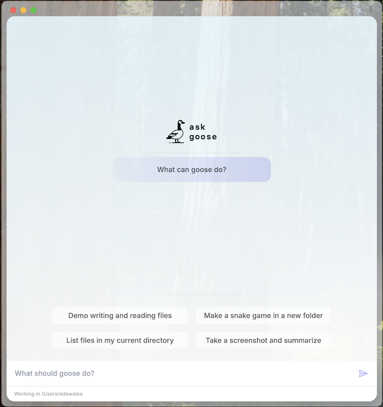

We are excited to announce the release of Goose v1.0!

This major update comes with a bunch of new features and improvements that make Goose more powerful and user-friendly. Here are some of the key highlights.

<!-- more -->

## Exciting Features of Goose 1.0

### 1. Transition to Rust

The core of Goose is being rewritten in Rust. Why does this matter? Rust allows for a more portable and stable experience. This change means that Goose can run smoothly on different systems without the need for Python to be installed, making it easier for anyone to start using it.

### 2. Contextual Memory

Goose will remember previous interactions to better understand ongoing projects. This means you won’t have to keep repeating yourself. Imagine having a conversation with someone who remembers every detail—this is the kind of support Goose aims to offer.

### 3. Improved Plugin System

The Goose toolkit system is being updated to systems. With the Rust rewrite, Goose will be able to support more complex plugins and integrations. This will make it easier to extend Goose with new features and functionality.

### 4. Headless mode

You can now run Goose in headless mode - this is useful for running Goose on servers or in environments where a graphical interface is not available.

```sh
cargo run --bin goose -- run -i instructions.md
```

### 5. Goose now has a GUI

Goose now has an electron-based GUI application that makes it easier to interact with Goose and manage your projects.



Excited for many more feature updates and improvements? Stay tuned for more updates on Goose! Check out the [Goose repo](https://github.com/block/goose) and join our [Discord community](https://discord.gg/block-opensource).