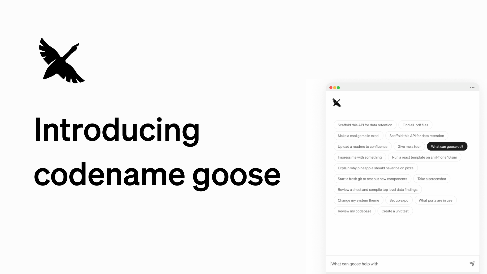

We are thrilled to announce **codename goose**, your on-machine, open source AI agent built to automate your tasks. 

Powered by your choice of [large language models (LLMs)](/docs/getting-started/providers), a user-friendly desktop interface and CLI, and [extensions](/docs/getting-started/using-extensions) that integrate with your existing tools and applications, Goose is designed to enhance your productivity and workflow.

<!--truncate-->

You can think of Goose as an assistant that is ready to take your instructions, and do the work for you.

While Goose's first use cases are engineering focused, the community has been exploring other non-engineering use cases for Goose as well. And it goes without saying, Goose is [open source](https://github.com/block/goose) 🎉.

## How Goose Works

Goose operates as an intelligent, autonomous agent capable of handling complex tasks through a well-orchestrated coordination of its core features:
  
- **Using Extensions**: [Extensions](/docs/getting-started/using-extensions) are key to Goose’s adaptability, providing you the ability to connect with applications and tools that you already use. Whether it’s connecting to GitHub, accessing Google Drive or integrating with JetBrains IDEs, the possibilities are extensive. Some of these extensions have been curated in the [extensions](/extensions) directory. Goose extensions are built on the [Model Context Protocol (MCP)](https://www.anthropic.com/news/model-context-protocol) - enabling you to build or bring your own custom integrations to Goose. 

- **LLM Providers**: Goose is compatible with a wide range of LLM providers, allowing you to choose and integrate your preferred model. Supported providers include OpenAI, Anthropic, and more, each offering unique capabilities to fit your needs.

- **CLI and Desktop Support**: You can have Goose running as both a desktop app or a command-line interface - whatever your preference is - using the same configuration across board.

## Goose in Action

Goose is able to handle a wide range of tasks, from simple to complex, across various engineering domains. Here are some examples of tasks that Goose has helped people with:

- Conduct code migrations like: Ember to React, Ruby to Kotlin, Prefect-1 to Prefect-2 etc. 
- Dive into a new project in an unfamiliar coding language
- Transition a code-base from field-based injection to constructor-based injection in a dependency injection framework.
- Conduct performance benchmarks for a build command using a build automation tool
- Increasing code coverage above a specific threshold
- Scaffolding an API for data retention
- Creating Datadog monitors
- Removing or adding feature flags etc.

## Getting Started

Getting up and running with Goose is easy:

1. **Installation**: Quickly install Goose using the setup guide in the [documentation](/docs/getting-started/installation).

2. **Configure Your Environment**: Choose your desired LLM provider.

3. **Explore Extensions**: Browse and toggle between various built-in extensions to customize Goose to your  needs, or explore the [central directory of extensions](/extensions) for additional options.

4. **Build**: Start a Goose session and start building. 🚀

## Join the Goose Community

Excited for upcoming feature updates and improvements? Check out the [Goose repo](https://github.com/block/goose) and join our [Discord community](https://discord.gg/block-opensource).