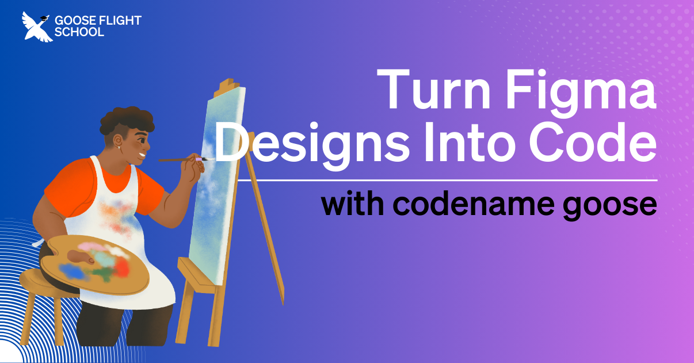

In our previous episode of [Goose Flight School](https://www.youtube.com/playlist?list=PLyMFt_U2IX4s1pMaidir5P4lSfjUK6Nzm), our host [Ace Abati](https://www.linkedin.com/in/acekyd/) showed us how to use Goose to take a Figma design and transform it into a functional Nox application. In this stream he covered the entire process, from initial setup to final implementation, highlighting how Goose can help developers bridge the gap between design and development.

<!--truncate-->

# How It Works
[Extensions](https://block.github.io/goose/docs/getting-started/using-extensions) enhance Goose's functionality by connecting with your existing toolds and workflows. They add new features, access external data resources, and integrate with other systems. Learn how multiple extensions—including Figma, Git, and Developer—worked together seamlessly to dramatically accelerate development. 

Goose uses three extensions to accomplish this design-to-code workflow automation:
1. **[Figma Extension](https://github.com/hapins/figma-mcp#readme)**: This connects Goose to the Figma API to extract design specifications, component hierarchies, and styling information directly from your design files. Tutorial for using this extension is [here](https://block.github.io/goose/docs/tutorials/figma-mcp).
2. **[Developer Extension](https://github.com/block/goose/tree/main/crates/goose-mcp/src/developer)**: Built-in extension that enables Goose to handle the heavy lifting of code generation, interpreting the design data and converting it into appropriate components, layouts, and styling for the Nox application framework. Tutorial for using this extension is [here](https://block.github.io/goose/docs/tutorials/developer-mcp).
3. **[Git Extension](https://github.com/modelcontextprotocol/servers/tree/main/src/git)**: This helps manages version control throughout the process, creating repositories and making commits to track changes as you go. Tutorial for using this extension is [here](https://block.github.io/goose/docs/tutorials/github-mcp).

# Live Tutorial: Goose Builds Live
During the livestream, Adewale demonstrated step-by-step how Goose handled each development phase, from creating the basic application structure to generating responsive layouts using Tailwind CSS. Adewale also highlighted how Goose addresses potential limitations as you go, showcasing the powerful balance between the Goose's automation and developer control.

<iframe class="aspect-ratio" src="https://www.youtube.com/embed/_9t_N9zKwKM?si=r3e1MkrjS-f2AvkI" title="YouTube video player" frameborder="0" allow="accelerometer; autoplay; clipboard-write; encrypted-media; gyroscope; picture-in-picture; web-share" referrerpolicy="strict-origin-when-cross-origin" allowfullscreen></iframe>

Throughout the stream, Adewale shared valuable tips to prepare your design for Goose. His key recommendations include: starting with a well-structured Figma design, using Goose to make targeted improvements after the initial generation, fine-tuning specific elements as needed, and to make sure you thoroughly test for functionality and responsiveness.

# Getting Started with Goose and Figma
Whether you're a designer wanting to rapidly turn concepts into working code or a developer curious about streamlining design implementation, you can download Goose with its built-in Developer Extension [here](https://block.github.io/goose/docs/getting-started/installation), and the Figma and Git extensions can be installed from [here](https://block.github.io/goose/v1/extensions/).

<head>
  <meta property="og:title" content="Goose Flight School: Turn Figma Designs Into Code With Goose" />
  <meta property="og:type" content="article" />
  <meta property="og:url" content="https://block.github.io/goose/blog/2025/03/12/goose-figma-mcp" />
  <meta property="og:description" content="Give Goose the ability to turn Figma designs into code with the Figma extension." />
  <meta property="og:image" content="https://block.github.io/goose/assets/images/goosefigma.png" />
  <meta name="twitter:card" content="summary_large_image" />
  <meta property="twitter:domain" content="block.github.io/goose" />
  <meta name="twitter:title" content="Goose Flight School: Turn Figma Designs Into Code With Goose" />
  <meta name="twitter:description" content="Give Goose the ability to turn Figma designs into code with the Figma extension." />
  <meta name="twitter:image" content="https://block.github.io/goose/assets/images/goosefigma.png" />
</head>