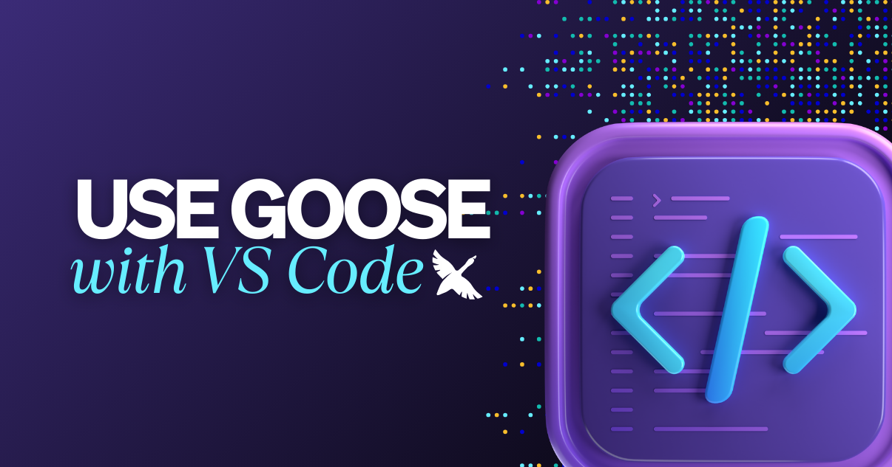

Want to use Goose in VS Code? On the recent [Wild Goose Case livestream](https://www.youtube.com/watch?v=hG7AnTw-GLU&ab_channel=BlockOpenSource), hosts [Ebony Louis](https://www.linkedin.com/in/ebonylouis/) and [Adewale Abati](https://www.linkedin.com/in/acekyd/) were joined by [Andrew Gertig](https://www.linkedin.com/in/andrewgertig/), Engineering Lead at Cash App, as he demonstrated the new VSCode MCP and how it brings powerful Goose-assisted coding capabilities directly into VS Code.

<!--truncate-->

# What is the VSCode MCP?
The [VSCode MCP Server](https://github.com/block/vscode-mcp), and its companion VSCode Extension, together enable AI agents like Goose to interact with VS Code through the Model Context Protocol.

As Andrew explained during the stream, an MCP ([Model Context Protocol](https://modelcontextprotocol.io/introduction)) server acts as a proxy between a Large Language Model (LLM) and whatever applications or tools you want to access to - in this case, VS Code. Extensions are add-ons based on this protocol that provide a way to extend Goose's functionality for your workflow.

```
vscode-mcp/
├── server/    # MCP server implementation
└── extension/ # VS Code extension
```

# Key Features
VSCode MCP and VSCode Extension offer several powerful features for you to explore:

## Intelligent Context Awareness
The extension maintains synchronization between Goose and your VS Code environment to understand your project structure and make contextually relevant suggestions. During the live demo, this came in handy as Goose navigated complex codebases with precision.

## Interactive Code Modifications
Rather than making direct changes, the extension presents modifications through VS Code's diff tool. This ensures that no code changes happen without your explicit approval, allowing you to keep control over your codebase.

## Progressive Complexity Handling
During the demo, the VSCode MCP seamlessly handled tasks ranging in complexity, from basic text modifications to implementing interactive features like animated emojis with mouse interactions.

## Real-time Visual Feedback
Developers can see proposed changes in real-time with the diff view, making it easy to understand exactly what modifications Goose is suggesting before accepting them. This was demonstrated when an emoji's sizes visually while preserving existing functionality.

# What's Next for VSCode MCP?
The features don't end here. The team is actively exploring several exciting features to take VSCode MCP to the next level:

- **Custom diff tool for granular control** - This means you will be able to be selective on specifici parts of changes you want to accept or reject.
- **Smart navigation to specific code locations** - Imagine being able to ask Goose to take you directly to a function definition or a specific implementation.
- **Enhanced linting integration** - To help maintain code quality standards automatically, making it way easier to fix issues before production.
- **Terminal integration for command execution** - This would allow Goose to execute commands and display results right in your development environment.
- **Potential VS Code sidebar integration for Goose chat** - Andrew showed a quick preview of an early prototype showing Goose running directly inside VS Code.

# Community and Contributing
The project is open-source, and welcomes contributions from the community. If you'd like to support the project or directly contribute to it, you can check out [the VSCode MCP repo on GitHub](https://github.com/block/vscode-mcp), or [join the Block Open Source Discord](https://discord.gg/block-opensource) if you'd like to ask the team any questions or start discussions.

You can also follow the [tutorial showing you how to integrate VS Code with Goose](https://block.github.io/goose/docs/tutorials/vscode-mcp).

<head>
  <meta property="og:title" content="Use Goose in VS Code" />
  <meta property="og:type" content="article" />
  <meta property="og:url" content="https://block.github.io/goose/blog/2025/03/21/goose-vscode" />
  <meta property="og:description" content="Bring Goose's AI capabilities into VS Code." />
  <meta property="og:image" content="http://block.github.io/goose/assets/images/vscodestream.png" />
  <meta name="twitter:card" content="summary_large_image" />
  <meta property="twitter:domain" content="block.github.io/goose" />
  <meta name="twitter:title" content="Use Goose in VS Code" />
  <meta name="twitter:description" content="Bring Goose's AI capabilities into VS Code." />
  <meta name="twitter:image" content="http://block.github.io/goose/assets/images/vscodestream.png" />
</head>