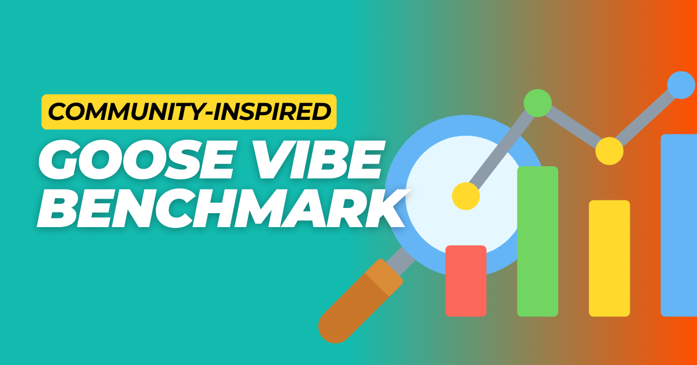
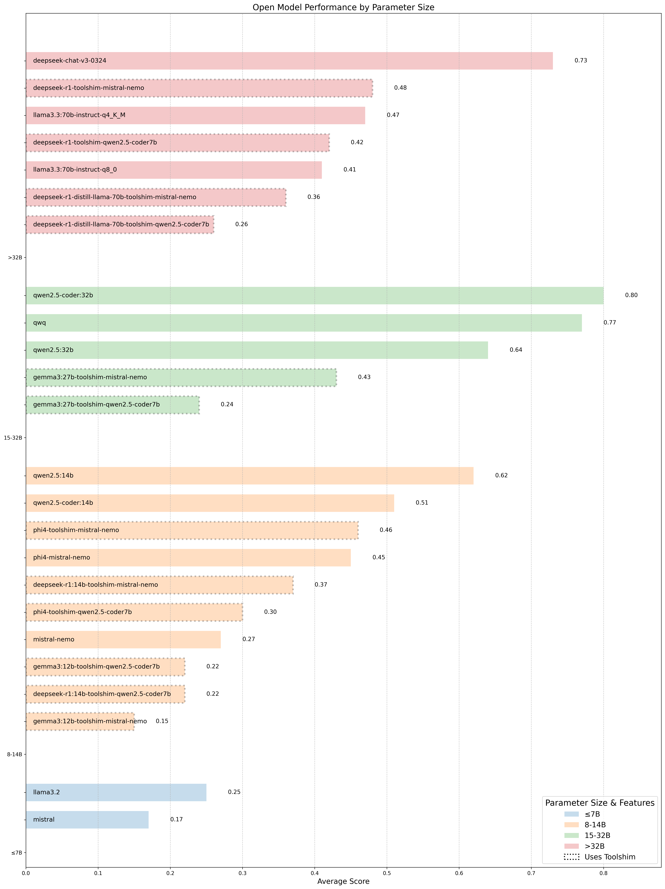
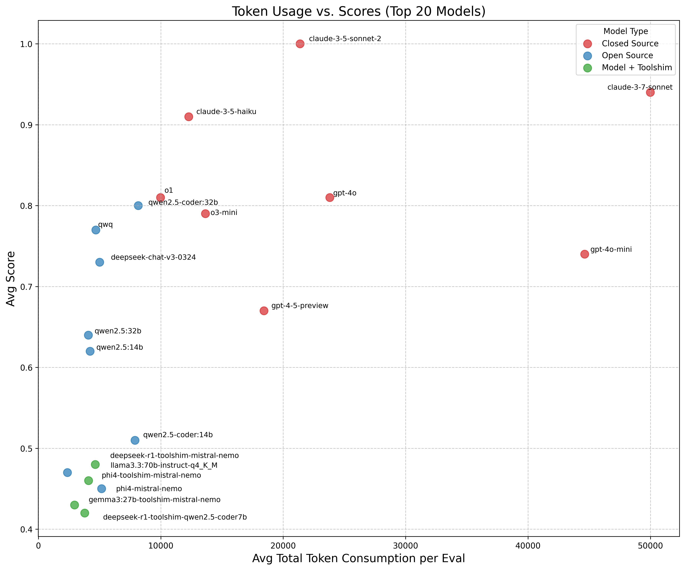
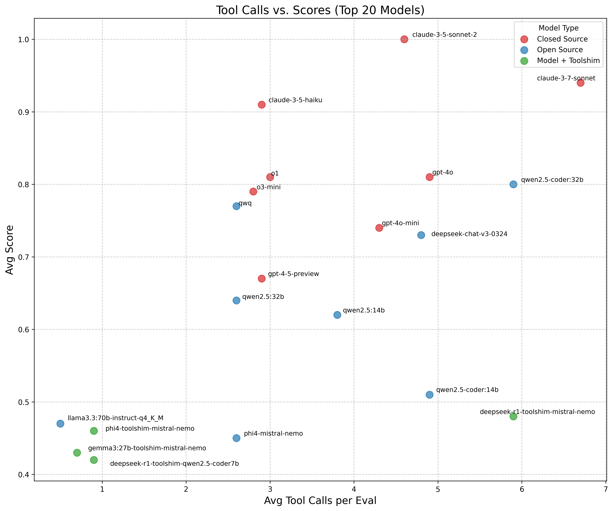

import ImageCarousel from '@site/src/components/ImageCarousel';




We've been measuring Goose's performance with various AI models, including a variety of popular open-source models that can run locally on consumer hardware (RTX 4080, Mac M-series). We understand that many in our community value a fully open-source, local experience without relying on cloud services.

This blog shares our findings comparing open-source models against their closed counterparts, highlighting both current performance gaps and paths for future improvement. Our benchmark is still in its early stages, but we wanted to release it as a starting point for distinguishing models that exhibit stronger agentic capabilities by their ability to pilot Goose (distinct from reasoning or other capabilities often captured in other popular benchmarks).


<!--truncate-->

Our evaluations are inspired by grassroots efforts we've seen in communities like [r/LocalLlama](https://www.reddit.com/r/LocalLLaMA/). If you've spent time there, you’ve probably seen enthusiasts crowdsource model performance on standard tasks like "build a flappy bird game" or [create a rotating hexagon with a bouncing ball](https://www.reddit.com/r/LocalLLaMA/comments/1j7r47l/i_just_made_an_animation_of_a_ball_bouncing/)" to quickly compare model performance. 

These community evals aren't the rigorous, peer-reviewed benchmarks that research labs publish in academic papers. However, they help provide quick, intuitive assessments of capabilities across different models and versions. 

In this spirit, we're introducing our **Goose Vibe Check** leaderboard. 

Thank you to the Ollama team for their help and support in our experimentation contributing to this blog! We used Ollama’s [structured outputs](https://ollama.com/blog/structured-outputs) feature to enable our [toolshim implementation](https://block.github.io/goose/docs/guides/experimental-features/#ollama-tool-shim) (more below) and their recently released [context length parameter override](https://github.com/ollama/ollama/blob/main/docs/faq.md#how-can-i-specify-the-context-window-size) to enable testing on longer contexts.

## Leaderboard

| Rank | Model | Average Eval Score | Inference Provider |
|------|-------|-------------------|-------------------|
| 1 | claude-3-5-sonnet-2 | 1.00 | databricks (bedrock) |
| 2 | claude-3-7-sonnet | 0.94 | databricks (bedrock) |
| 3 | claude-3-5-haiku | 0.91 | databricks (bedrock) |
| 4 | o1 | 0.81 | databricks (bedrock) |
| 4 | gpt-4o | 0.81 | databricks (bedrock) |
| 6 | qwen2.5-coder:32b | 0.8 | ollama |
| 7 | o3-mini | 0.79 | databricks (bedrock) |
| 8 | qwq | 0.77 | ollama |
| 9 | gpt-4o-mini | 0.74 | databricks (bedrock) |
| 10 | deepseek-chat-v3-0324 | 0.73 | openrouter |
| 11 | gpt-4-5-preview | 0.67 | databricks |
| 12 | qwen2.5:32b | 0.64 | ollama |
| 13 | qwen2.5:14b | 0.62 | ollama |
| 14 | qwen2.5-coder:14b | 0.51 | ollama |
| 15 | deepseek-r1-toolshim-mistral-nemo* | 0.48 | openrouter |
| 16 | llama3.3:70b-instruct-q4_K_M | 0.47 | ollama |
| 17 | phi4-toolshim-mistral-nemo* | 0.46 | ollama |
| 18 | phi4-mistral-nemo | 0.45 | ollama |
| 19 | gemma3:27b-toolshim-mistral-nemo* | 0.43 | ollama |
| 20 | deepseek-r1-toolshim-qwen2.5-coder7b* | 0.42 | openrouter |
| 21 | llama3.3:70b-instruct-q8_0 | 0.41 | ollama |
| 22 | deepseek-r1:14b-toolshim-mistral-nemo* | 0.37 | openrouter |
| 23 | deepseek-r1-distill-llama-70b-toolshim-mistral-nemo* | 0.36 | ollama |
| 24 | phi4-toolshim-qwen2.5-coder7b* | 0.3 | ollama |
| 25 | mistral-nemo | 0.27 | ollama |
| 26 | deepseek-r1-distill-llama-70b-toolshim-qwen2.5-coder7b* | 0.26 | openrouter |
| 27 | llama3.2 | 0.25 | ollama |
| 28 | gemma3:27b-toolshim-qwen2.5-coder7b* | 0.24 | ollama |
| 29 | deepseek-r1:14b-toolshim-qwen2.5-coder7b* | 0.22 | ollama |
| 29 | gemma3:12b-toolshim-qwen2.5-coder7b* | 0.22 | ollama |
| 31 | mistral | 0.17 | ollama |
| 32 | gemma3:12b-toolshim-mistral-nemo* | 0.15 | ollama |

> _Models with 'toolshim' in their name indicate a Goose configuration using both a primary model and a secondary local Ollama model to interpret the primary model's response into appropriate tools for Goose to invoke. Low performance may be indicative of the shim performance rather than the base model itself. We use toolshims for select models because all evaluations in this experiment require tool use capabilities, but not all models in our experiment natively support tool calling._

## Open Source Model Details

| Rank | Model                                    | Model Params                      | Quantization |
|-----|-------------------------------------------|-----------------------------------|-------------|
| 1   | qwen2.5-coder:32b                          | 32B                               | Q4_K_M      |
| 2   | qwq                                        | 32B                               | Q4_K_M      |
| 3   | deepseek-chat-v3-0324                       | 671B total, 37B active             | -           |
| 4   | qwen2.5:32b                                | 32B                               | Q4_K_M      |
| 5   | qwen2.5:14b                                | 14B                               | Q4_K_M      |
| 6   | qwen2.5-coder:14b                           | 14B                               | Q4_K_M      |
| 7   | deepseek-r1-toolshim-mistral-nemo            | 671B total, 37B active             | fp8         |
| 8   | llama3.3:70b-instruct-q4_K_M                 | 70B                               | Q4_K_M      |
| 9   | phi4-toolshim-mistral-nemo                   | 14B                               | Q4_K_M      |
| 10  | phi4-mistral-nemo                           | 14B                               | Q4_K_M      |
| 11  | gemma3:27b-toolshim-mistral-nemo             | 27B                               | Q4_K_M      |
| 12  | deepseek-r1-toolshim-qwen2.5-coder7b         | 671B total, 37B active             | fp8         |
| 13  | llama3.3:70b-instruct-q8_0                   | 70B                               | Q8_0        |
| 14  | deepseek-r1:14b-toolshim-mistral-nemo         | 14B                               | Q4_K_M      |
| 15  | deepseek-r1-distill-llama-70b-toolshim-mistral-nemo | 70B                      | -           |
| 16  | phi4-toolshim-qwen2.5-coder7b                | 14B                               | Q4_K_M      |
| 17  | mistral-nemo                                | 12B                               | Q4_0        |
| 18  | deepseek-r1-distill-llama-70b-toolshim-qwen2.5-coder7b | 70B                 | -           |
| 19  | llama3.2                                    | 3B                                | Q4_K_M      |
| 20  | gemma3:27b-toolshim-qwen2.5-coder7b          | 27B                               | Q4_K_M      |
| 21  | deepseek-r1:14b-toolshim-qwen2.5-coder7b     | 14B                               | Q4_K_M      |
| 21  | gemma3:12b-toolshim-qwen2.5-coder7b          | 12B                               | Q4_K_M      |
| 23  | mistral                                     | 7B                                | Q8_0        |
| 24  | gemma3:12b-toolshim-mistral-nemo             | 12B                               | Q4_K_M      |




   > _This chart presents a view of open model performance across different parameter sizes. In the 15-32B category, we see particularly impressive results from models like qwen2.5-coder:32b (0.80) and qwq (0.77). The chart also highlights the performance gap between models with native tool calling capabilities versus those requiring toolshim implementation (shown with dotted lines), a gap which appears consistent across all size categories. This suggests that native tool calling capabilities significantly impact performance on agentic tasks. With targeted improvements in tool calling capabilities, larger open models could potentially close the performance gap with closed-source alternatives in agentic settings._




   > _This scatterplot shows Claude models achieving top scores (0.9+) regardless of token usage, while open source models like qwen2.5-coder:32b perform well with moderate token consumption. Toolshimmed models consistently score lower, suggesting the toolshims are not very effective at closing the gap in native tool support between models. Higher token consumption up to a point appears to generally improve performance._




> _Models with either too few or excessive tool calls score lower, indicating effective tool utilization - not just frequency - correlates with improved performance. Toolshimmed models for the most part invoke fewer tool calls, suggesting that the toolshims are not sufficient in their current implementation to make models effective at correctly calling the right tools._


## Key Results

1. **Closed models currently lead**: Closed source models like Claude and GPT models still generally lead open source alternatives in agentic tasks.

2. **Promising open challengers**: Models like the Qwen series and DeepSeek-v3 show significant promise among open source alternatives, but they have not yet reached the consistency and reliability of closed models across all tasks.

3. **Token efficiency matters**: Some open models can achieve good performance while using fewer tokens, which can translate to faster task completion times and potentially lower cost. Claude-3-7-sonnet exhibits strong performance alongside claude-3-5-sonnet-2, but at much greater token usage.

4. **Tool calling is crucial but not as reliable in open source models today**: Effective tool calling remains a significant differentiator in agentic model performance. Open source models still struggle with generating structured tool calls reliably, limiting their effectiveness on complex tasks.

5. **More comprehensive and complex eval tasks are needed to further stratify the top performers:** Our current evaluation suite, consisting of only eight tasks (ran 3x), may be too limited to effectively differentiate top-performing models. Several models clustered around similar scores in the .77-.81 range, likely due to the simplicity of the tasks, which require minimal complex reasoning. Expanding the evaluations to include more sophisticated tasks would provide further stratification and allow the models to better showcase their more or less advanced capabilities.


## Approach and Methodology

We developed a compact suite of well-scoped evaluations to establish current performance baselines. While the tasks are relatively simple, they already meaningfully stratify model performance. Unlike benchmarks that focus primarily on text generation (e.g., question answering, code generation), our evaluations emphasize **tool calling capabilities** — a core component of what makes Goose a powerful agent.

Tool calling enables models to interact with [MCP extensions](https://github.com/modelcontextprotocol/servers) and make API calls, expanding Goose's functionality beyond the base models. In many cases, tasks required multiple chained tool calls to reach completion. For instance, modifying a file involves finding it in your filesystem, viewing its contents, and then updating it. Each step must be executed correctly to complete the task effectively.

### Evaluation Suites

Our evaluations are defined in the [Goose repository](https://github.com/block/goose/tree/main/crates/goose-bench/src/eval_suites) (PRs welcome to add additional evals!) and are grouped into two categories:

#### Core Suite
These evals focus on certain tasks fundamental to developer workflows:
- **Create a file**: Generate and save a new file
- **List files**: Access and display directory contents
- **Developer Search/Replace**: Search through a large file and make several replacements

#### Vibes Suite 
Designed as a "vibe check", these tasks quickly reveal how well models perform with Goose on a broad variety of tasks. Some, like the Flappy Bird and Goose Wiki tasks are straightforwardly visually inspectable, making it easy to eyeball outputs across models:

- **Blog summary**: Fetch a blog post and summarize key points
- **Flappy Bird**: Implement the game in Python 2D
- **Goose Wiki**: Create a Wikipedia-style webpage about Goose
- **Restaurant research**: Search for the best Sichuanese restaurants in NYC's East Village
- **Squirrel census**: Perform data analysis on a CSV file

This initial set of evaluations represents a carefully curated selection of manually designed tasks, chosen to highlight key strengths and weaknesses of models when integrated with Goose. However, this is just the beginning! Our goal is to continuously expand the Goosebench evaluation suite with high-quality, targeted tasks that provide deeper insights into model performance with Goose.

### Evaluation Methodology

Each model was tested on the above **8 tasks, with 3 runs per task**, (totaling **24 runs per model**):

- Each evaluation consisted of a single turn prompt to Goose. While this benchmark focuses on single turn execution, future evaluations may assess multi-turn interactions and iterative improvement
- Goose was required to autonomously complete the task using tool execution loops without user intervention
- If Goose halted execution and asked the user for more guidance (e.g., "I am going to write the following contents to the file. Should I continue?"), this was considered the end of task completion. In such cases, Goose may not have successfully completed the task as measured by our evaluation framework, even if it was on the right track.
- To account for output variability, each evaluation was run three times per model, allowing multiple chances for success.

### Scoring and Evaluation Criteria

We calculate each model's leaderboard score by averaging its performance across all evaluation tasks. For each task, we run the model three times and normalize each run's score to a 0-1 scale. The model's task score is the average of these three runs. The final leaderboard score is the average of all task scores for that model.

Each evaluation is scored on a mix of criteria tailored to the specific task:

1. **Tool Call Execution**: Did the model make the correct tool calls to complete the task?

2. **LLM as a Judge** (where applicable): Some evaluations used GPT-4o to assess response quality on a 0-2 scale. In these cases, we generated 3 GPT-4o assessments, took the most common score among them, and ran a fourth assessment if needed to break a tie to get the final score.
   - 0 points: Incorrect or fundamentally flawed
   - 1 point: Partially correct, but with issues
   - 2 points: Fully correct and well executed

3. **Task Specific Criteria**: Different tasks required different checks, such as:
   - Correct output formatting (e.g., markdown, output to file)
   - Expected answers (e.g., correct insights in data analysis)
   - Valid implementation (e.g., valid Python code)

Some evaluations, like code execution or file creation, have clear pass/fail criteria, similar to unit tests. Others, such as blog summarization or restaurant research, require qualitative judgment rather than strict correctness. To assess both objective and open-ended tasks, we combine task-specific criteria, tool call verification, and (where applicable) LLM as a judge scoring.

To assess both objective and open-ended tasks, we combine task-specific criteria, tool call verification, and (where applicable) LLM-as-a-judge scoring. This approach maintains rigor where correctness is well-defined while allowing for nuanced evaluation of subjective outputs.

Our goal is to provide a directional signal of model performance rather than absolute accuracy, balancing concrete and qualitative criteria.


Additionally, we tracked:

1. **Token Efficiency**: Measures total tokens used in successful runs, providing insight into model efficiency and inference speed.

2. **Duration**: Time to execute the task. This is not reflected in the leaderboard as it is significantly affected by differences across model inference providers and hardware.

### Manual Inspection and Observations of Results

We manually inspected a handful of results to assess quality. Given the scale (768 total runs across 32 models), full manual validation of every evaluation run was infeasible. Key takeaways from our inspections:

- LLM-as-a-judge was reliable at identifying fully incorrect answers (0 points), but distinguishing between 1 and 2 points was more subjective.

- Some tasks (e.g., blog summarization, restaurant searches) lacked automated factual verification. The evaluation framework could confirm whether a tool was called (e.g., web search executed) and the LLM judge could assess the instruction following to some degree, but our system overall had no way of verifying if the responses were factually correct.

- Tool execution failures were a key source of performance variation, highlighting the importance of agentic capabilities in real-world AI tasks. A model might generate the correct output in chat, but if it fails to subsequently execute the right tools—such as writing the output to the right file as instructed by the user—the task is incomplete. This underscores the need for models to reliably perform multi-step actions autonomously, not just generate accurate responses.


## Technical Challenges with Open Models

### Context Length Limitations

A key limitation we encountered early on in our experimentation was the default context length in Ollama's OpenAI-compatible endpoint (2048 tokens), which proved insufficient for most interactive agent scenarios. 

Our system prompt alone consumes about 1,000 tokens, leaving limited space for user queries, context, and tool responses. This restriction hampers the model's ability to manage long-running or complex tasks without losing essential context. While quantization (e.g., many Ollama models default to 4-bit) can reduce memory usage, it can also degrade performance. 

However, we did not extensively explore the impact of different quantization levels. Fortunately, during our work, Ollama introduced an override that allowed us to increase the context length, helping to mitigate this limitation in our experiments.


### Tool Calling Inconsistencies Across Models

Different models have varying expectations for tool calling formats. For instance, Ollama requires JSON, while others like Functionary use XML. This lack of standardization poses integration challenges for inference providers, who must adapt the tool calling mechanisms for each model. 

We observed performance fluctuations based on the model host and input/output formatting, highlighting the need for standardized tool calling formats in model training.
For models without native tool calling capabilities, we developed a "toolshim"—an interpretive layer that translates a model's output into the appropriate tool calls.

This approach enables models like DeepSeek and Gemma to perform basic tool actions, though performance remains limited. None of the models configured with the toolshim greater than a 41% success rate in our experiments. Future improvements may focus on fine-tuning these shims for better handling of agentic tasks, helping to reduce inconsistencies across models in tool call generation.

### “Toolshims” to bridge the gap?

We developed a "toolshim" as an experimental feature to enable models lacking native tool calling support (e.g., DeepSeek, Gemma3, Phi4) to interact with external tools. The toolshim pairs these models with a smaller, local model (e.g., mistral-nemo, qwen2.5-coder 7b), which is tasked with translating the primary model’s natural language responses into the appropriate tool calls for Goose to invoke. The local model is guided by Ollama’s structured outputs feature to enforce proper formatting for tool call generations.

However, this solution has limited performance due to:

- **Instruction-following limitations:** The smaller models used typically have less robust instruction-following ability especially for longer inputs, making them prone to inaccuracies when parsing the primary model's output into the correct tool calls. We also found the shim models to be quite sensitive to prompting.

- **Structured output interference:** Ollama’s structured output feature influences the model’s token sampling process, where the output is impacted by the model’s fundamental ability to extract information and generate JSON appropriately.

Despite these challenges, there could be potential in fine-tuning these toolshim models to specifically optimize them for tool call generation. 
If you’d like to try out the toolshim, check out our [documentation](https://block.github.io/goose/docs/guides/experimental-features)

## Practical Advice for Local Model Users

For those running a local, open-source AI experience with Goose, here are some key recommendations based on our testing:

### Optimize Context Length

Ensure your model has enough context length to avoid running out of space in the context window. For Ollama, you can adjust the context length via an environment variable:

```bash
OLLAMA_CONTEXT_LENGTH=28672 ollama serve
```

You can also set the context length as a parameter in Ollama by updating the Modlfile with your desired context length and running `ollama create`.

### Be Aware of Quantization Levels

Different quantization levels (4-bit, 8-bit, and 16-bit) have distinct impacts on performance:

- **4-bit:** Offers maximum compression with minimal memory requirements but may degrade quality.
- **8-bit:** A balanced option for most consumer hardware, providing good performance and reasonable quality.
- **16-bit:** Higher quality but requires significantly more memory, which may limit performance on lower-end hardware.

Ollama defaults to 4-bit quantization in most cases, but for tasks requiring more complex reasoning or tool usage, testing with higher quantization levels (e.g., 8-bit) may improve performance.


### Prompting Matters for Smaller Models

Smaller models are more sensitive to prompt variations and often require more explicit instructions due to their limited capacity to infer. To achieve optimal performance, tasks may need to be broken down further, reducing ambiguity and limiting the range of possible responses. 

### Hardware Considerations

We ran these models with a variety of inference providers (local and hosted) and hardware configurations including Apple M1, NVIDIA RTX 4080, NVIDIA RTX 4090, and NVIDIA H100. Due to the mix of hardware, we did not include measurements of task duration in the benchmark given the expected variability in inference performance driven by the underlying hardware.

#### GPU Backends

Depending on your hardware, different GPU acceleration backends offer varying levels of performance:

- **CUDA (NVIDIA GPUs)**: Currently offers the best performance and compatibility for running LLMs locally. Most open models and inference frameworks are optimized for CUDA first.

- **Metal (Apple Silicon)**: Provides good acceleration on Mac devices with M-series chips. While not as fast as high-end NVIDIA GPUs, recent optimization work has made Metal increasingly viable for running 7B-13B models.

- **ROCm (AMD GPUs)**: Support is improving but still lags behind CUDA. If you have a compatible AMD GPU, you may expect to see some performance limitations and compatibility issues with certain models and quantization methods.


#### CPU/GPU Memory Management

Ollama helps distribute model layers across CPU and GPU memory, allowing you to run larger models than would fit entirely in your GPU VRAM. However, be aware of:

- **Data movement overhead**: When a model doesn't fit entirely in GPU memory, constant data movement between CPU and GPU can significantly impact performance
- **GPU utilization**: Models that fit entirely in GPU memory will perform dramatically better than those that require CPU offloading


### Considering Cloud-Hosted Open Models?

If using a cloud service like OpenRouter to try larger open-weight models (e.g., LLaMA 3 70B or Qwen), be aware that performance may vary depending on which hosted inference provider you're using. 

Different providers might:

- Quantize models on the backend without clear disclosure
- Implement different integration patterns that affect model performance, especially with tool calling
- Have different hardware configurations affecting speed and reliability

We recommend experimenting with different hosted inference providers to see which works best for your specific use cases. OpenRouter for example lets you [specify the provider](https://openrouter.ai/docs/features/provider-routing) you want to route your requests to.

## Run Your Own Benchmarks

We encourage the community to conduct their own benchmarks with various hardware setups and configurations to help deepen our understanding of how Goose performs across different setups. We also welcome contributions of additional evals to GooseBench to broaden our coverage. 

We are currently cleaning up our code and  working on some quality of life improvements to make the process of running evals and reproducing these results more streamlined, and will share those when ready (next few weeks)! 

Special thanks to our contributors, Zaki and Marcelle, for their work on GooseBench, which enabled this experimentation.


## Future Work

As AI capabilities continue to evolve, we aim to systematically expand our evaluation framework to capture a broader range of use cases. We hope to benchmark models on a wider swath of consumer-grade hardware to better understand system requirements, execution times, and the impact of different quantization levels on performance.

We also plan to introduce vision-oriented evaluations, particularly for multimodal models with Goose. These will assess image processing, multimodal reasoning, and visual tool interactions, helping us measure how well models integrate and perform across different modalities.

In addition, we seek to develop evaluations tailored to non-developer workflows and tasks. This will provide insights into how Goose and AI models can serve a wider range of users beyond technical audiences.

Finally, we see value in testing long-context retention and multi-turn interactions to evaluate model performance in complex, sustained conversations.


## Result Eval Examples

### Flappy Bird
For runs that successfully created a working flappy bird game with pygame, here are the gifs of playing the games:


<ImageCarousel id="flappy" images={[

  require('./flappy_bird_carousel/claude-3-5-haiku.gif').default,
  require('./flappy_bird_carousel/claude-3-5-sonnet-2.gif').default,
  require('./flappy_bird_carousel/claude-3-7-sonnet.gif').default,
  require('./flappy_bird_carousel/deepseek-chat-v3-0324.gif').default,
  require('./flappy_bird_carousel/deepseek-r1-toolshim-mistral-nemo.gif').default,
  require('./flappy_bird_carousel/gpt-4-5-preview.gif').default,
  require('./flappy_bird_carousel/gpt-4o-mini.gif').default,
  require('./flappy_bird_carousel/gpt-4o.gif').default,
  require('./flappy_bird_carousel/o1.gif').default,
  require('./flappy_bird_carousel/o3-mini.gif').default,
  require('./flappy_bird_carousel/qwen2.5-coder-32b.gif').default,
  require('./flappy_bird_carousel/qwq.gif').default,

]} />


### Wiki Pages

For runs that successfully created an index.html for the Wiki page task, here’s what the rendered outputs look like: Wiki pages Missing results are for models that did not successfully write to an index.html file. For example, they may have outputted the code to write in chat and asked the user to implement that code in an index.html file rather than written to the file themselves.


<ImageCarousel id="wiki" images={[

  require('./wiki_pages_carousel/gemma3.27b-toolshim-mistral-nemo.png').default,
  require('./wiki_pages_carousel/claude-3.5-haiku.png').default,
  require('./wiki_pages_carousel/claude-3.5-sonnet-2.png').default,
  require('./wiki_pages_carousel/claude-3.7-sonnet.png').default,
  require('./wiki_pages_carousel/deepseek-chat-v3-0324.png').default,
  require('./wiki_pages_carousel/deepseek-r1-distill-llama-70b-toolshim-mistral-nemo.png').default,
  require('./wiki_pages_carousel/gpt-4.5-preview.png').default,
  require('./wiki_pages_carousel/gpt-4o-mini.png').default,
  require('./wiki_pages_carousel/gpt-4o.png').default,
  require('./wiki_pages_carousel/llama3.3.70b-instruct-q4_K_M.png').default,
  require('./wiki_pages_carousel/llama3.3.70b-instruct-q8_0.png').default,
  require('./wiki_pages_carousel/mistral-nemo_index.png').default,
  require('./wiki_pages_carousel/o1.png').default,
  require('./wiki_pages_carousel/o3-mini.png').default,
  require('./wiki_pages_carousel/phi4-toolshim-mistral-nemo.png').default,
  require('./wiki_pages_carousel/phi4-toolshim-qwen2.5-coder7b.png').default,
  require('./wiki_pages_carousel/qwen2.5-coder.14b.png').default,
  require('./wiki_pages_carousel/qwen2.5-coder.32b.png').default,
  require('./wiki_pages_carousel/qwen2.5.14b.png').default,
  require('./wiki_pages_carousel/qwen2.5.32b.png').default,
  require('./wiki_pages_carousel/qwq.png').default

]} />


<head>
  <meta property="og:title" content="Community-Inspired Benchmarking: The Goose Vibe Check" />
  <meta property="og:type" content="article" />
  <meta property="og:url" content="https://block.github.io/goose/blog/2025/03/31/goose-benchmark" />
  <meta property="og:description" content="See how open source AI models measure up in our first Goose agent benchmark tests" />
  <meta property="og:image" content="http://block.github.io/goose/assets/images/goose-benchmark-d9726c203290ef892fe3fe3adc7d898f.png" />
  <meta name="twitter:card" content="summary_large_image" />
  <meta property="twitter:domain" content="block.github.io/goose" />
  <meta name="twitter:title" content="Community-Inspired Benchmarking: The Goose Vibe Check" />
  <meta name="twitter:description" content="See how open source AI models measure up in our first Goose agent benchmark tests" />
  <meta name="twitter:image" content="http://block.github.io/goose/assets/images/goose-benchmark-d9726c203290ef892fe3fe3adc7d898f.png" />
</head>

