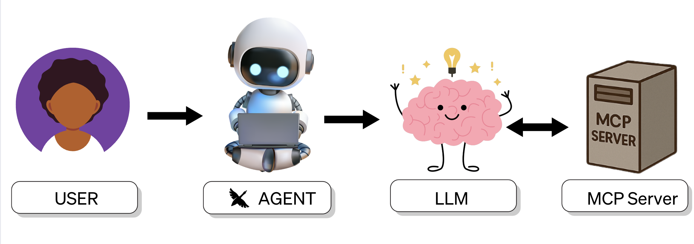

# A Visual Guide to MCP (Model Context Protocol) 

You ever open a GitHub repo or blog post and instantly feel like you need a PhD just to understand the first sentence?

Yeah. Same.

<!--truncate-->

So let’s break down Model Context Protocol (MCP) like we’re explaining it to our semi technical friend, that doesn’t want to read 30 whitepapers to get the gist.

## What Is MCP in plain English?

MCP is like a universal translator between your AI agent, like Goose, and external tools, files, databases, APIs, you name it.

It gives your agent a way to, ask questions, run tools, store/retrieve context, and keep track of everything it knows. 

Instead of cramming everything into one prompt like “here’s 10k tokens worth of context, good luck,” MCP helps the model pull what it needs, when it needs it.

## Who Are The Players? 

- **User** – You, the person with the big ideas and messy problems

- **Agent** – The AI agent, Goose, living in your CLI, IDE, or desktop application

- **LLM** – The model that does the reasoning (like Claude, GPT-4, etc.)

- **MCP Servers (Extensions)** – Goose's toolbox: built-in and custom extensions that give goose the ability to execute task

## How Do They Communicate?
Lets take a look at how all the players work together: 

In this flow, the user kicks things off by giving Goose a prompt. Goose gets the prompt ready, along with its available tools and any relevant context, and hands it off to the LLM. The LLM figures out what it needs, Goose routes those requests to the right MCP servers, and they execute the tasks. Once everything's done, Goose brings the final answer back to you, the user.

## I'm Still Confused..

Okay. So you’ve seen the flow, but if its still not making sense lets think of it in context of James Bond. 

If you’ve ever seen a James Bond movie, you know the scene,
Bond walks into Q’s lab before the mission.
Q opens up the suitcase of gadgets, exploding pens, invisible cars, grappling watches, you name it.

Goose is _like_ Q in this situation.
The suitcase is already packed with tools, built-in and custom extensions (MCP servers).

Before the LLM (Bond) starts the mission, Goose gives it the full briefing:

>_"Here’s your target (the prompt). Here’s your gadget suitcase (the extensions you can use). Good luck."_

The MCP servers?

That’s the hidden team in the back actually building the gadgets and handing them over when Bond needs them in the field.

The LLM (Bond) picks the right gadgets for the mission, Goose routes the request to the right MCP server, MCP makes sure they work, and the whole operation runs smoothly.

Without Goose handing over the gadget suitcase, the model would just show up in the field with nothing but a tuxedo and a smile, and we don't want to know how that ends.

<head>
  <meta property="og:title" content="A Visual Guide To MCPs" />
  <meta property="og:type" content="article" />
  <meta property="og:url" content="https://block.github.io/goose/blog/2025/04/10/visual-guide-mcp" />
  <meta property="og:description" content="MCP ecosystem explained through images" />
  <meta property="og:image" content="http://block.github.io/goose/assets/images/responsible-vibe-code-a77f5e24a879edda943cc76f1fc0bd2a.png" />
  <meta name="twitter:card" content="summary_large_image" />
  <meta property="twitter:domain" content="block.github.io/goose" />
  <meta name="twitter:title" content="A Visual Guide To MCPs" />
  <meta name="twitter:description" content="MCP ecosystem explained through images" />
  <meta name="twitter:image" content="http://block.github.io/goose/assets/images/responsible-vibe-code-a77f5e24a879edda943cc76f1fc0bd2a.png" />
</head>