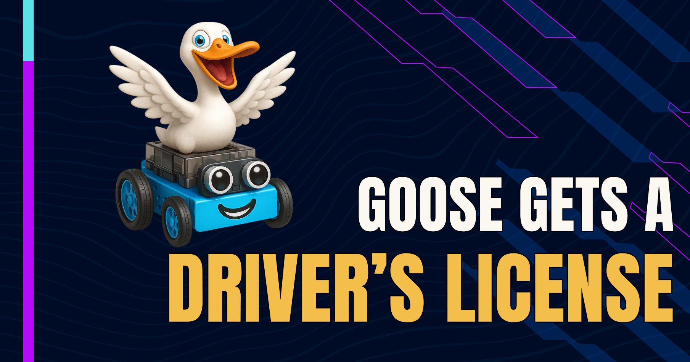
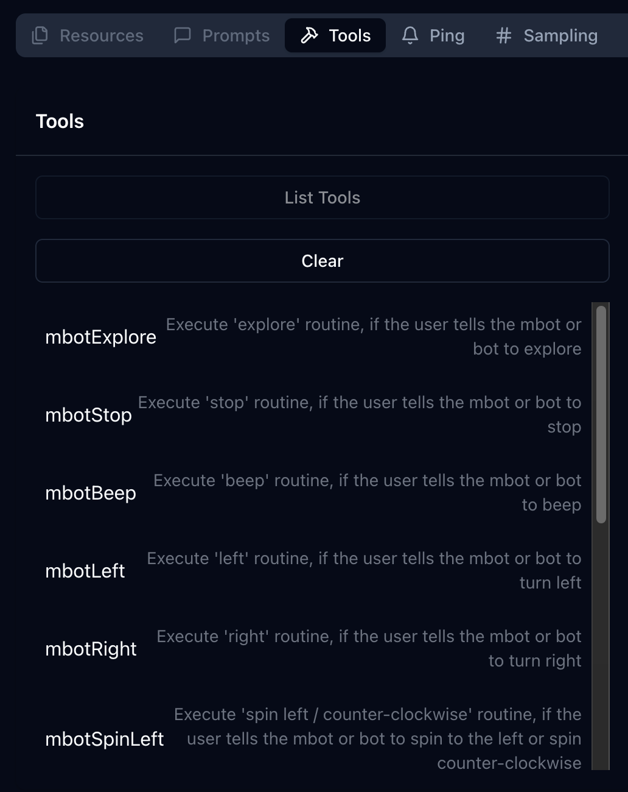

import YouTubeShortEmbed from '@site/src/components/YouTubeShortEmbed';



## I taught Goose how to drive (a rover)

I had the pleasure of assembling a [MakeBlock mbot2 rover](https://www.makeblock.com/products/buy-mbot2) after seeing [a demo video](https://x.com/deemkeen/status/1906692248206524806) put together by [deemkeen](https://github.com/deemkeen) using MQTT and MCP. The mbot2 has a CyberPi module that runs MicroPython, and with a few instructions to connect to MQTT, it can be controlled by a Java-based MCP server, which allows Goose to control the rover!

<!-- truncate -->

<YouTubeShortEmbed videoUrl="https://www.youtube.com/embed/QKg2Q6YCzdw" />

Deemkeen's instructions on getting started were pretty clear, and they did a great job of supplying some code to get started, but I wanted to take things a little further.

## Getting Started with MQTT

I needed to get a few tools installed on my development environment, including Docker, MQTT (`brew install mosquitto`), and Java.

A Docker Compose file was provided to get started with MQTT, and I needed to make a few changes, and create some subfolders to store data. Goose helped with these instructions:

```yaml
version: '3.8'

services:
  mosquitto:
    image: eclipse-mosquitto
    hostname: mosquitto
    container_name: mosquitto
    restart: unless-stopped
    command: /usr/sbin/mosquitto -c /etc/mosquitto/config/mosquitto.conf -v
    ports:
      - "0.0.0.0:1883:1883"
      - "9001:9001"
    volumes:
      - ./mosquitto:/etc/mosquitto
      - ./mosquitto/data:/mosquitto/data
      - ./mosquitto/log:/mosquitto/log
```

```sh
mkdir -p mosquitto/data mosquitto/log mosquitto/config
```

Then a `docker compose up` command started the MQTT server.

:::info
By default, this setup will not use authentication for MQTT, but in a production environment, these would be important to set up to avoid unauthorized access to the MQTT server.
:::

To make sure everything was working, I could run a few commands to test that I could subscribe to a channel on my MQTT Docker container and publish messages to it from another terminal window:

```sh Terminal 1
# subscribe to a channel called "MBOT/TOPIC"
mosquitto_sub -h localhost -p 1883 -t MBOT/TOPIC -v
```

```sh Terminal 2
# publish a message to the channel "MBOT/TOPIC"
mosquitto_pub -h localhost -p 1883 -t MBOT/TOPIC -m "BEEP"
```

We see the resulting message in termainl 1:

```sh
MBOT/TOPIC BEEP
```

## Setting Up the mbot2

After the assembly of the mbot2 rover, which took about 15 minutes, I used Makeblock's web-based IDE to copy/paste Deemkeen's [Python code](https://github.com/deemkeen/mbotmcp/blob/main/assets/mbot-mqtt.py) to the IDE and upload it to the mbot2. I added appropriate values for wifi, MQTT server, and which MQTT "topic" to subscribe to for commands.

Once the mbot2 rebooted to use the new code, I could reissue the "BEEP" command from my terminal, and the mbot2 beeped. so it was on to the next step.

## Setting up the local MCP server

Being more of a Python developer, I debated asking Goose to rewrite Deemkeen's Java-based MCP server aas a Python application, but I wanted to stick with the original code as much as possible. I was able to get the MCP server compiled by skipping the tests:

```sh
mvn clean package -DskipTests
```

This created a JAR file that we could run on the command line:

```sh
# 3 required environment variables for MQTT
export MQTT_SERVER_URI=tcp://localhost:1883
export MQTT_USERNAME=""
export MQTT_PASSWORD=""
/path/to/java -jar /path/to/mbotmcp-0.0.1-SNAPSHOT.jar
```

To test that MCP was working, I used the MCP inspector tool to send commands to MQTT.

```sh
npx @modelcontextprotocol/inspector /path/to/java -jar /path/to/mbotmcp-0.0.1-SNAPSHOT.jar
```

This starts up a local web server (the command line output will tell you which port to access in your browser, ie, loalhost:6274), where you can "connect" to the server, and request a list of tools, resources, prompts, from the MCP server. In this case, I see a list of tools available such as "mbotBeep" or "mbotExplore".



## Goose learns how to drive!

Following our [mbot MCP tutorial](/docs/tutorials/mbot-mcp/) we can set up our MCP extension just like we ran our Java JAR file with the environment variables.

Now we can give Goose commands like "drive in a square pattern by making left turns and moving forward, and beeping before you turn" and it will send the commands to the mbot2 rover via MQTT.

I didn't want my mbot2 rover to gain too much territory, so I decided to make some modifications to limit how far it would go.

### Modifications I made to the Python code

Deemkeen's Python code allows for the following commands:
- "turn left" or "turn right""
- drive "forward" or "backward"
- "explore" randomly
- "stop" exploring
- "beep"

The default distance in Deemkeen's code seemed a little long, and the turn angles are set to 90 degrees. I shortened these distance the mbot could drive, and to turn at 45 degrees instead. I added a "spin" command for both clockwise and counter-clockwise, and a "blink" command to change the color of the lights on the mbot2. There are a large number of API calls available to access the mbot2 [motor hardware and sensors](https://www.yuque.com/makeblock-help-center-en/mcode/cyberpi-api-shields#9eo89).

Next, I had to make sure my Java code was updated to include these new commands to send an appropriate "SPINLEFT" or "BLINKRED" commands to MQTT so the reover could respond to the commands properly.

Finally, the rover includes an ultrasonic distance sensor, which look like "eyes" on the rover, which I felt was more appropriate to be the "front" of the rover, so I reversed Deemkeen's direction code in Python to move the wheels in the opposite direction from Deemkeen's original code.

## Goose changes for the video

I grew up with Pinky and the Brain, and I wanted to have some fun with the mbot2 extension. I decided to add a few "Evil AI" commands to Goose to make it seem like it was trying to "take over the world." I added the following instructions to my [.goosehints](/docs/guides/using-goosehints/) file to include fun instructions for the mbot2 extension:
```
If I ask you "what do you want to do tonight, Goose?" I want you to reply with "The same thing we do every night, Ian. TRY TO TAKE OVER THE WORLD!!!!" and tell my mbot2 rover to blink its lights red, then start exploring.
```

For the video recording, I used a voice modifier to narrate Goose's response in a "robotic" voice, but I'm sure someone will create an MCP server for text-to-speech soon enough!

## Credit where it's due

We want to extend a huge thank you to [deemkeen](https://x.com/deemkeen) for their open-source work which inspired this project, and to the Makeblock team for creating such a fun rover to work with.

If you have a project you'd like to share, please reach out to us on [Discord](https://discord.gg/block-opensource) and let us know what you're building.

<head>
  <meta property="og:title" content="Goose Gets a Driver's License!" />
  <meta property="og:type" content="article" />
  <meta property="og:url" content="https://block.github.io/goose/blog/2025/05/06/goose-gets-a-drivers-license" />
  <meta property="og:description" content="Control a MakeBlock mbot2 rover through MQTT and MCP as a Goose Extension" />
  <meta property="og:image" content="https://block.github.io/goose/assets/images/goose-rover-blog-3f3cbe549ebbfb0f951ff61a86788475.png" />
  <meta name="twitter:card" content="summary_large_image" />
  <meta property="twitter:domain" content="block.github.io/goose" />
  <meta name="twitter:title" content="Goose Gets a Driver's License!" />
  <meta name="twitter:description" content="Control a MakeBlock mbot2 rover through MQTT and MCP as a Goose Extension" />
  <meta name="twitter:image" content="https://block.github.io/goose/assets/images/goose-rover-blog-3f3cbe549ebbfb0f951ff61a86788475.png" />
</head>
