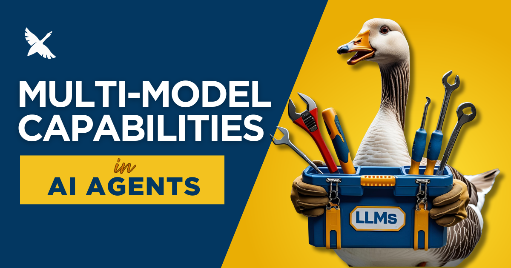

Not every task needs a genius. And not every step should cost a fortune.

That's something we've learned while scaling Goose, our open source AI agent. The same model that's great at unpacking a planning request might totally fumble a basic shell command, or worse - it might burn through your token budget doing it.

So we asked ourselves: what if we could mix and match models in a single session?

Not just switching based on user commands, but building Goose with an actual system for routing tasks between different models, each playing to their strengths.

This is the gap the lead/worker model is designed to fill.

<!-- truncate -->

## The Problem with Single-Model Sessions

Originally, every Goose session used a single model from start to finish. That worked fine for short tasks, but longer sessions were harder to tune:

* Go too cheap, and the model might miss nuance or break tools.
* Go too premium, and your cost graph starts looking like a ski slope.

There was no built-in way to adapt on the fly.

We saw this tension in real usage where agents would start strong, then stall out when the model struggled to follow through. Sometimes users would manually switch models mid-session. But that's not scalable, and definitely not agent like.

## Designing the Lead/Worker System

The core idea is simple:

* Start the session with a lead model that's strong at reasoning and planning.
* After a few back and forths between you and the model (what we call "turns"), hand off to a worker model that's faster and cheaper, but still capable.
* If the worker gets stuck, Goose can detect the failure and temporarily bring the lead back in.


You can configure how many turns the lead handles upfront (`GOOSE_LEAD_TURNS`), how many consecutive failures trigger fallback (`GOOSE_LEAD_FAILURE_THRESHOLD`), and how long the fallback lasts before Goose retries the worker.

This gives you a flexible, resilient setup where each model gets used where it shines.

One of the trickiest parts of this feature was defining what failure looks like.

We didn't want Goose to swap models just because an API timed out. Instead, we focused on real task failures:

* Tool execution errors
* Syntax mistakes in generated code
* File not found or permission errors
* User corrections like "that's wrong" or "try again"

Goose tracks these signals and knows when to escalate. And once the fallback model stabilizes things, it switches back without missing a beat.

## The Value of Multi-Model Design

Cost savings are a nice side effect, but the real value is in how this shifts the mental model: treating AI models like tools in a toolbox, each with its own role to play. Some are built for strategy. Some are built for speed. The more your agent can switch between them intelligently, the closer it gets to feeling like a true collaborator.

We've found that this multi-model design unlocks new workflows:

* **Long dev sessions** where planning and execution ebb and flow
* **Cross-provider setups** (Claude for planning, OpenAI for execution)
* **Lower-friction defaults** for teams worried about LLM spend

It also opens the door for even smarter routing in the future with things like switching based on tasks, ensemble voting, or maybe even letting Goose decide which model to call based on tool context.

## Try It Out

Lead/worker mode is already available in Goose.  To enable, export these variables with two models that have already been configured in Goose:

```bash
export GOOSE_LEAD_MODEL="gpt-4o"
export GOOSE_MODEL="claude-4-sonnet"
```

From there, Goose takes care of the hand off, the fallback, and the recovery. You just... keep vibing.

If you're curious how it all works under the hood, we've got a [full tutorial](/docs/tutorials/lead-worker).

---

If you're experimenting with multi-model setups, [share what's working and what isn't](https://discord.gg/goose-oss).


<head>
  <meta property="og:title" content="Treating LLMs Like Tools in a Toolbox: A Multi-Model Approach to Smarter AI Agents" />
  <meta property="og:type" content="article" />
  <meta property="og:url" content="https://block.github.io/goose/blog/2025/06/16/multi-model-in-goose" />
  <meta property="og:description" content="How Goose uses multiple LLMs within a single task, optimizing for speed, cost, and reliability in AI agent workflows" />
  <meta property="og:image" content="https://block.github.io/goose/assets/images/multi-model-ai-agent-d408feaeba3e13cafdbfe9377980bc3d.png" />
  <meta name="twitter:card" content="summary_large_image" />
  <meta property="twitter:domain" content="block.github.io/goose" />
  <meta name="twitter:title" content="Treating LLMs Like Tools in a Toolbox: A Multi-Model Approach to Smarter AI Agents" />
  <meta name="twitter:description" content="How Goose uses multiple LLMs within a single task, optimizing for speed, cost, and reliability in AI agent workflows" />
  <meta name="twitter:image" content="https://block.github.io/goose/assets/images/multi-model-ai-agent-d408feaeba3e13cafdbfe9377980bc3d.png" />
</head>