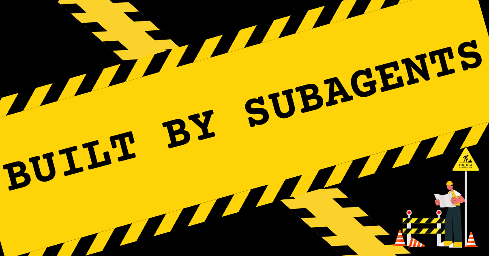
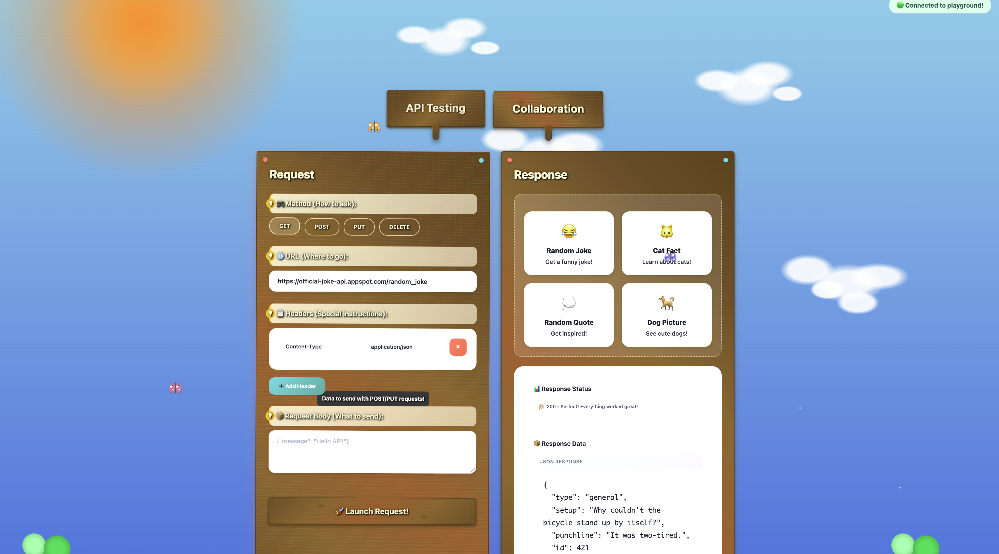

I built Postman meets Google Docs for 10-year-olds.

*Cue record scratch.*

*Cue freeze frame.*

*Cue movie cliché.*

You're probably wondering how I got here.


<!--truncate-->

Before I explain, it’s better if I just show you:

👉Try it yourself: https://api-playground-production.up.railway.app/ 



It’s a collaborative API testing playground where kids can run sample requests, get playful error messages, and see live responses in real time. Everyone in the session sees the API response together, turning the experience of solo debugging into multiplayer coding. And I wanted it to look like a literal playground.

I was inspired to build this after attending our company’s Bring Your Kids to Work Day. I didn’t bring my kid because she’s still an infant, but I attended to support my teammate Adewale Abati, who led a virtual session introducing kids to Goose. They used it to build comics, games, and music apps that were fun, imaginative, and genuinely impressive.

I decided to create a digital resource that teaches foundational concepts like APIs in a way that feels inviting instead of intimidating. Traditional API testing tools are powerful, but for a kid just starting out, they can be confusing and unclear.

The wild part is that I let Goose and six subagents bring this idea to life.

## Meet the Subagents

[Subagents](https://block.github.io/goose/docs/experimental/subagents) are individual AI instances that take on specific tasks. Each one runs in its own session, which helps preserve the main context window and keeps your primary Goose conversation uncluttered and focused on high-level orchestration. I think of subagents as temporary teammates. For this project, I treated them like an on-demand dev squad. I had a Backend Developer to build the server, a Frontend Developer to handle the UI, a Doc Writer to create a beginner-friendly README, and a Test Engineer to put together a simple test suite.

:::note  
Goose automatically cleans up subagents upon task completion.  
:::

Typically, I am not a one-shot prompter. I prefer prompt chaining, which means breaking a complex task into smaller prompts and guiding the AI step by step. This method gives me more control over the output, especially when I am trying to build something complex.

But this time, I wanted to delegate, walk away, and come back to progress, so I used subagents.

Since the feature is still experimental, I had to enable it via an environment variable:

```bash
export GOOSE_ALPHA_FEATURES=true  
```

## A Gaggle of Geese

There are a few ways to create subagents in Goose. You can use natural language prompts, define them through [recipes](https://block.github.io/goose/docs/guides/recipes/), or even spin up [external subagents](https://block.github.io/goose/docs/experimental/subagents/#external-subagents) like Codex or Claude Code.. 

I used natural language prompts because of the convenience to directly configure a subagent through one prompt. Here’s the prompt I used:

```
Build a real-time collaborative API testing platform using 3 AI subagents working sequentially - like "Google Docs for Postman" where teams can test APIs together, but for kids. Make it so errors and results are explained in a way that kids can understand and the design is kid friendly using metaphors. 

3 Sequential subagents 

- Subagent 1: Create a WebSocket backend server that handles API request execution (GET/POST/PUT/DELETE with headers, body, auth) AND real-time collaboration features (multiple users, shared collections, live updates). 

- Subagent 2: Build a conflict resolution system for when multiple users edit the same API request simultaneously, plus response formatting and request history management. 
- Subagent 3: Create the collaborative web UI using HTML, CSS, and vanilla JavaScript with API testing interface (URL input, method selection, headers, request body) that shows live user cursors, real-time updates, and shared results when anyone runs a test. 

3 other subagents should work in parallel developing a readme, api collections and, a simple test suite. 

- Subagent 4: Create a beginner friendly README
- Subagent 5: Create a spample api collection and examples with 2-3 read to try example requests. Use safe, fun public apis like dog facts and joke api
- Subagent 6: Create a simple test suite 

Final result should be a working web app where multiple people can test APIs together, see each other's requests and responses instantly, and collaborate without conflicts. Use HTML/CSS/JS for the frontend, no frameworks. 

Set the time out to 9 minutes
```

Goose lets you run subagents in parallel or sequentially. I chose a hybrid approach. The first three tasks needed to happen in order, since each step relied on the previous one. But the last three could run in parallel, since they only needed the core app to exist before moving forward.

I set the timeout to 9 minutes giving the subagents more time to work on accomplishing the tasks. The subagent working on conflict resolution failed to accomplish its task in 9 minutes, so after all the subagents completed their tasks, Goose used the main session to accomplish the failed tasks. 

## My Parallel Prompt Fail

Once I had a working app, I wanted to refine the design and make the interface feel more cohesive. I wrote a follow up prompt asking Goose to spin up five subagents in parallel. Each one was in charge of a different UI component: the header, request builder, tab layout, and collaboration panel.

It didn’t go as planned. Each subagent brought its own interpretation of what “kid-friendly” meant. The result was a clashing mix of styles that felt disconnected and inconsistent.

That confirmed a hunch I had. When tasks are interdependent, running subagents in parallel is not the right move. Those kinds of tasks are better handled sequentially.

## A Better Prompt Strategy

This time, I took a different approach. I asked Goose to analyze the existing UI and generate a shared design plan. Then I told Goose to use that plan to spawn new subagents and assign them tasks based on the plan.

The result was a much more consistent interface. This felt super meta and futuristic for me that I could have Goose instruct the subagents.

## Final Thoughts

This was my first experience with subagents, and I learned that:

* Sequential execution works better when one task builds on another. Parallel execution is best for independent tasks.  
* I could let Goose make the plan and delegate the tasks to subagents, rather than doing it all myself.

I loved that instead of managing every step, I could assign focused jobs and let Goose coordinate the flow. It felt less like babysitting a tool and more like leading a small dev team.  In fact, I don't think I could lead Goose to success this quickly without prior coding knowledge, but it does provide accessibility and helps me multitask better.

The next experiment I want to try is using external subagents. This method would allow me to delegate one-off tasks to Claude Code or Codex. 

What will you build with subagents?

[Download Goose](http://block.github.io/goose)

[Learn about subagents](https://block.github.io/goose/docs/experimental/subagents)

<head>
  <meta property="og:title" content="Orchestrating 6 Subagents to Build a Collaborative API Playground" />
  <meta property="og:type" content="article" />
  <meta property="og:url" content="https://block.github.io/goose/blog/2025/03/06/goose-tips" />
  <meta property="og:description" content="Delegating backend, frontend, docs, and tests so six subagents could build collaborative API tool for kids." />
  <meta property="og:image" content="https://block.github.io/goose/assets/images/built-by-subagents-869a01d4b147ebdb54334dcc22dc521e.png" />
  <meta name="twitter:card" content="summary_large_image" />
  <meta property="twitter:domain" content="block.github.io/goose" />
  <meta name="twitter:title" content="Orchestrating 6 Subagents to Build a Collaborative API Playground" />
  <meta name="twitter:description" content="Delegating backend, frontend, docs, and tests so six subagents could build collaborative API tool for kids." />
  <meta name="twitter:image" content="https://block.github.io/goose/assets/images/built-by-subagents-869a01d4b147ebdb54334dcc22dc521e.png" />
</head>