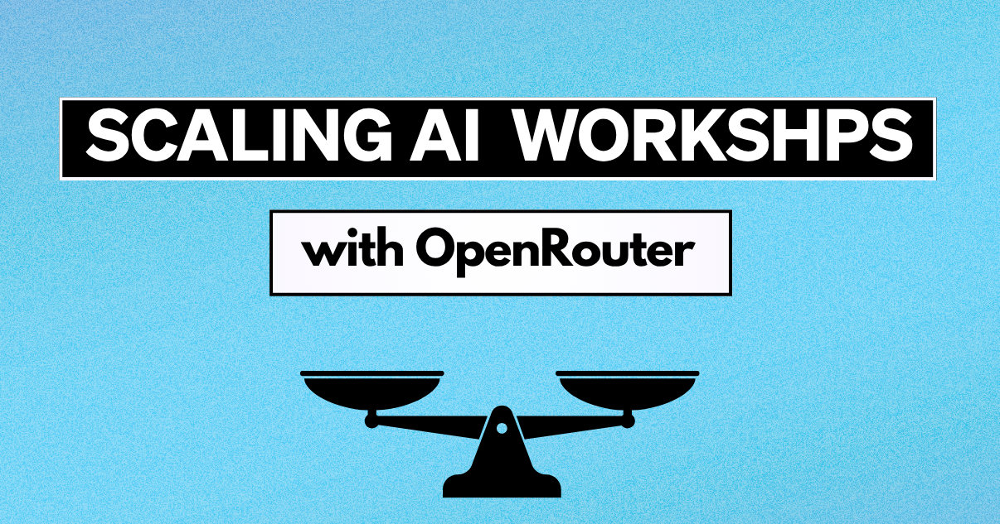
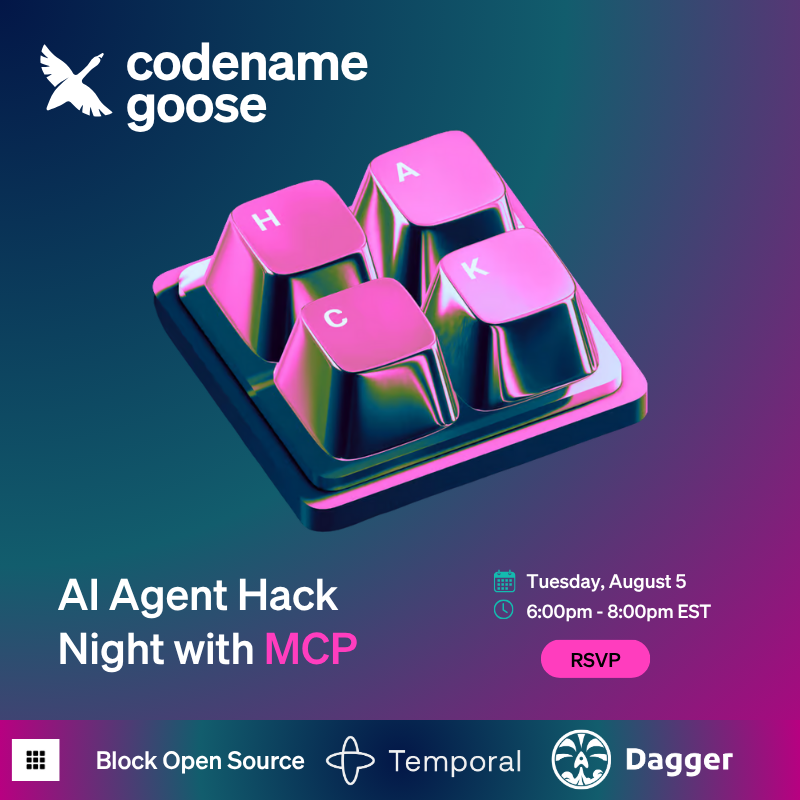

When my team launched [Goose](/) in early January 2025, we knew we had something special. We built a free, open source AI agent that leverages the Model Context Protocol. It was inventive in its approach, offering developers a local solution with the flexibility to bring their LLM of choice.

## The LLM Cost Problem

After using the product internally for a few months, my teammates were eager to share Goose with the developer community through workshops and hackathons. We wanted to provide hands-on experiences where people could actually build with Goose, because that's how developers fall in love with a product.

But we hit a thorny challenge: while Goose is free, high-performing LLMs are not.

<!--truncate-->

Free, local open source models exist, but the experience is variable and often requires high-end hardware. Many local models struggle with tool calling or have small context windows. It would be unfair to ask people to pay out of pocket just to try the tool.

## Existing Solutions We Considered

Our team initially looked into covering LLM usage costs. After talking to other organizations, here's what we found. People either:

* Manually distributed API keys  
* Used one shared API key  
* Relied on a partnership with a provider for credits

For our small but scrappy team, these options felt insecure, inflexible, and unscalable. We were concerned that people would steal and misuse shared API keys, or that credits might not get distributed evenly. Manually sharing API keys would be tedious and time-consuming, taking away from the depth of the meetup.

## Discovering OpenRouter

When I came back from parental leave, I was ready to jump back in and tackle this problem head-on. I started by teaming up with Alex Hancock, an MCP steering committee member and Goose OSS engineer, on planning our first-ever meetup in Boston. My boss, Angie Jones, suggested the meetup would be the perfect moment to get people's hands on Goose.

This gave me the motivation I needed to find a quick solution. I figured I could create a web app that would generate API keys for attendees. They could grab their key, which would already have a preset amount of credits.

The only problem was that popular providers like OpenAI and Anthropic didn't allow me to set specific credit amounts per API key.

Then I discovered [OpenRouter](https://openrouter.ai/): "a unified API platform that provides access to a wide range of large language models with intelligent routing and automatic fallbacks." You can use whatever model you want with the same API key. But the feature I really needed was its provisionary API key system, which allowed me to generate one master key and programmatically:

* Create individual API keys on demand  
* Set specific credit limits per key ($5 per participant)  
* Manage and disable keys as needed  
* Support any model available through their platform  
* Avoid the chaos of shared or static keys

## Building the Web App

I built a simple web app around OpenRouter's API. Attendees could visit a link, click a button, and instantly get their own temporary API key. They could plug that into Goose and start building without having to set up an account on OpenRouter.

```shell
curl -X POST https://openrouter.ai/api/v1/keys \
     -H "Authorization: Bearer <PROVISIONARY API KEY>" \
     -H "Content-Type: application/json" \
     -d '{
  "name": "string"
}'
```

And it worked. People *actually* used Goose and loved the entire experience, from the meetup to the talks to Goose itself.

We've now hosted meetups in Sydney, Berlin, Boston, Atlanta, San Francisco, Texas, and New York. You can read about our past experiences in our [Boston](/blog/2025-03-21-goose-boston-meetup/index.mdx) and [New York](/blog/2025-04-17-goose-goes-to-NY/index.mdx) blog posts.

## Upcoming Denver Workshop

We're bringing this hands-on Goose workshop to Denver on August 5.

Join us for an evening in collaboration with Temporal and Dagger, where you'll get free API credits, build something tangible with Goose, and learn in-depth about MCP.

**RSVP here:** https://lu.ma/tylz1e9o



## Future Improvements

This system isn't perfect. Right now, it's still a separate experience outside the Goose interface, and it doesn't scale well for events with different credit amounts or more complex needs.

We're working on it. Goose engineer, Mic Neale recently opened a [pull request](https://github.com/block/goose/pull/3507) to automate Goose's first-time setup. It simplifies the onboarding flow so new users can log into OpenRouter through their browser, securely authenticate, and get a pre-configured Goose setup without touching config files or copying API keys. It's a huge leap in user experience and lays the groundwork for future improvements.

## Why This Approach Matters

As more developers experiment with local agents and bring-your-own-model setups, we need infrastructure that matches that flexibility without compromising control. The combination of flexible API providers and programmatic key management might just be the missing piece in your event strategy.

Want us to run a Goose workshop or hackathon? We’ll bring the API credits. You bring the builders. 


<head>
  <meta property="og:title" content="How OpenRouter Unlocked Our Workshop Strategy" />
  <meta property="og:type" content="article" />
  <meta property="og:url" content="https://block.github.io/goose/blog/2025/07/29/openrouter-unlocks-workshops" />
  <meta property="og:description" content="How we used Open Router to provide frictionless LLM access for Goose workshops" />
  <meta property="og:image" content="https://block.github.io/goose/assets/images/ai-to-ai-dc88f565e573f0825a4fde3c522d2b8b.png" />
  <meta name="twitter:card" content="summary_large_image" />
  <meta property="twitter:domain" content="block.github.io/goose" />
  <meta name="twitter:title" content="How OpenRouter Unlocked Our Workshop Strategy" />
  <meta name="twitter:description" content="How we used Open Router to provide frictionless LLM access for Goose workshops" />
  <meta name="twitter:image" content="https://block.github.io/goose/assets/images/ai-to-ai-dc88f565e573f0825a4fde3c522d2b8b.png" />
</head>


