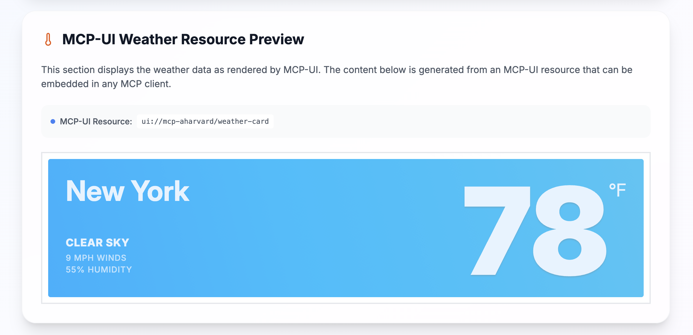

Goose recently merged in changes related to [MCP-UI](https://mcpui.dev/), an extension that allows MCP servers to deliver user interface elements back to the agent.

This sits on top of the protocol, but instead of text/markdown being the result, servers can return content that the client can render richly (including interactive GUI content).

<!-- truncate -->

At the heart of this is an interface for a UIResource:

```
interface UIResource {
  type: 'resource';
  resource: {
    uri: string;       // e.g., ui://component/id
    mimeType: 'text/html' | 'text/uri-list' | 'application/vnd.mcp-ui.remote-dom'; // text/html for HTML content, text/uri-list for URL content, application/vnd.mcp-ui.remote-dom for remote-dom content (Javascript)
    text?: string;      // Inline HTML, external URL, or remote-dom script
    blob?: string;      // Base64-encoded HTML, URL, or remote-dom script
  };
}
```

The `mimeType` is where the action happens. It can be HTML content, for example (in the simplest case).

It is worth taking a minute to watch this MCP server for an airline seat selector demo to get a taste of the capability:

<div style={{ width: '100%', maxWidth: '800px', margin: '0 auto' }}>
  <video 
    controls 
    width="100%" 
    height="400px"
    poster={require('@site/static/img/mcp-ui-shot.png').default}
    playsInline
  >
    <source src={require('@site/static/videos/mcp-ui.mov').default} type="video/mp4" />
    Your browser does not support the video tag.
  </video>
</div>

Essentially, MCP servers are suggesting GUI elements for the client (agent) to render as it sees fit.

## Remote DOM

A key tech at play here is <a href='https://github.com/Shopify/remote-dom'>Remote DOM</a>, which is something Shopify has cooked up. It lets you take DOM elements from a sandboxed environment and render them in another one, which is quite useful for agents. This also opens up the possibility that the agent side can render widgets as it needs (i.e., with locally matching styles or design language).

## Possible futures

MCP-UI will continue to evolve, and may pick up more declarative ways for MCP-UI servers to specify they need forms or widgets of certain types, but without specifying the exact rendering (how nice would it be to be able to specify that and let the agent render it beautifully—be that in a desktop or mobile client, or even a text UI in a command line!).

## Why have MCP-UI

Many everyday activities that agents undertake could benefit from a graphical representation. Sometimes this is done by the agent rendering a GUI on its own (I know I do that a lot), but this allows it to be more intrinsic to extensions for cases where interaction is best done graphically with a human. It also naturally (hence the Shopify connection) works well with commerce applications (you want to see the product!).

## How this fits with Goose

Goose Desktop supports this via the MCP-UI client libraries and MCP support.

## How do I use this

Take a look at Andrew Harvard's demos here: https://mcp-aharvard.netlify.app/ which include a GitHub repo with some samples you can start with.
This is available right now with Goose Desktop.


<head>
  <meta property="og:title" content="MCP UI, bringing the browser into the agent" />
  <meta property="og:type" content="article" />
  <meta property="og:url" content="https://block.github.io/goose/blog/2025/08/11/mcp-ui-post-browser-world" />
  <meta property="og:description" content="A first look at a UI for agents built on the proposed MCP-UI extension" />
  <meta property="og:image" content="https://block.github.io/goose/assets/images/mcp-ui-shot.png" />
  <meta name="twitter:card" content="summary_large_image" />
  <meta property="twitter:domain" content="block.github.io/goose" />
  <meta name="twitter:title" content="A first look at a UI for agents built on the proposed MCP-UI extension" />
  <meta name="twitter:description" content="A first look at a UI for agents built on the proposed MCP-UI extension" />
  <meta name="twitter:image" content="https://block.github.io/goose/assets/images/mcp-ui-shot.png" />
</head>
