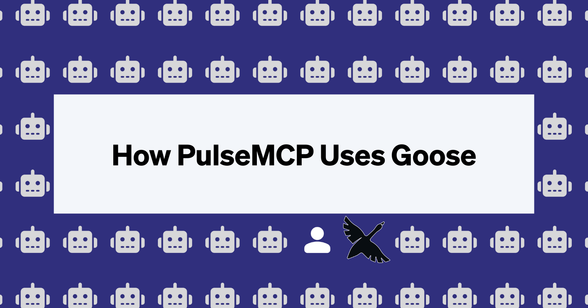

*"The best AI agent workflows go beyond demos. They deliver real productivity."*

The DevRel team at Block is a huge fan of [PulseMCP](https://pulsemcp.com). Their weekly newsletter has been an amazing way for us to discover trending MCP servers and stay in the loop with any changes within the ecosystem. When the PulseMCP creators, Mike and Tadas, shared their goals of using Goose to help [automate the boring parts of their newsletter workflow](https://www.pulsemcp.com/building-agents-with-goose), we were excited to see what they'd build.

Their implementation showcased exactly why we built Goose's feature set the way we did, and they documented the entire journey to help others learn from their experience.

<!-- truncate -->

## The Challenge

Every week, the PulseMCP team faced the same time-consuming workflow: sourcing relevant news from multiple platforms, organizing and removing duplicates, drafting compelling narratives, polishing for quality and accuracy, publishing across multiple channels, and managing email distribution. This repetitive workflow seemed perfect for AI automation, but was complex enough that most attempts fail.

## The Solution: Why Sequential Beats Monolithic

Instead of building one massive "do-everything" agent (which inevitably fails on complex tasks), PulseMCP broke their workflow into six distinct phases. Each phase gets handled by focused [recipes](/docs/guides/recipes/session-recipes), [sub-recipes](/docs/guides/recipes/sub-recipes) and [subagents](/docs/experimental/subagents) with clear inputs, outputs, and a single job.

This approach has three main benefits: debugging becomes easier when agents have single responsibilities, results become more predictable with clear handoffs between stages, and humans stay in control of the editorial process while automating the tedious work.

## The Six-Agent Pipeline

### **1. Sourcer Agent** 
Automatically scans GitHub, Reddit, and HackerNews for relevant content through MCP integration while humans curate the most interesting finds throughout the week.

### **2. Organizer Agent**
Removes duplicates, categorizes items, and adds context, turning raw links into organized content.

### **3. Drafter Agent** 
Merges statistics and context into human-written narratives, handling tedious data assembly while preserving the editorial voice.

### **4. Polisher Agent**
Handles typo checking, link verification, and consistency reviews that would otherwise take hours of human attention.

### **5. Publisher Agent**
Manages the technical publishing: HTML formatting, CMS uploads, and content deployment through MCP servers.

### **6. Sender Agent**
Handles email campaign setup, preview generation, and distribution scheduling.

## Helping Humans, Not Replacing Them

What's remarkable isn't just that PulseMCP automated their newsletter but how they kept human creativity while eliminating boring work. Humans still make editorial decisions, craft narratives, and maintain creative control, while agents handle repetitive tasks that drain human energy.

The result is a workflow that's both more efficient and higher quality. Agents never tire of checking links or formatting content, freeing humans to focus on strategic thinking and creative storytelling.

## A Glimpse of the Future

The PulseMCP team envisions agents that "build these recipes on your behalf." Imagine describing your workflow in natural language and having AI automatically generate the agent architecture and integration points.

We're already seeing hints of this capability. As Tadas demonstrated this by prompting: 

> "Hey Goose: I have these AI agent log files that are hard to read. Can you build me a simple web server with a pretty UI where I can parse through these as a human?"*

This points toward a future where AI handles the mechanics while humans focus on strategy, creativity, and judgment.

## The Blueprint is Available

The PulseMCP team documented everything in a comprehensive 95-page handbook that serves as both inspiration and implementation guide. Their work proves that successful AI agent deployment isn't about replacing humans or building complex AI systems but about thoughtful workflow design, clear boundaries, and practical patterns.

**[Read the complete PulseMCP handbook: "A Human, A Goose, and Some Agents"](https://www.pulsemcp.com/building-agents-with-goose)**

Their detailed case study includes complete agent architectures, actual YAML recipe files, production deployment lessons, and a practical cheatsheet for building your own agents.

## What's Next?

The PulseMCP implementation proves we're past the demo phase of AI agents. Real productivity gains are happening right now, in production workflows, through thoughtful human-AI collaboration. Organizations that master these patterns will have a significant advantage.

---

*Want to build your own AI agent workflows? [Get started with Goose](https://block.github.io/goose/) and join the community of developers building the future of human-AI collaboration.*

<head>
  <meta property="og:title" content="How PulseMCP Automated Newsletter Workflow with Goose" />
  <meta property="og:type" content="article" />
  <meta property="og:url" content="https://block.github.io/goose/blog/2025/08/13/pulse-mcp-automates-recipe" />
  <meta property="og:description" content="uPlseMCP used Goose recipes, subagents, and sub-recipes to automate the boring parts of their newsletter workflow" />
  <meta property="og:image" content="https://block.github.io/goose/assets/images/pulsemcp-65abe93bd65402c122b395ae6bdadf95.png" />
  <meta name="twitter:card" content="summary_large_image" />
  <meta property="twitter:domain" content="block.github.io/goose" />
  <meta name="twitter:title" content="How PulseMCP Automated Newsletter Workflow with Goose" />
  <meta name="twitter:description" content="PulseMCP used Goose recipes, subagents, and sub-recipes to automate the boring parts of their newsletter workflow" />
  <meta name="twitter:image" content="https://block.github.io/goose/assets/images/pulsemcp-65abe93bd65402c122b395ae6bdadf95.png" />
</head>