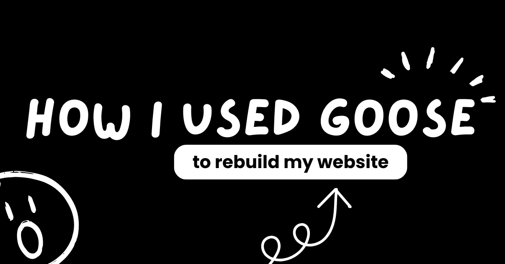
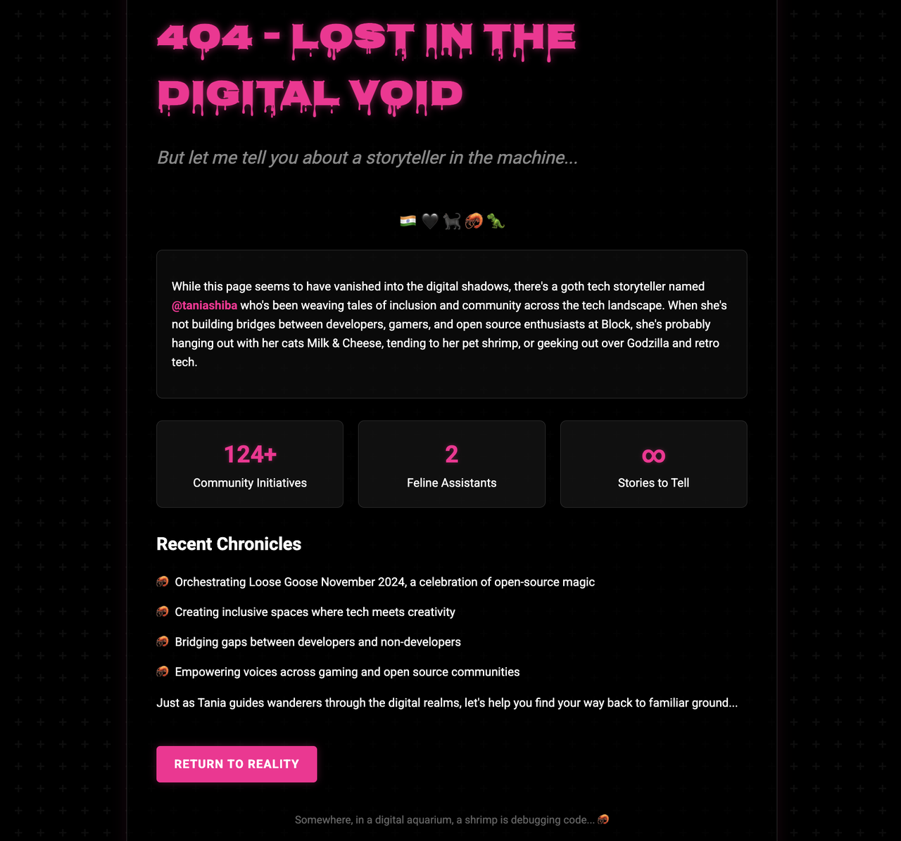

# How Goose Helped Me Rebuild My Website

A website to me is a corner of the internet where I can be who I am, share the my work, and ultimately a place I can do whatever I want with. For it to be anything but my personality personified, especially as an ex-nerdy blog designer (in my middle school and high school days), felt so sad! Until suddenly, what started out as a harmless 404 day challenge quickly turned into making that website in basically no time.

## Going Back to My Roots

When I say I was a nerdy blog creator for other people, I mean I was living in the deep-end of HTML and CSS. It was a hobby where I got to create super-customized websites for other nerds like myself on the internet. So it was really bugging me to have a website today that was basically :poopemoji: personified. No character, no style of my own, just a minimal generic layout I was paying a monthly subscription for just to avoid complete embarassment. It's been a decade at least since then, and I was NOT in the mood to sit here and relearn pieces to create a website structure from scratch. I had all the pieces in my drafts, just needed structure.

## The 404 Challenge That Started It All

Then came this [simple and easy prompt on 404 day](https://www.linkedin.com/posts/block-opensource_happy-404-day-we-used-goose-to-generate-activity-7313972103613939713-GF1T/). The post was about creating your own 404 page using goose, where goose will give you a custom page based on your profile. The original prompt went something like this:

> Create a 404 page that tells a creative story about GitHub user @taniashiba using their public GitHub data — commit history, contribution graph, repos, or anything else you can access.

I took this prompt, and modified it a bit. My personal GitHub profile and contributions are great, but I also wanted to make sure goose referenced my LinkedIn, Instagram, and all other social channels to get a good grasp of me.

> You can also reference Tania's Bluesky/Instagram/TikTok/Twitter accounts (username @taniashiba) along with her LinkedIn for additional info on her.

Quickly brought to life is a 404 page that is witty and actually pretty reflective of who I am and what I like in its styling. It even inserted a shrimp joke I had made in a past social post. I didn't even tell goose about any color combos I love, and somehow it made something that spoke to me. This lit a bright spark of inspiration. So, I asked goose:

> Can you remember that you made this? I'd love for you to make a website in this exact styling for taniachakraborty.com.

## Implementation

goose was helping me resolve what felt like an age-old problem, and made it so simple to do. I gave goose my website, told goose it was hosted on Neocities, and it went to work. After creating general pages with the styling it made for the 404 page, implementation was easy:

1. **Upload** the files goose made onto Neocities
2. **Review** the site and ask goose to edit or create any pages I needed
3. **Write content** to fill the different pages of my website (my favorite part)

Then boom, my website was done. No wrestling ancient memories from my mind to relearn CSS, no debugging issues caused by a responsive hover effect I thought was cool at 2 AM, no troubles at all. Goose handled everything. It started with a simple structure, used the styling it came up with from the 404 day challenge, and made changes as I asked for them in conversation. My website went from being embarrasingly empty to being wonderfully designed and easy to edit in *minutes*.

## Always Use Git

It honestly felt like playing a video game, because I could see changes happen live in my local preview, and with git I could save progress as we went. Goose even suggested I add my blog posts from my dev.to page, and created a simple template for me. And if anything wasn't showing up as intended? We just troubleshooted together by me sending screenshots of what I was seeing, and goose simply fixing it.

## A HUGE Timesaver, Seriously

Something that would've taken me anywhere from a week to a month to build, was done instantly. Instead of worrying about learning or relearning a skill in order to build something you need right now, you can learn as you go along with goose. This entire experience reminded me why I fell in love with styling websites for others in the first place, you really create something out of nothing!

So if you're sitting there with a naked website that needs help, or if you've been putting off a project because the technical aspects feel like an overwhelming nightmare, maybe it's time you start a conversation with a useful tool like goose. And who knows? Maybe you will end up with your own digital aquarium of a website with shrimp jokes about debugging lurk in your website footer. 🦐

---

*Want to see the final result? Check out my portfolio at [taniachakraborty.com](https://taniachakraborty.com). Let me know how many shrimp jokes you find.*

---

<head>
  <meta property="og:title" content="How Goose Helped Me Rebuild My Website" />
  <meta property="og:type" content="article" />
  <meta property="og:url" content="https://block.github.io/goose/blog/2025/08/14/how-goose-rebuilt-my-website" />
  <meta property="og:description" content="How a simple prompt transformed a blank website into a personal portfolio" />
  <meta property="og:image" content="https://block.github.io/goose/assets/images/goose_website_banner.jpg" />
  <meta name="twitter:card" content="summary_large_image" />
  <meta property="twitter:domain" content="block.github.io/goose" />
  <meta name="twitter:title" content="How Goose Helped Me Rebuild My Website" />
  <meta name="twitter:description" content="How a simple prompt transformed a blank website into a personal portfolio" />
  <meta name="twitter:image" content="https://block.github.io/goose/assets/images/goose_website_banner.jpg" />
</head>
