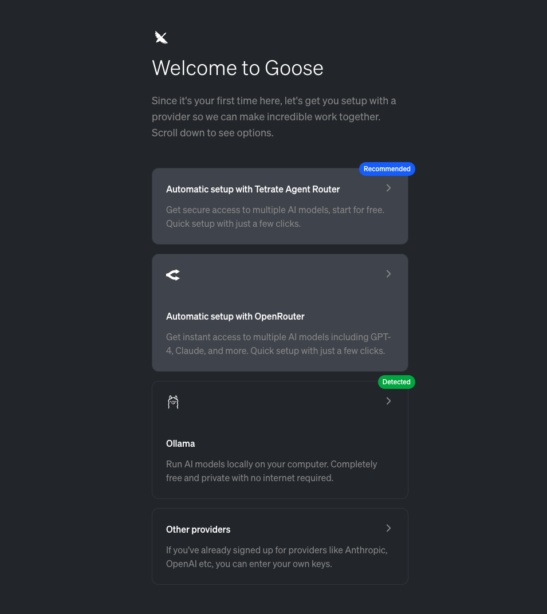
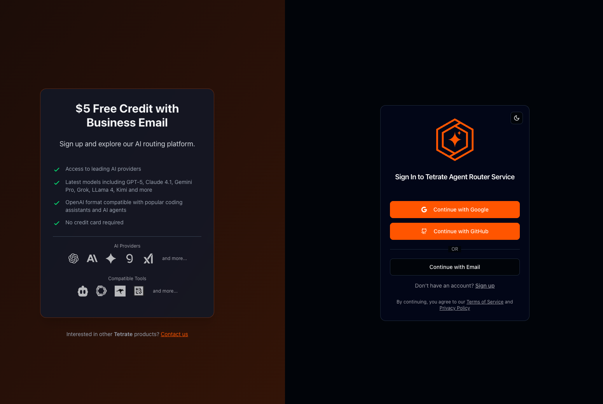
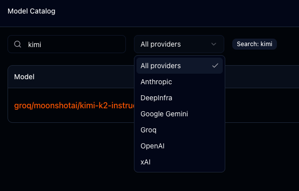
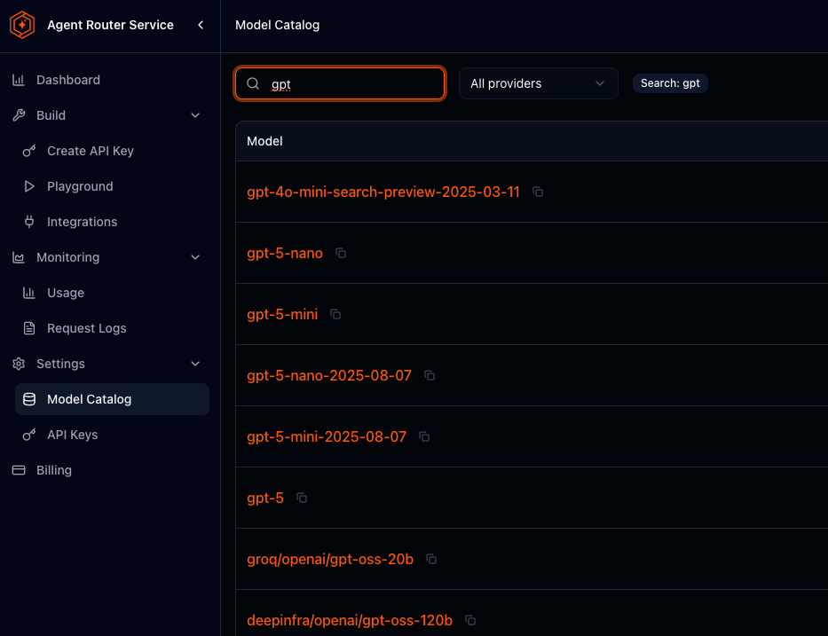

Let's be honest: while Goose is completely free to use, the reality is that most performant LLMs aren't. You want to experience that agentic goodness without breaking the bank or jumping through hoops. We've been thinking about how to make that first step easier for newcomers to AI development.

That's why we're thrilled about our newest provider integration: Tetrate's Agent Router Service. From August 27th through October 2nd, new Goose users can get $10 in credits to explore any model on the Tetrate platform.

<!--truncate-->

If you are brand new to Goose, or start with a fresh install, you will notice a new getting started experience: 

You can click on the Tetrate Agent router service and then quickly create an account, and Tetrate will give you $10 in credits to get started with immediately. 

For Goose users, this means:
- **Simple setup** in a few clicks
- **starting credits** to get started immediately
- **Access to multiple models** through one interface
- **Reliable routing** built on envoy and more

## Tetrate's Agent Router Service

Tetrate's agent router service at [router.tetrate.ai](https://router.tetrate.ai/) provides access to a collection of popular AI models, open source and also the frontier models like gpt-5 and sonnet-4, grok4 and more (all the hits!). 

### From Cloud Routing to Model Routing

Tetrate has deep experience in routing and infrastructure, having been involved with major open source projects like Istio and Envoy for many years. It seems natural that this expertise and approach can now be applied to routing/handling of LLM traffic workload, which has simmilar needs, but is also kind of novel. 

Currently LLM traffic is stateless in the sense that you can route requests to many providers and models, either for cost, speed, availability, quality or even just to have another model check your work. The patterns here are still emerging, and sometimes the terminology can be confusing (eg in goose we have providers, of which Tetrate is one, and in turn, Tetrate has service providers as well, which are also in turn called providers!), confused? Not to worry, mostly you don't have to configure things too much with router services. 

## Why This Matters

We love making Goose accessible to anyone as quickly as possible, which means removing barriers to getting started, which has been aided greatly by Tetrate helping out here with their service and credits. 

Tetrate's commitment to open source continues with their support for making AI development more accessible through services like this.

## Advanced usage and model catalog

Out of the box Goose will be auto configured to use sonnet-4 (at the time of writing) but, there is a whole catalog of models to choose from. 

You can select from from within Goose, and explore what is available via Tetrate. There are open weight models (such as kimi/k2) which are hosted for you (of you had the hardware you could run them yourself) as well as the frontier models hosted in a variety of places. 

With Goose you can optimize your usage, for example with the "Lead/Worker" configuration: this could let you save time/money by using a frontier model as the lead and falling back to a lower cost or faster model for iteration, automatically.

Thanks again for Tetrate for supporting open source!

---

*Have questions about setting up with Goose? Join our [community discussions](https://github.com/block/goose/discussions) or check out our [documentation](https://block.github.io/goose/docs/) for more detailed setup guides.*

<head>
  <meta property="og:title" content="Get Started with Goose Using Tetrate's Agent Router Service" />
  <meta property="og:type" content="article" />
  <meta property="og:url" content="https://block.github.io/goose/blog/2025/08/25/get-started-for-free-with-tetrate" />
  <meta property="og:description" content="Start using Goose today with Tetrate's agent router service. Get $10 in credits and access to popular AI models including Sonnet 4." />
  <meta name="twitter:card" content="summary_large_image" />
  <meta property="twitter:domain" content="block.github.io/goose" />
  <meta name="twitter:title" content="Get Started with Goose Using Tetrate's Agent Router Service" />
  <meta name="twitter:description" content="Start using Goose today with Tetrate's agent router service. Get $10 in credits and access to popular AI models including Sonnet 4, with the reliability of proven cloud routing expertise." />
</head>
