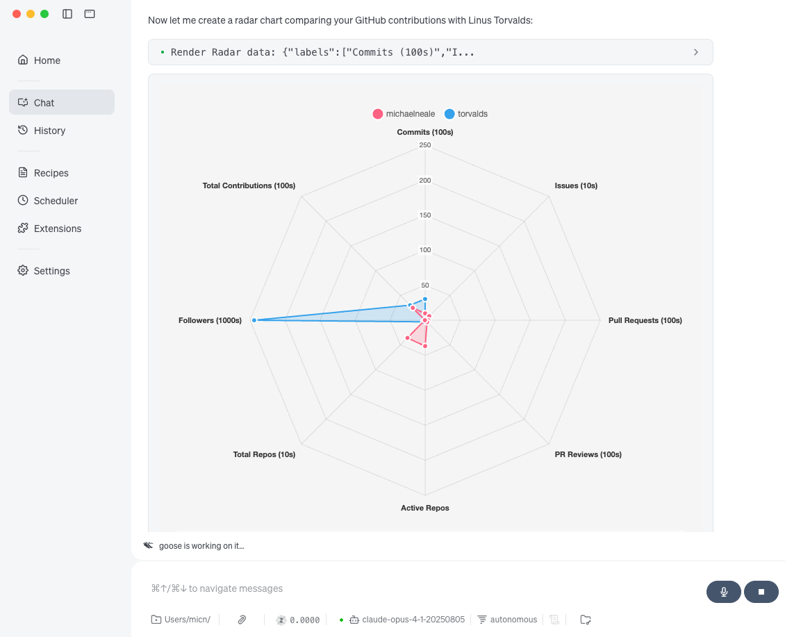
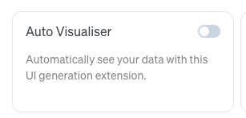
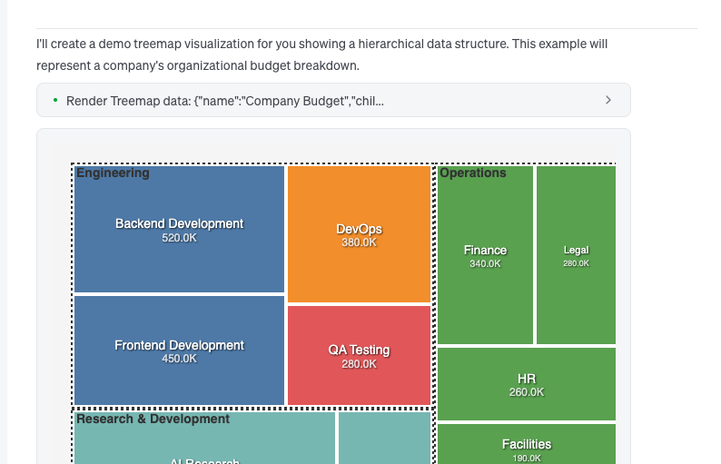

Data visualization just got a major upgrade in Goose. With the new MCP-UI auto visualiser feature, you no longer need to manually request charts, graphs, or visual representations of your data. Goose now automatically detects when data would benefit from visualization and renders interactive visual components directly in your conversation.

<!-- truncate -->

## What is Auto Visualiser?

[Auto Visualiser](/docs/mcp/autovisualiser-mcp) is a built-in extension that integrates with [Goose's MCP-UI system](/docs/guides/interactive-chat/) to automatically generate visual representations of data as you work. 

Once turned on, a smorgasboard of visualisation tools are made available as tools which will be automatically invoked if and when it makes sense to, for example, show things as a radar diagram, or a "sankey" diagram:

You can also explicitly ask for a visualisation, even specifying what style you want, and Goose will try to shape your data and then render it inline. This is powered by the [MCP-UI](https://mcpui.dev/) emerging standard, which lets the MCP server formulate a visualisation (in this case using libraries like d3.js) and render it inline.

The autovisualiser analyzes data patterns and automatically suggests the most appropriate visualization type. My favourite is the treemap which is a great way to see releative sizes of things in a way that pie charts can mislead. It is also interactive in that you can drill down.

Of course, if you want you can resort to the "last refuge of the unimaginative" and graph the weather: 

Note this is an early feature, and functionality may change and vary a lot (as with MCP-UI). This is an early example of what is emerging as generative UI, although in this case the templates are pre-generated and the data is dynamically matched to the session and then displayed (from local resources).

## Types of Visualizations

There are currently several families of things it can show: 

* sankey diagrams
* radar charts
* chord diagrams
* donut/pie charts
* bar graphs and general charts  
* treemap visualisations (tiles)
* maps (place things on geographic maps)

---

*Ready to see your data? [Enable the Auto Visualiser extension](/docs/mcp/autovisualiser-mcp#configuration) in Goose.*

<head>
  <meta property="og:title" content="Auto Visualiser with MCP-UI" />
  <meta property="og:type" content="article" />
  <meta property="og:url" content="https://block.github.io/goose/blog/2025/08/27/autovisualiser-with-mcp-ui" />
  <meta property="og:description" content="How Goose now automatically renders visual representations of data as you interact with it, powered by the new MCP-UI feature" />
  <meta property="og:image" content="https://block.github.io/goose/assets/images/autovis-banner-c6e34e561b2fad329ea00024c301e910.png" />
  <meta name="twitter:card" content="summary_large_image" />
  <meta property="twitter:domain" content="block.github.io/goose" />
  <meta name="twitter:title" content="Auto Visualiser with MCP-UI" />
  <meta name="twitter:description" content="How Goose now automatically renders visual representations of data as you interact with it, powered by the new MCP-UI feature" />
  <meta name="twitter:image" content="https://block.github.io/goose/assets/images/autovis-banner-c6e34e561b2fad329ea00024c301e910.png" />
</head>
