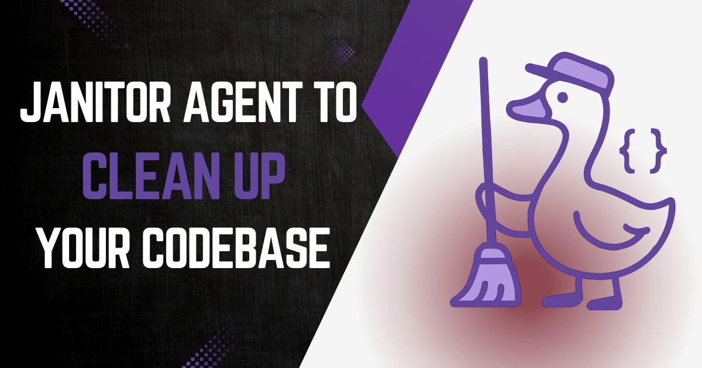

Over the years, Block's iOS engineers have felt the pain of technical debt accumulating. Feature flags are a specific example of this. Even when successfully rolled out, they tend to linger in the codebase, each one a small weight slowing down development.

In the early stages of 2025, with a renewed focus on developer acceleration, the Foundation iOS team decided to organize 'Feature Flag Removal Month' - an opportunity for teams in the large iOS monorepo to come together and delete _possibly hundreds of thousands of lines of code of dead code_. 

With the serendipitous launch of Goose recipes around the same time, the team wondered could a dedicated recipe aid this effort? [Gemma Barlow](https://www.linkedin.com/in/gemmakbarlow/), a newer iOS engineer on the team, wanted to find out. 


<!-- truncate -->


## Phase 1: Making Knowledge AI-Accessible

Gemma's first move was to utilize an existing system of `.mdc`, `.goosehints` and other symlinked context documents to capture how to safely remove feature flags from the repository.

She created documentation that allows AI agents to glean enough context to perform their work accurately.

## Phase 2: Validation Across Generations

Given AI documentation is designed to work with a variety of AI tools in use at Block, Gemma then iterated to add to these basic instructions. This validated the approach worked across the three different generations of feature flag implementations that had accumulated:

- super legacy flags the team used way back yonder
- legacy flags that were newer but are now old
- current implementation of feature flags

This documentation alone would help teams clean up faster. But now, AI could also understand and safely navigate the complexity of real world legacy systems in most scenarios, a win for developer velocity! 🎉

## Phase 3: Building an AI Team Member

This was great progress. Gemma could have stopped here. 

But instead, she utilized Goose recipes to create **Goose Janitor**.


Goose Janitor acts as new AI team member whose responsibility is to tidy up the code after we're done experimenting. Gemma drew inspiration from existing [Goose recipes](/recipes/detail/?id=clean-up-feature-flag) and internal talks from other departments to create it. Here's how it works:

```bash
goose run \
--recipe .goose/recipes/goose-janitor-flag-removal.yaml \
--params feature_flag_key=log-observer-is-enabled \
--params variant_to_remain=true \
--params create_pr=false
```

The recipe:
- Runs completely autonomously (no human intervention needed)
- Handles simple and complex flags 
- Attempts refactoring for outdated code paths
- Can automatically create draft pull requests
- Integrates with [Xcode Index MCP](https://github.com/block/xcode-index-mcp) for deep iOS project understanding
- Plans, implements, builds and tests locally to improve the accuracy of the flag removal result


## The Bigger Picture: AI-First Development

Recipes like Goose Janitor represent a fundamental shift in how we think about AI in software development. They can be deployed to:

- Understand complex legacy codebases
- Make safe refactoring decisions
- Integrate seamlessly with existing development workflows
- Provide developer velocity improvements
- Scale across large codebases

Teams at Block are confident that Goose Janitor will be of assistance in production scale cleanup work.

This is exactly the kind of work AI should handle: tedious, repetitive, but requiring deep codebase knowledge. By automating portions of their work, developers can focus on what they do best, which is building new features and solving novel problems while AI keeps the codebase clean and maintainable.


## The AI-First Mindset

This story illustrates what an AI-first approach to legacy codebases looks like in practice.

Start by making tribal knowledge AI-accessible. Test and validate that AI can actually handle the complexity with enough accuracy to prove useful. Even if manual intervention is required for complex cases, a first pass performed by AI can be a useful boost to productivity. Build automation that scales across teams and focus human energy on high value creative work.


## What's Next?

The success of Goose Janitor opens up fascinating possibilities. What other forms of technical debt could benefit from this approach? What other "AI team members" could we build to handle routine but knowledge intensive work?

As we move toward an AI-first future, stories like Gemma's show us the path. Not just using AI tools, but thinking systematically about how to make our codebases and processes AI-ready.

The future of software development is mixed teams where AI agents are autonomous contributors, handling the maintenance work that keeps our systems healthy while humans focus on building the future.

---

Want the tweak the base recipe for your own needs? Check out [Clean up feature flag](/recipes/detail/?id=clean-up-feature-flag) in our Recipe Cookbook!

<head>
  <meta property="og:title" content="When AI Becomes Your New Team Member: The Story of Goose Janitor" />
  <meta property="og:type" content="article" />
  <meta property="og:url" content="https://block.github.io/goose/blog/2025/08/28/ai-teammate" />
  <meta property="og:description" content="How an engineering team is trialling autonomous AI-powered technical debt cleanup" />
  <meta property="og:image" content="https://block.github.io/goose/assets/images/goose-janitor-129889884d9265d001fe12cbfde03d57.png" />
  <meta name="twitter:card" content="summary_large_image" />
  <meta property="twitter:domain" content="block.github.io/goose" />
  <meta name="twitter:title" content="When AI Becomes Your New Team Member: The Story of Goose Janitor" />
  <meta name="twitter:description" content="How an engineering team is trialling autonomous AI-powered technical debt cleanup" />
  <meta name="twitter:image" content="https://block.github.io/goose/assets/images/goose-janitor-129889884d9265d001fe12cbfde03d57.png" />
</head>