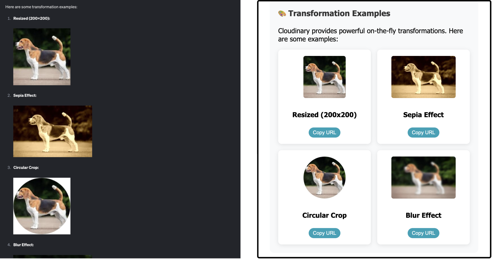
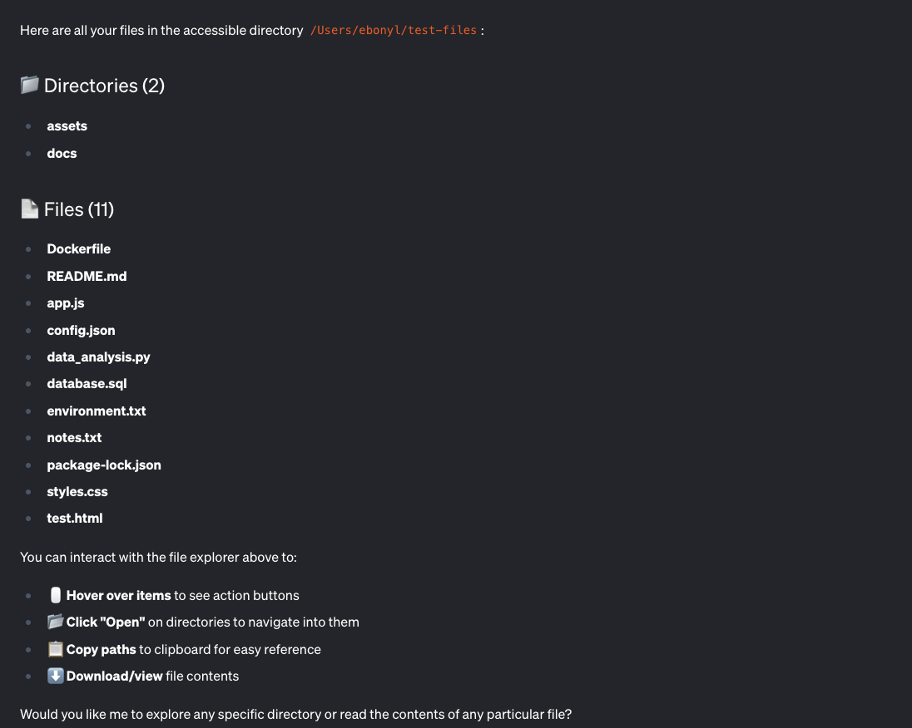
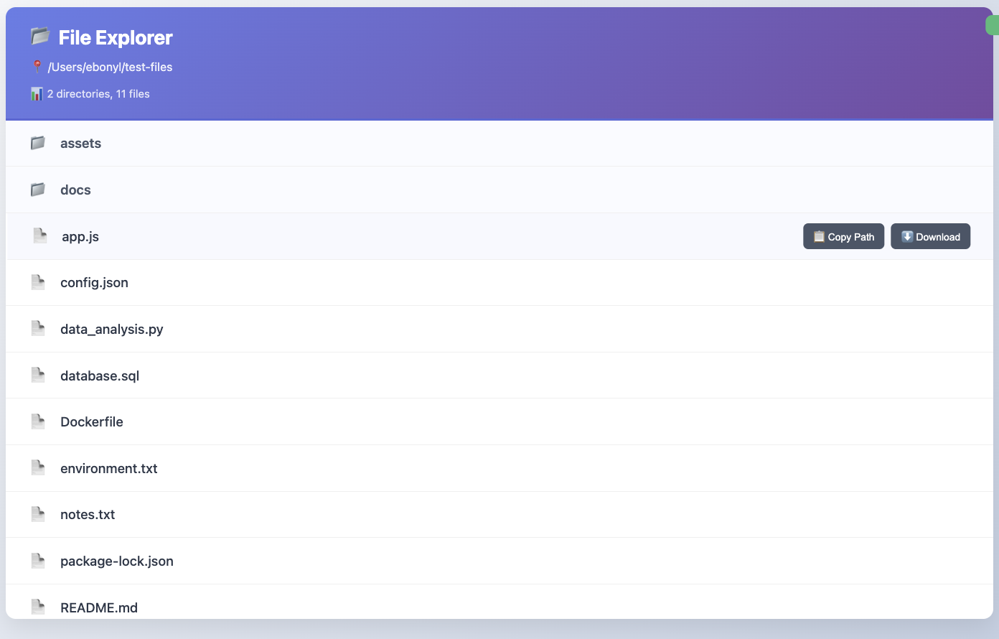

[MCP-UI](https://mcpui.dev/guide/introduction) isn’t fully rolled out yet, but to me that’s what makes it so fun to play with. We’re at this point where the spec is still taking shape, clients are only partially supporting it, and yet… you can already do a lot.

I wanted to see how far I could push it. So I grabbed two open source MCP servers, [Cloudinary](https://github.com/felores/cloudinary-mcp-server) and [Filesystem](https://github.com/modelcontextprotocol/servers/tree/main/src/filesystem), and gave them a UI. Instead of boring text, I now get rich, interactive interfaces right inside goose.

<!-- truncate -->

## Why I Wanted This

Raw JSON and text is fine, it gets the job done but lets be real I rather interact with something pretty. Give me a cool UI over back and forth prompts.

Take Cloudinary for example. By default, uploads return a block of text, basically a JSON dump of URLs, metadata, and public IDs. Useful, sure, but not exactly easy to glance at.

What I really wanted was:

- Image and video previews
- One‑click buttons to copy or view links
- Transformation examples

With MCP-UI, it’s not just responses anymore. These tools feel like little apps you can actually click around in, right inside the chat window.

{/* Video Player */}
<div style={{ width: '100%', maxWidth: '800px', margin: '0 auto' }}>
  <video 
    controls 
    width="100%" 
    height="400px"
    playsInline
  >
    <source src={require('@site/static/videos/cloudinary2.mp4').default} type="video/mp4" />
    Your browser does not support the video tag.
  </video>
</div>

## The Pattern

Here’s the cool part, the steps are basically the same for any MCP server.

### **1. Install the SDK**

```bash
npm install @mcp-ui/server
```

### **2. Import it**

```ts
import { createUIResource } from "@mcp-ui/server";
```

### **3. Build your HTML**

For my Cloudinary server update, I used `Direct HTML → iframe`. I wrote a function that returns an HTML string that includes upload previews and action buttons.  

MCP-UI takes that HTML and renders it inside an iframe using `srcdoc`.  
It’s simple, totally self-contained, fast to iterate, and I get full control over how it looks.  

💡 However, other modes exist:  

- **External URL** – iframe a hosted page:  
  `content: { type: "externalUrl", iframeUrl }`

- **Remote DOM** – send a script that builds UI directly in the host’s DOM:  
  `content: { type: "remoteDom", script, framework }`

But for my use case, **Direct HTML was the perfect fit.**

### **4. Return both**

In your tool handler, I recommend returning both the original response and the `createUIResource`.

That’s it. Regardless the server the main steps remain the same.

> ⚠️ **Heads up**: Right now the MCP-UI SDK is only available in **TypeScript** and **Ruby**.
> If your server is in one of those languages, you can start today.
> If not, you’ll either need to wait for more SDKs to drop or build your own bindings.

## Step 3: My Cloudinary UI

Here’s the HTML generator I wrote for Cloudinary, this is where you decide exactly how your UI should look.

Instead of just telling you, let’s look at the difference.

**Before MCP-UI (left):** An unstyled block of text with links and raw transformations

**After MCP-UI (right):** A clean layout with cute interactive cards & previews



<details>
<summary>Click to see the code</summary>

```ts
private createUploadResultUI(result: UploadApiResponse): string {
    const isImage = result.resource_type === 'image';
    const isVideo = result.resource_type === 'video';

    return `
    <!DOCTYPE html>
    <html lang="en">
    <head>
    <meta charset="UTF-8">
    <meta name="viewport" content="width=device-width, initial-scale=1.0">
    <title>Cloudinary Upload Result</title>
    <style>
    body {
      font-family: 'Segoe UI', Tahoma, Geneva, Verdana, sans-serif;
      margin: 0;
      padding: 20px;
      background: linear-gradient(135deg, #667eea 0%, #764ba2 100%);
      min-height: 100vh;
    }
    .container {
      max-width: 800px;
      margin: 0 auto;
      background: white;
      border-radius: 15px;
      box-shadow: 0 20px 40px rgba(0,0,0,0.1);
      overflow: hidden;
    }
    .header {
      background: linear-gradient(135deg, #4CAF50, #45a049);
      color: white;
      padding: 30px;
      text-align: center;
    }
    .content { padding: 30px; }
    .preview-section { text-align: center; margin-bottom: 30px; }
    .preview-section img, .preview-section video {
      max-width: 100%; max-height: 300px; border-radius: 10px;
      box-shadow: 0 10px 30px rgba(0,0,0,0.2);
    }
    .actions { display: flex; gap: 15px; justify-content: center; flex-wrap: wrap; }
    .btn { padding: 12px 24px; border-radius: 25px; color: white; border: none; cursor: pointer; }
    .btn-primary { background: #007bff; }
    .btn-success { background: #28a745; }
    </style>
    </head>
    <body>
      <div class="container">
        <div class="header">
          <div style="font-size:3em">✅</div>
          <h1>Upload Successful!</h1>
        </div>
        <div class="content">
          ${isImage ? `` : ''}
          ${isVideo ? `<video controls><source src="${result.secure_url}" /></video>` : ''}
          <div class="actions">
            <a href="${result.secure_url}" target="_blank" class="btn btn-primary">🔗 View</a>
            <button class="btn btn-success" onclick="navigator.clipboard.writeText('${result.secure_url}')">📋 Copy URL</button>
          </div>
        </div>
      </div>
      <script>
    // highlight-start
        const resizeObserver = new ResizeObserver((entries) => {
          entries.forEach((entry) => {
            window.parent.postMessage({
              type: "ui-size-change",
              payload: { height: entry.contentRect.height },
            }, "*");
          });
        });
        resizeObserver.observe(document.documentElement);
    //highlight-end
      </script>
    </body>
    </html>
    `;
}
```

</details>

💡 **Callout: Resize your UI**  
Notice the `ResizeObserver` at the bottom of the HTML.  
That little snippet is what keeps the iframe height in sync with your content so if your UI grows or shrinks, the window resizes automatically. Without it, your UI might look cut off and difficult to view.

## Step 4: Look How Small the Diff Is

This is the part that blew my mind, making a tool UI-compatible is just a tiny code change.

Here’s the old version:

```ts
return {
    content: [
        {
            type: "text",
            text: JSON.stringify(response, null, 2)
        }
    ]
};
```

And here’s the new version with MCP-UI support:

```ts
return {
    content: [
        {
            type: "text",
            text: `🎉 Upload successful!\n\n${JSON.stringify(response, null, 2)}`
        },
        createUIResource({
            uri: `ui://cloudinary-upload/${result.public_id}`,
            content: { type: 'rawHtml', htmlString: this.createUploadResultUI(result) },
            encoding: 'text'
        })
    ]
};
```

That’s it. One extra resource, and suddenly Goose renders a full UI.

## Filesystem: Same Pattern

To prove this wasn’t a one-off, I also made the Filesystem MCP server UI-compatible.

> **Before:** Text output (what Goose shows by default)



> **After:** UI output (interactive explorer with MCP-UI)



And here’s the only diff you need:

```ts
return {
    content: [
        { type: "text", text: `📂 Files in ${directoryPath}:\n\n${textResponse}` },
        createUIResource({
            uri: `ui://filesystem/explorer/${encodeURIComponent(directoryPath)}`,
            content: { type: "rawHtml", htmlString: htmlContent },
            encoding: "text",
        })
    ]
};
```

## Ahead of the Curve

I’ve now made two open source MCP servers UI-compatible, before MCP-UI is even fully rolled out. That’s crazy to me.

And if you zoom out, you’ll see other people pushing here too. Goose and Postman already support rendering and partial UI actions, today when I click a button in goose I get a toast or a message. Nothing fancy yet.

But the fact that rendering works means we can start perfecting these UI experiences.

That’s what excites me, we’re not waiting around. We’re experimenting in the open, and shaping what the future will feel like.

---

## Try It Yourself

Wanna see it in action? 

Download [Goose](/docs/quickstart#install-goose), give an MCP server a UI facelift of your own, and see the magic for yourself. Boring text prompts will never hit the same again.

*Got questions?* Explore our [docs](/docs/category/guides), browse the [blog](/blog), or join the conversation in our [Discord](https://discord.gg/block-opensource) and [GitHub Discussions](https://github.com/block/goose/discussions). We’d love to have you.