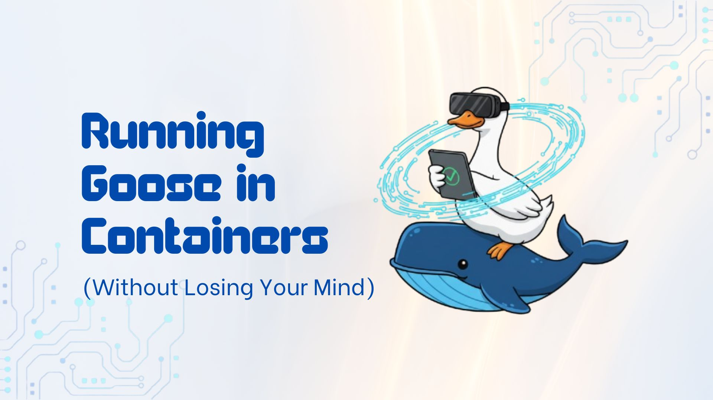

# Running Goose in Containers (Without Losing Your Mind)

I'm a huge fan of containers. They're not just a cool buzzword for résumés; they actually save your sanity. And today, I'll show you how to run goose inside Docker. specifically how to integrate it into CI/CD pipelines, debug containerized workflows, and manage secure deployments at scale. Once you containerize goose, you'll never go back to raw installs.

<!--truncate-->

## Why Containerize Goose? The Real Benefits

goose is an AI agent that can automate engineering tasks, build projects from scratch, debug code, and orchestrate complex workflows through the [Model Context Protocol](https://modelcontextprotocol.io/docs/getting-started/intro) (MCP). But here's why containers unlock its true potential:

**For CI/CD Integration:** Run automated code reviews, documentation generation, and testing across your entire pipeline without environment drift. Imagine having goose automatically review every PR, generate release notes, or validate your infrastructure as code-all running consistently in containers.

**For Team Collaboration:** Every developer gets the same goose setup, eliminating "works on my machine" problems when sharing AI-powered workflows or debugging sessions.

**for Production Deployments:** Scale goose instances horizontally, manage API keys securely, and deploy across multiple environments with confidence.

In this guide, we'll cover:

- Quick deployment with pre-built images
- CI/CD pipeline integration with GitHub Actions and GitLab
- Debugging containerized goose workflows
- Production-ready security and scaling patterns

The benefits are immediate and compound over time-especially when you're managing API keys for multiple LLM providers and need consistent behavior across environments.

## Quick Start: Your First Containerized Workflow

Let's jump straight into a practical example-using goose to analyze and improve a codebase:

```bash
# Pull the image and analyze your project
$ docker run --rm \
   -v $(pwd):/workspace \
   -w /workspace \
   -e GOOSE_PROVIDER=openai \
   -e GOOSE_MODEL=gpt-4o \
   -e OPENAI_API_KEY=$OPENAI_API_KEY \
   ghcr.io/block/goose:v0.9.3 run -t "Review this code for security issues and suggest improvements"
```

That's it. The ~340MB image contains everything goose needs to analyze your code, suggest improvements, or even refactor entire functions. This same pattern works for documentation generation, test creation, or architectural reviews.

## Building Your Own Images

Sometimes you need customizations. Maybe you want the bleeding edge from source, or you need additional tools. Building from source is straightforward:

```bash
# Clone and build
$ git clone https://github.com/block/goose.git
$ cd goose
$ docker build -t goose:local .
```

The build uses multi-stage magic: compiles with Rust's heavy toolchain, then copies just the binary to a minimal Debian runtime. Smart stuff. The Dockerfile even includes Link-Time Optimization (LTO) and binary stripping to keep things lean.

Pro tip: For development builds with debug symbols, add `--build-arg CARGO_PROFILE_RELEASE_STRIP=false`.

## Running Goose Effectively

### Basic CLI Usage

Mount your workspace and let Goose work its magic:

```bash
$ docker run --rm \
   -v $(pwd):/workspace \
   -w /workspace \
   -e GOOSE_PROVIDER=openai \
   -e GOOSE_MODEL=gpt-4o \
   -e OPENAI_API_KEY=$OPENAI_API_KEY \
   goose:local run -t "Analyze this codebase"
```

### Interactive Sessions

For longer sessions, use the interactive mode:

```bash
$ docker run -it --rm \
   -v $(pwd):/workspace \
   -w /workspace \
   -e GOOSE_PROVIDER=anthropic \
   -e GOOSE_MODEL=claude-3-5-sonnet-20241022 \
   -e ANTHROPIC_API_KEY=$ANTHROPIC_API_KEY \
   goose:local session
```

### Docker Compose for Complex Setups

When you're dealing with multiple services or persistent config, use Docker Compose:

```yaml
version: "3.8"
services:
  goose:
    image: ghcr.io/block/goose:latest
    environment:
      - GOOSE_PROVIDER=${GOOSE_PROVIDER:-openai}
      - GOOSE_MODEL=${GOOSE_MODEL:-gpt-4o}
      - OPENAI_API_KEY=${OPENAI_API_KEY}
    volumes:
      - ./workspace:/workspace
      - goose-config:/home/goose/.config/goose
    working_dir: /workspace
    stdin_open: true
    tty: true

volumes:
  goose-config:
```

Run with: `$ docker-compose run --rm goose session`

## Configuration Deep Dive

Goose supports all the usual environment variables: `GOOSE_PROVIDER`, `GOOSE_MODEL`, and provider-specific keys. The container runs as a non-root user (UID 1000) by default, which is great for security.

For persistent config, mount the config directory:

```bash
$ docker run --rm \
    -v ~/.config/goose:/home/goose/.config/goose \
    goose:local configure
```

Need extra tools? The image is based on Debian Bookworm Slim, so you can install what you need:

```bash
FROM ghcr.io/block/goose:latest

USER root

RUN apt-get update && apt-get install -y vim tmux && rm -rf /var/lib/apt/lists/*

USER goose
```

## CI/CD Integration: Where Containers Shine

This is where containerization really pays off. In CI/CD pipelines, you want consistent, isolated environments. Here's how to integrate Goose:

### GitHub Actions

```yaml
jobs:
  analyze:
    runs-on: ubuntu-latest
    container:
      image: ghcr.io/block/goose:latest
      env:
        GOOSE_PROVIDER: openai
        GOOSE_MODEL: gpt-4o
        OPENAI_API_KEY: ${{ secrets.OPENAI_API_KEY }}
    steps:
      - uses: actions/checkout@v4
      - name: Run goose analysis
        run: |
          goose run -t "Review this codebase for security issues"
```

### GitLab CI

```yaml
analyze:
  image: ghcr.io/block/goose:latest
  variables:
    GOOSE_PROVIDER: openai
    GOOSE_MODEL: gpt-4o
  script:
    - goose run -t "Generate documentation for this project"
```

I've used this setup on multiple projects, and it's a game-changer for automated code reviews and documentation generation.

## Troubleshooting: Real-World Issues

### File Permission Problems with Workspace Mounts

When goose can't write to your mounted workspace, it's usually a user ID mismatch:

```bash
# Problem: "Permission denied" when goose tries to create files
$ docker run --rm -v $(pwd):/workspace ghcr.io/block/goose:v0.9.3

# Solution: Match container user with host user
$ docker run --rm \
   -v $(pwd):/workspace \
   -u $(id -u):$(id -g) \
   ghcr.io/block/goose:v0.9.3 run -t "Create a README.md"
```

### Managing Multiple API Keys

When working with multiple LLM providers (OpenAI, Anthropic, Google), passing individual `-e` flags becomes unwieldy and error-prone. Instead, use a single `.env` file:

```bash
# Create a comprehensive .env file
$ cat > .env << EOF
GOOSE_PROVIDER=openai
GOOSE_MODEL=gpt-4o
OPENAI_API_KEY=sk-your-openai-key
ANTHROPIC_API_KEY=sk-ant-your-anthropic-key
GOOGLE_API_KEY=your-google-key
EOF

# Use the entire file at once
$ docker run --rm --env-file .env -v $(pwd):/workspace goose:v0.9.3
```

This approach is cleaner, more maintainable, and essential for CI/CD environments where you might switch between providers based on cost, availability, or model capabilities. It also keeps sensitive keys out of your shell history and makes it easy to version different configurations for different environments.

### Connecting to Local Development Services

When goose needs to interact with local databases, development servers, or APIs running on your host machine, the container's isolated network becomes a barrier. This is common when:

- Testing integrations with a local PostgreSQL database
- Analyzing APIs running on `localhost:3000`
- Debugging microservices in development
- Working with locally hosted documentation servers

Use host networking to bridge this gap:

```bash
# Allow goose to access your local services
$ docker run --rm --network host \
   --env-file .env \
   -v $(pwd):/workspace \
   ghcr.io/block/goose:v0.9.3 run -t "Test the API endpoints in our local development server"
```

**Security note:** Only use host networking in development environments. For production, use proper service discovery and networking configurations.

## Advanced Patterns

### Resource Limits

Set memory and CPU limits for production:

```bash
$ docker run --rm \
   --memory="2g" \
   --cpus="2" \
   goose:local
```

### Debugging Container Issues

When goose behaves unexpectedly in containers, you need to investigate the environment. Here are common debugging scenarios:

**Inspect the container environment:**

```bash
# Drop into a shell to examine the container
$ docker run --rm -it --entrypoint bash \
   -v $(pwd):/workspace \
   --env-file .env \
   ghcr.io/block/goose:v0.9.3

# Inside the container, check:
goose@container:~$ env | grep GOOSE      # Environment variables
goose@container:~$ goose --version       # Binary version
goose@container:~$ ls -la /workspace     # File permissions
goose@container:~$ cat ~/.config/goose/config.yaml  # Configuration
```

**Debug API connectivity issues:**

```bash
# Test network connectivity and API access
$ docker run --rm -it --entrypoint bash goose:v0.9.3
goose@container:~$ curl -I https://api.openai.com/v1/models
goose@container:~$ goose configure --check  # Verify API keys
```

**Examine goose logs in verbose mode:**

```bash
$ docker run --rm -it \
   -v $(pwd):/workspace \
   --env-file .env \
   ghcr.io/block/goose:v0.9.3 \
   --verbose run -t "Your failing command"
```

This debugging approach helps identify issues with file permissions, network connectivity, API authentication, or configuration problems that might not be obvious from normal goose output.

### Multi-Platform Builds

For deployment across architectures:

```bash
$ docker buildx build --platform linux/amd64,linux/arm64 -t goose:multi .
```

## Production Considerations

For production deployments, replace all the `latest` tags from our examples with specific release versions:

### Use Specific Release Tags

```bash
# Instead of this (unpredictable):
$ docker pull ghcr.io/block/goose:latest

# Use this (reproducible):
$ docker pull ghcr.io/block/goose:v0.9.3
```

Pinning to specific versions prevents surprises during deployments and makes rollbacks predictable when issues arise.

## Wrap-Up

Containerizing Goose has been one of those "why didn't I do this sooner?" moments in my career. It eliminates environment drift, simplifies deployments, and makes your AI-powered workflows truly portable. So, start with the prebuilt image, then customize as you grow. Your future self will thank you.
