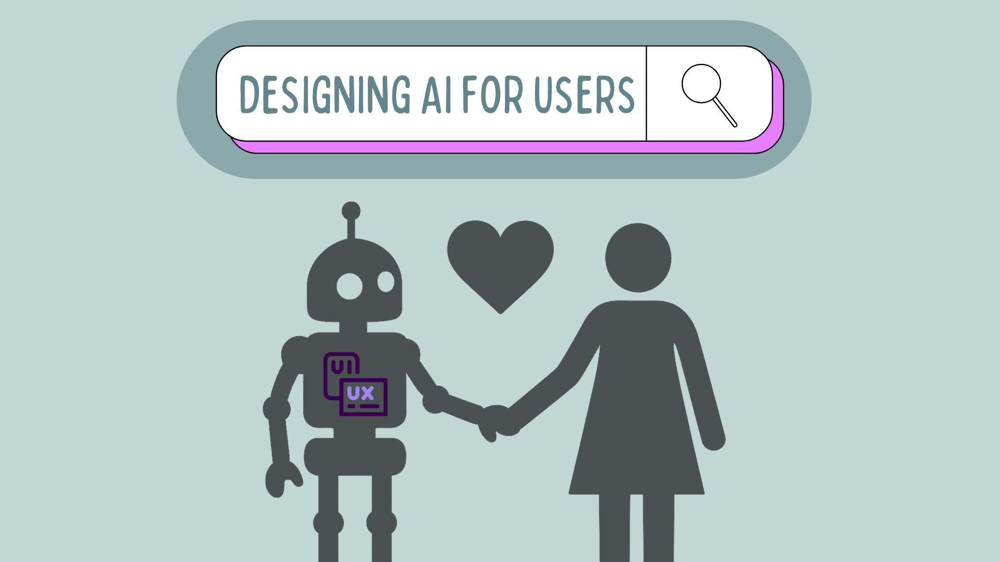

My mom was doing her usual Sunday ritual she had her pen, paper, calculator, and a pile of receipts. I’ve tried to get her to use every budgeting app out there, but she’s old school and always says the same thing:  
> “They’re all too complicated.”  

<!--truncate-->

Last month, halfway through crunching numbers, she sighed and said,  
> “I just wish I could see where my money’s going.”  

So I opened [**goose**](http://block.github.io/goose/docs/quickstart), added her notes, and turned on [**Auto Visualiser**](https://block.github.io/goose/docs/mcp/autovisualiser-mcp). In seconds, her budget became this colorful, interactive chart. She hovered over each slice, analyzing where her money was going.  

Now, I'm not saying this is some groundbreaking use case. There are plenty of apps that do this. What stood out to me was how simple it felt. My mom didn’t need to learn anything new or adapt to someone else’s design. The visualization just appeared, and she got it immediately.  

It wasn’t about the tech working. It was about AI finally showing up in a way that made sense to her.

### **When AI Starts Showing, Not Just Talking**

We’ve made huge progress with agentic AI. Agents can plan, reason, and act, but they often still communicate like terminals with walls of text, and no real interaction. That’s where [**MCP-UI**](https://mcpui.dev/guide/getting-started) changes everything.  

MCP-UI gives agents a visual language *and* a way for users to interact directly within the chat window. Before this, conversations with AI consisted of a chain of prompts and responses. Now, users can actually engage with their agent through the interface itself. A button can launch a new prompt without the user typing anything. A dropdown can run a tool call in the background. A link can open a page or resource for them instantly. Even notifications can be exchanged between this embedded UI and the host application to keep everything in sync.  

This is what turns an AI chat into an interface layer. Instead of describing what it can do, the agent can present real, clickable options and respond to them in real time. That makes AI conversations feel fluid and interactive. 

Instead of saying, ‘Here’s your data,’ your agent can show it, let you act on it, and react to what you choose.

### **Why This Matters for Builders**

As developers, we often design for the model first, thinking about prompt structure or JSON formatting. But the next big step for agents is how well they can anticipate what the user wants to do and needs to see.  

We’re already seeing this shift across the industry. Google’s new AI Mode is transforming search into an intent-driven experience. Instead of sending users to links, it now shows tickets, seat maps, and purchase buttons directly in the results. The web is becoming dynamic, adapting to what users are trying to do.  

MCP-UI brings that same evolution into the agent world. It extends the [Model Context Protocol](https://modelcontextprotocol.io/docs/getting-started/intro) so your MCP server can return more than just data. It can render interactive components right inside your agent's chat. Whether it’s a chart, button, table, or form, the agent can display live, usable views of your service instead of describing them in text.  

goose’s built-in Auto Visualiser is one example of this in action, automatically turning structured output into interactive visuals using MCP-UI behind the scenes.  

But the potential goes much further. When developers build their own MCP servers, they get full control over *how*  their data appears. They can design interfaces that reflect their brand or product style, ensuring users interacting with their API through an AI agent still get a familiar experience. Imagine a Shopify MCP server returning product listings that look like their storefront, or a Notion MCP server displaying content in its block layout inside the chat.  

Both point to the same future: one where AI doesn’t just reply with text, but responds with the right interface for the moment. Instead of fixed screens, we get dynamic, intent-based experiences that adapt to what the user needs in real time.  

That’s what Agentic UX is really about: building AI that responds to what the user intends to do.  

If you’re building your own MCP server, start by thinking about the experience you want your users to have. Then experiment with MCP-UI and design the flow you’d expect if you were the one using it. For a full walkthrough, see [How To Make An MCP Server MCP-UI Compatible](https://block.github.io/goose/blog/2025/09/08/turn-any-mcp-server-mcp-ui-compatible).

---

I have a feeling that next month, when my mom sits down to balance her bills, she’s going to ask me:  
> “You brought that goose thing again?”  

<head>
  <meta property="og:title" content="Designing AI for Users, Not Just LLMs" />
  <meta property="og:type" content="article" />
  <meta property="og:url" content="https://block.github.io/goose/blog/2025/10/14/designing-ai-for-humans" />
  <meta property="og:description" content="Building intent-based AI experiences with MCP-UI." />
  <meta property="og:image" content="https://block.github.io/goose/assets/images/design-ai-de5d0af69d8d21111dd271624ac7cab3.png" />
  <meta name="twitter:card" content="summary_large_image" />
  <meta name="twitter:title" content="Designing AI for Users, Not Just LLMs" />
  <meta name="twitter:description" content="Building intent-based AI experiences with MCP-UI." />
  <meta property="twitter:domain" content="block.github.io/goose" />
  <meta name="twitter:image" content="https://block.github.io/goose/assets/images/design-ai-de5d0af69d8d21111dd271624ac7cab3.png" />
</head>