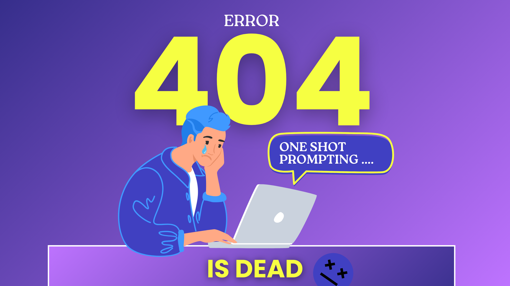

I attended one shot prompting’s funeral.

There were no tears. Just a room full of developers quietly pretending they weren’t taking shots the night before. Because if we’re being honest, everyone saw this coming and couldn’t be happier it was over.

Saying “one-shot prompting is dead” isn’t revolutionary. It’s just catching up to what builders have been experiencing for months.

<!-- truncate -->

---

## The blog post that aged faster than oat milk

Last year, I wrote a post about [how to prompt better](https://block.github.io/goose/blog/2025/03/19/better-ai-prompting). I shared tricks, phrasing tips, and even said to add a few “pleases” and “thank yous” and your AI agent would give you the world. At the time it felt cutting edge, because it was. There were livestreams and conference talks entirely about how to prompt better.

Less than a year later, it feels… quaint. Not because prompting stopped mattering, but because prompting stopped being the main character.

The conversation shifted from:

> “How do I coach the model better?”

to

> “What environment am I dropping this model into?”

That’s a completely different problem, and now it has a name. **Context engineering**.

---

## The abstraction that broke

One-shot prompting worked when agents were party tricks. You crafted a clever prompt, you got a clever answer, and by “clever answer” I mean a fully “working” app, so everyone clapped. But the moment we asked agents to plan, remember, call tools, and operate across multiple steps, the definition of “worked” fell apart.

A single prompt stopped being a solution and became a bottleneck. What matters now isn’t the sentence you type. It’s the system that surrounds it.

Once we started wanting deployable and repeatable workflows. Things like, memory, long term state, planning loops, guardrails and context handoffs between steps became the focus. Resulting in prompts becoming one *small* step along the way.

As someone put it in a thread I recently came across:

> “The best model with bad context loses to an average model with great context.”

That’s the shift in one line.

---

## We’re already living in the post-prompt era

This isn’t a prediction. It’s already happening.

Patterns like [Ralph Wiggum loop](https://ghuntley.com/loop/), [OpenClaw](https://openclaw.ai/), and multi-agent planning systems aren’t about clever wording. They’re about designing context pipelines that let agents think across steps.

The reaction to these projects weren't just hype. Developers went **completely* feral over them because they were hungry for real examples of successful context engineering. Not prompt tricks but actual systems that held state, iterated, and behaved *predictably* across time.

That excitement tells you where the energy is moving. Builders are asking for environments that scale. And once you start designing those environments, new concerns show up immediately, context pollution, memory drift, permission boundaries, security, governance, etc. Context engineering isn’t just about giving agents more power, it’s about deciding what they’re allowed to carry forward and what they’re not allowed to touch.

That’s the shift, working with agents is becoming more architectural.

You see the same philosophy showing up across the ecosystem. Stripe’s [end-to-end coding agents](https://stripe.dev/blog/minions-stripes-one-shot-end-to-end-coding-agents), Goose’s [skills](https://block.github.io/goose/docs/guides/context-engineering/using-skills/) and [recipes](https://block.github.io/goose/docs/guides/recipes/), and tools like [rp-why](https://block.github.io/goose/blog/2026/02/06/rp-why-skill) that analyze interaction patterns over time are all converging on the same idea. Success isn’t measured in prompts anymore, it’s measured in systems and how well you can orchestrate them.

Developers are already sharing success stories with context engineering. My coworker, Rizel Scarlett, documented how she used [RPI to build a lightweight OpenClaw alternative](https://block.github.io/goose/blog/2026/02/06/rpi-openclaw-alternative) after the usual back and forth prompting led her to hit multiple context limits. Structured [research, planning, and implementation](https://block.github.io/goose/docs/tutorials/rpi/) gave her agent the ability to approach the project strategicly, appose to just responding.

Once you see that, the next question isn’t philosophical anymore. It’s practical. What does building this way actually look like for me?

---

## What building inside this shift actually looks like

When I started building our skills marketplace, one-shot prompting got messy fast. My normal flow of researching in one tool and implementing in another didn’t hold up. That’s what forced me to stop and experiment with RPI.

I didn’t adopt a new context engineering workflow because it was trendy. I adopted it because honestly the alternative became tedious. Once I committed to RPI, the friction disappeared. I repeated myself less. My agent made fewer mistakes. We stopped losing the plot halfway through the project. And I had research and planning docs I could actually read.

Because of that experience, I started applying the same approach to other projects too. I built a video workflow agent where the operational steps live inside the system through recipes, and skills. So as a team, we’re not carrying the process in our heads anymore, we can now focus on the creative direction of our videos instead of babysitting the workflow.

---

## This is good news for people who think beyond code

The interesting part is this shift isn’t just technical. There’s a quiet career implication hiding inside it. AI isn’t replacing engineers per se. It’s replacing the old workflows and fundamentals we’ve come to rely on.

The thought process being phased out, in my opinion, is the one that ends at “my code runs, so I’m done.” Context engineering rewards a different mindset. 

We need to understand how a series of decisions propagate through a system and the different outcomes they create. That’s a mindset shift I’m actively working toward too, so I’d be remiss not to share it. We all need to be actively zooming out, seeing the bigger picture, and designing with downstream effects in mind.

---

## The new skill isn’t prompting

Prompting isn’t gone. It’s still useful for demos and bringing ideas to life quickly.

But one-shot prompting as a workflow has been demoted. The long term skill to master is understanding how information flows, what persists, what’s reusable, and what the agent is allowed to safely assume. In other words, mastering the orchestration of these systems.

One-shot prompting didn’t die because it failed. It died because we outgrew it.

<head>
  <meta property="og:title" content="One Shot Prompting is Dead - The Era of Context Engineering" />
  <meta property="og:type" content="article" />
  <meta property="og:url" content="https://block.github.io/goose/blog//2026/02/07/context-engineering" />
  <meta property="og:description" content="One-shot prompting isn’t the future. Context engineering is. A practical look at how AI workflows are shifting from clever prompts to engineered systems." />
  <meta property="og:image" content="https://block.github.io/goose/assets/images/blogbanner-2fa90c93a49496447d38217739242dec.png" />
  <meta name="twitter:card" content="summary_large_image" />
  <meta property="twitter:domain" content="block.github.io/goose" />
  <meta name="twitter:title" content="One Shot Prompting is Dead - The Era of Context Engineering" />
  <meta name="twitter:description" content="One-shot prompting isn’t the future. Context engineering is. A practical look at how AI workflows are shifting from clever prompts to engineered systems." />
  <meta name="twitter:image" content="https://block.github.io/goose/assets/images/blogbanner-2fa90c93a49496447d38217739242dec.png" />
</head>