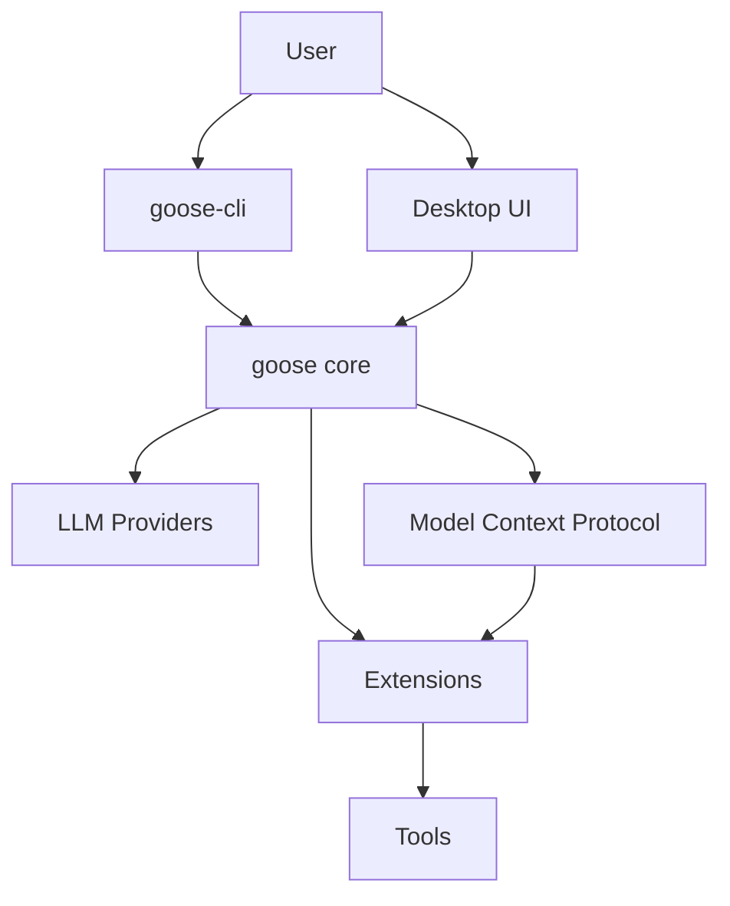

# Comprehensive Architecture Overview

Goose is an open-source AI agent built with a modular, extensible architecture designed to connect Large Language Models (LLMs) to various tools and data sources. This document provides a comprehensive overview of Goose's architecture, components, and how they interact.

## System Architecture

Goose's architecture consists of several key components:

1. **Core Library (`goose`)**: The central component that implements the agent logic, provider integrations, and extension management.
2. **Command Line Interface (`goose-cli`)**: Provides a CLI for interacting with Goose.
3. **Server (`goose-server`)**: Implements a server for remote interaction with Goose.
4. **Desktop Application (`ui/desktop`)**: An Electron-based UI for interacting with Goose.
5. **Model Context Protocol (`mcp-core`, `mcp-client`, `mcp-server`)**: A standardized protocol for connecting LLMs to tools and data sources.
6. **Extensions (`goose-mcp`)**: Built-in extensions that provide additional capabilities.

### Component Relationships

## Core Components

### Agent System

The Agent system is responsible for managing the conversation with the LLM, handling tool calls, and managing the context window. Goose implements multiple agent strategies:

1. **TruncateAgent**: Manages context by removing oldest messages first when context limits are reached.
2. **SummarizeAgent**: Uses the LLM to summarize conversation history when context limits are reached.

Agents are registered through a factory pattern, allowing for easy extension with new agent types.

### Provider System

The Provider system abstracts interactions with different LLM providers (OpenAI, Anthropic, Google, etc.). Each provider implements the `Provider` trait, which defines methods for:

- Getting provider metadata
- Completing prompts with the LLM
- Managing model configuration

Supported providers include:
- OpenAI
- Anthropic
- Google
- Azure OpenAI
- Ollama
- Groq
- Bedrock
- OpenRouter

### Extension System

Extensions provide tools that the LLM can use to interact with external systems. Each extension implements the `Extension` trait and exposes a set of tools. Extensions can be:

1. **Built-in**: Part of the Goose binary
2. **Standard I/O**: External processes communicating via stdin/stdout
3. **Server-Sent Events (SSE)**: External servers communicating via SSE

Extensions can depend on each other, allowing for modular composition of capabilities.

### Model Context Protocol (MCP)

MCP is a standardized protocol for connecting LLMs to tools and data sources. It defines:

- Message formats for requests, responses, notifications, and errors
- Tool definitions and calling conventions
- Resource management for sharing data with LLMs

MCP uses JSON-RPC as its underlying protocol and supports multiple transport mechanisms.

## Context Revision Mechanism

Goose implements sophisticated context revision mechanisms to manage token usage and maintain conversation coherence.

### Token Management

The token management system:

1. Tracks token usage for each message
2. Estimates token counts for different content types
3. Enforces context limits based on model configuration

When context limits are approached, Goose can:

1. Truncate older messages (OldestFirstTruncation)
2. Summarize conversation history (SummarizeAgent)

### Truncation Strategy

The truncation system:

1. Calculates token counts for all messages
2. Identifies messages to remove based on the selected strategy
3. Ensures tool request-response pairs are kept together
4. Maintains conversation coherence by preserving critical messages

## Error Handling

Goose implements a comprehensive error handling system that:

1. Distinguishes between traditional errors (network, availability) and agent errors (invalid tool calls)
2. Surfaces errors to the LLM to enable self-correction
3. Provides detailed error information to guide recovery

## Desktop Application Architecture

The desktop application uses Electron with React and implements:

1. Dynamic window management
2. Process management for the Goose server
3. Cross-platform compatibility
4. Configuration management

## Conclusion

Goose's architecture is designed for modularity, extensibility, and robustness. The separation of concerns between agents, providers, and extensions allows for easy customization and extension of capabilities.
