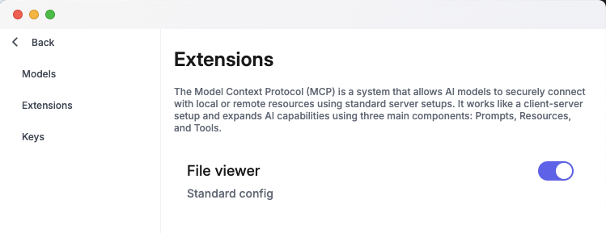
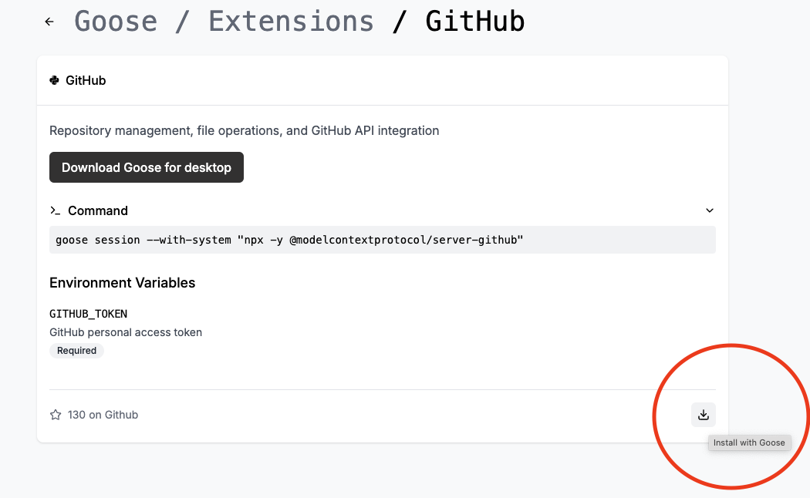

import Tabs from '@theme/Tabs';
import TabItem from '@theme/TabItem';

# Installation

#### Installing the Goose Cli
To install Goose CLI, run the following script on macOS or Linux. 

```sh
curl -fsSL https://github.com/block/goose/releases/download/stable/download_cli.sh | sh
```
This script will fetch the latest version of Goose and set it up on your system.

#### Instaling the Goose UI

To install the Goose desktop UI, follow these steps: 
1. Visit the [Goose Releases page](https://github.com/block/goose/releases/tag/stable)
2. Download the `Goose.zip` file.
3. Open the downloaded `Goose.zip` file and launch the desktop application.

### Configuration
Goose allows you to configure settings for both its command-line interface (CLI) and desktop UI. You can update your LLM provider and API key, enable or disable extensions, and add new extensions to enhance Goose's functionality.

#### Set up a provider
Goose works with a set of [supported LLM providers][providers] that you can obtain an API key from if you don't already have one. You'll be prompted to pick a provider and set an API key on your initial install of Goose. 
<Tabs>
  <TabItem value="cli" label="Goose CLI" default>
    **To update your LLM provider and API key:** 
    1. Run the following command: 
    ```sh
    goose configure
    ```
    2. Select `Configure Providers` from the menu.
    3. Follow the prompts to choose your LLM privider and enter or update your API key. 

    **Example:**

    To select an option during configuration, hover over it and press Enter.

    ```sh
    What would you like to configure?
    > Configure Providers
      Toggle Extensions
      Add Extension

    Which Model provider should we use?
    > OpenAI
      Databricks
      Ollama
    .....

    Enter Api Key:
    >  sk-1234abcd5678efgh
    ```

    :::info Billing
    You will need to have credits in your LLM Provider account (when necessary) to be able to successfully make requests. Some providers also have rate limits on API usage, which can affect your experience. Check out our [Handling Rate Limits][handling-rate-limits] guide to learn how to efficiently manage these limits while using Goose.
    :::
  </TabItem>
  <TabItem value="ui" label="Goose UI">
  **To update your LLM provider and API key:** 

    1. Click on the three dots in the top-right corner.
    2. Select `Provider Settings` from the menu.
    2. Choose a provider from the list.
    3. Click Edit, enter your API key, and click `Set as Active`.

  </TabItem>
</Tabs>

    #### Toggle Extensions

    Goose Extensions are add-ons utilizing [Anthropic's Model Context Protocol(MCP)][mcp], that enhance Goose's functionality by connecting it with different applications and tools you already use in your workflow. Extensions can be used to add new features, automate tasks, and integrate with other systems. 
<Tabs>
  <TabItem value="cli" label="Goose CLI" default>
    **To enable or disable extensions that are already installed:** 

    1. Run the following command to open up Goose's configurations:
    ```sh
    goose configure
    ```
    2. Select `Toggle Extensions` from the menu.
    3. A list of already installed extensions will populate.
    4. Press the `space bar` to toggle the extension `enabled` or `disabled`. 

    **Example:**

    To select an option during configuration, hover over it and press Enter.
    ```sh
    What would you like to configure?
      Configure Providers
    > Toggle Extensions
      Add Extension

    Enable systems: (use "space" to toggle and "enter" to submit)
    [ ] Developer Tools 
    [X] JetBrains
    ```
  </TabItem>
  <TabItem value="ui" label="Goose UI">
  **To enable or disable extensions that are already installed:**

  1. Click the three dots in the top-right corner of the application.
  2. Select `Settings` from the menu, then click on the `Extensions` section.
  2. Use the toggle switch next to each extension to enable or disable it.

  

  </TabItem>
</Tabs>

#### Adding An Extension
Extensions allow you to expand Goose's capabilities by connecting it with additional tools and systems. You can add built-in extensions provided by Goose, or integrate external extensions using [Anthropic's Model Context Protocol (MCP)][mcp].
<Tabs>
  <TabItem value="cli" label="Goose CLI" default>
    
    **To add a Built-in, Command-line or Remote extension:**

    1. run the following command:
    ```sh
    goose configure
    ```
    2. Select `Add Extension` from the menu.
    3. Choose the type of extension you’d like to add:
        - `Built-In Extension`: Use an extension that comes pre-installed with Goose.
        - `Command-Line Extension`: Add a local command or script to run as an extension.
        - `Remote Extension`: Connect to a remote system via SSE (Server-Sent Events).
    4. Follow the prompts based on the type of extension you selected.

    **Example: Adding Built-in Extension**

    To select an option during configuration, hover over it and press Enter.

    ```sh 
    What would you like to configure?
      Configure Providers
      Toggle Extensions
    > Add Extension


    What type of extension would you like to add?
    > Built-in Extension
      Command-line Extension
      Remote Extension

    Which Built-in extension would you like to enable?
      Developer Tools
      Non Developer
    > Jetbrains
    ```
  </TabItem>
  <TabItem value="ui" label="Goose UI">
    **Extensions can be installed directly from the directory to the Goose UI as shown below.** 

    
  </TabItem>
</Tabs>
## Running Goose

You can run `goose` from the command line using:

```sh
goose session start
```


## Additional Resources

Visit the [Configuration Guide][configuration-guide] for detailed instructions on configuring Goose.

[configuration-guide]: https://block.github.io/goose/configuration.html
[providers]: https://block.github.io/goose/plugins/providers.html
[handling-rate-limits]: https://block.github.io/goose/v1/docs/guidance/handling-llm-rate-limits-with-goose
[mcp]: https://www.anthropic.com/news/model-context-protocol