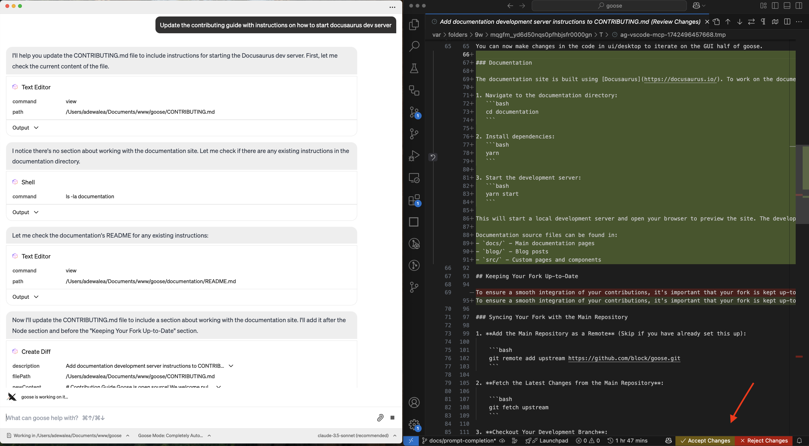

import Tabs from '@theme/Tabs';
import TabItem from '@theme/TabItem';
import YouTubeShortEmbed from '@site/src/components/YouTubeShortEmbed';

<YouTubeShortEmbed videoUrl="https://www.youtube.com/embed/gddEgvCLrgU" />


This tutorial covers how to add the [VS Code MCP Server](https://github.com/block/vscode-mcp) as a Goose extension to enable VS Code integration, file operations, and development workflow management.

:::info Required Setup
Install the [VS Code MCP Extension](https://marketplace.visualstudio.com/items?itemName=block.vscode-mcp-extension) from the Visual Studio Marketplace.
:::

:::tip TLDR
<Tabs groupId="interface">
  <TabItem value="ui" label="Goose Desktop" default>
  [Launch the installer](goose://extension?cmd=npx&arg=-y&arg=vscode-mcp-server&id=vscode-mcp&name=VS%20Code%20MCP&description=VS%20Code%20integration%20and%20file%20operations)
  </TabItem>
  <TabItem value="cli" label="Goose CLI">
  **Command**
  ```sh
  npx vscode-mcp-server
  ```
  </TabItem>
</Tabs>
:::


## Configuration

:::info
Note that you'll need [Node.js](https://nodejs.org/) installed on your system to run this command, as it uses `npx`.
:::

1. Add the [VS Code MCP Extension](https://marketplace.visualstudio.com/items?itemName=block.vscode-mcp-extension) to your VS Code. No additional settings required in VS Code.

<Tabs groupId="interface">
  <TabItem value="ui" label="Goose Desktop" default>
  1. [Launch the installer](goose://extension?cmd=npx&arg=-y&arg=vscode-mcp-server&id=vscode-mcp&name=VS%20Code%20MCP&description=VS%20Code%20integration%20and%20file%20operations)
  2. Press `Yes` to confirm the installation
  3. Click `Save Configuration`
  4. Click `Exit` from the upper left corner
  </TabItem>
  <TabItem value="cli" label="Goose CLI">
  1. Run the `configure` command:
  ```sh
  goose configure
  ```

  2. Choose to add a `Command-line Extension`
  ```sh
    ┌   goose-configure 
    │
    ◇  What would you like to configure?
    │  Add Extension (Connect to a new extension) 
    │
    ◆  What type of extension would you like to add?
    │  ○ Built-in Extension 
    // highlight-start    
    │  ● Command-line Extension (Run a local command or script)
    // highlight-end    
    │  ○ Remote Extension 
    └ 
  ```

  3. Give your extension a name
  ```sh
    ┌   goose-configure 
    │
    ◇  What would you like to configure?
    │  Add Extension (Connect to a new extension) 
    │
    ◇  What type of extension would you like to add?
    │  Command-line Extension 
    │
    // highlight-start
    ◆  What would you like to call this extension?
    │  vscode-mcp
    // highlight-end
    └ 
  ```

  4. Enter the command
  ```sh
    ┌   goose-configure 
    │
    ◇  What would you like to configure?
    │  Add Extension (Connect to a new extension) 
    │
    ◇  What type of extension would you like to add?
    │  Command-line Extension 
    │
    ◇  What would you like to call this extension?
    │  vscode-mcp
    │
    // highlight-start
    ◆  What command should be run?
    │  npx vscode-mcp-server
    // highlight-end
    └ 
  ```  

  5. Enter the timeout value (default 300s is recommended)
    ```sh
    ┌   goose-configure 
    │
    ◇  What would you like to configure?
    │  Add Extension (Connect to a new extension) 
    │
    ◇  What type of extension would you like to add?
    │  Command-line Extension 
    │
    ◇  What would you like to call this extension?
    │  vscode-mcp
    │
    ◇  What command should be run?
    │  npx vscode-mcp-server install
    │
    // highlight-start
    ◆  Please set the timeout for this tool (in secs):
    │  300
    // highlight-end
    │
    └ 
  ``` 

  6. Choose to add a description. If you select "Yes" here, you will be prompted to enter a description for the extension.
   ```sh
    ┌   goose-configure 
    │
    ◇  What would you like to configure?
    │  Add Extension (Connect to a new extension) 
    │
    ◇  What type of extension would you like to add?
    │  Command-line Extension 
    │
    ◇  What would you like to call this extension?
    │  vscode-mcp
    │
    ◇  What command should be run?
    │  npx vscode-mcp-server install
    │
    ◆  Please set the timeout for this tool (in secs):
    │  300
    │
    // highlight-start
    ◇  Would you like to add a description?
    │  No
    // highlight-end
    │
    └ 
  ```
  
  7. No additional environment variables are required for basic setup
  
  </TabItem>
</Tabs>


## Example Usage

The VS Code MCP extension enables Goose to interact with your VS Code environment, managing files, projects, and development workflows. 

The key strength of the VS Code MCP Server is its ability to:

- Show diffs before making changes
- Integrate file operations with VS Code's interface
- Manage project workspaces
- Provide immediate visual feedback in the editor


:::note
Every time you start a Goose session with the VS Code MCP server enabled, it checks to see if a matching project is open in VS Code. If not, it will prompt you to open the project before proceeding.
:::

### Goose Prompt

```
Update the contributing guide with instructions on how to start docusaurus dev server
```

## Result



